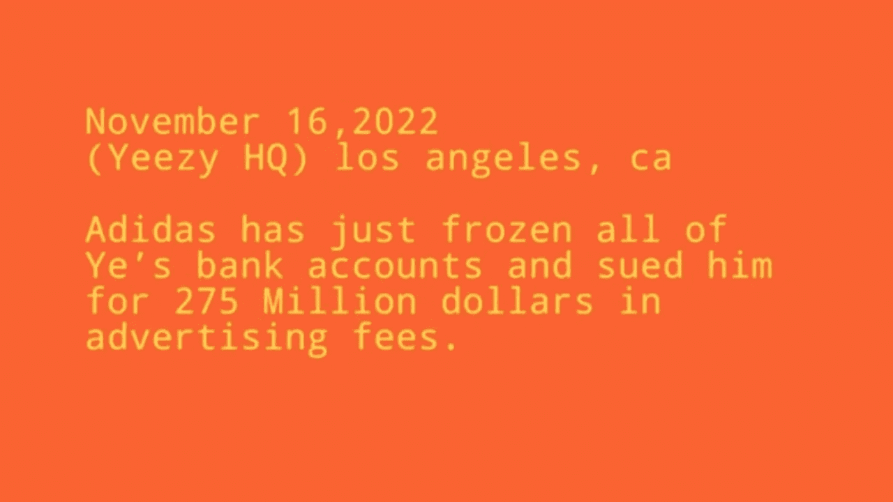

# 为什么 Kanye West 需要了解比特币

> 原文：<https://medium.com/coinmonks/why-ye-kanye-west-needs-to-understand-bitcoin-e23b7ce6b4af?source=collection_archive---------16----------------------->

坎耶·韦斯特一直很注意自己在聚光灯下的形象。这种形象是好是坏完全取决于他决定通过嘻哈、时尚或彻底抗议的表达来分享什么。Kanye West 可能是过去十年中世界上最著名的嘻哈艺术家。他还是一名时装设计师、企业家和唱片制作人。换句话说，他是一个强者。作为一个多才多艺的人，韦斯特无论做什么都走在最前沿。所以他对加密货币也感兴趣也就不足为奇了。韦斯特过去甚至在推特上谈论过比特币。然而，似乎很明显，他并不真正理解它是什么或它是如何工作的。**这就是为什么 Kanye West 需要了解比特币。**

## 比特币是什么？

比特币是一种数字资产和支付系统，由一位名为中本聪的匿名创建者于 2009 年创建。该系统是点对点的，这意味着交易直接发生在用户之间，没有中介。比特币是作为对采矿的奖励而创造的，采矿是一个验证交易并将其添加到公共账本(被称为区块链)的过程。比特币可以用于许多不同的目的，包括在线购物、投资或向海外汇款——然而，应该注意的是，并非所有企业都接受比特币作为支付方式。

然而，比特币提供了一些完全独特的价值储存层。比特币被数学和能量所统治，这推动了哈希速率、块大小算法，并为控制协议的采矿计算机提供了动力。我认为腐败在所有的人类机构和所有地方的政府中都是可能的，尤其是在金钱方面。数字财产和实物财产的区别在于，你可以从交易所或银行取走你的资产，而你不能从托管人那里取走你的资产。这就是比特币不同于人类以前见过的任何形式的货币的地方。

## 为什么 Kanye West 需要了解比特币？

Kanye West 是一个有影响力的人，他在 Twitter 上有数百万粉丝，他的话很有分量。如果西氏公开支持比特币，可能会对采用率产生重大影响。如果知道像韦斯特这样有影响力的人在背后支持比特币，更多的人可能会投资比特币，并将其作为一种货币使用。此外，韦斯特是一个喜欢走在时代前列的人。他是第一批穿紧身牛仔裤的主流名人之一，也是苹果产品的早期采用者。如果西氏现在涉足比特币，他可以将自己定位为该领域的思想领袖，并获得更大的影响力。

Kanye 最近无法访问他的 Apple Pay，并意识到他的银行账户已被冻结。Kanye West 在金融审查方面得到了一个惨痛的教训:[“阿迪达斯能够合法地进入并冻结我的钱……如果这能发生在我身上，这也能发生在其他美国人身上”](https://twitter.com/BitcoinMagazine/status/1595107286015696896?s=20&t=3KAF2Z2KBuqa3qDLL2QlLw)他对一群旁观者说。比特币让你可以自由地把钱转移到任何地方，而不会有混淆视听的威胁，比如为什么你不能获得自己辛辛苦苦赚来的钱。

跨国投资银行 JP 摩根联系了叶，并宣布他们因反犹太主义与这位说唱歌手断绝关系，他必须在 2022 年 11 月 21 日之前将账户资金转移到其他地方。拥有 Yeezy LLC 的 Kanye 现在不得不将他以自己的品牌积累的数百万美元存放在另一家银行，从外表看，大多数其他银行可能会效仿，让他陷入财务困境。这位说唱巨星的技术娴熟的粉丝，甚至社交影响力和加密爱好者大卫·戈克施泰因(David Gokhshtein)都建议韦斯特应该考虑将他的 1.4 亿美元储存在比特币中。

## 是什么阻止了 Kanye West 全面拥抱比特币？

当最近被问及是否考虑将比特币作为价值储存手段时，叶承认，他对比特币没有广泛的技术理解。很明显，Kanye West 并不真正了解比特币是什么，也不知道它是如何工作的。这种缺乏理解可能会阻碍他完全跳上比特币列车。此外，韦斯特谈到了他对埃隆·马斯克的钦佩，马斯克公开批评比特币对这种数字资产的评价褒贬不一。有可能韦斯特在如此高调的问题上犹豫不决，不愿反驳马斯克。

最后，值得注意的是，韦斯特已经表示有兴趣推出自己的加密货币。10 月份，一位不知名的创始人在 ETH 上推出了$YZY 令牌，但真正的比特币创造者不会接受任何不是在比特币下运行的协议。这样一个项目无疑将是一项巨大的事业，有可能韦斯特觉得他没有时间或专业知识来完成它。不管原因是什么，很明显 Kanye West 还没有完全致力于比特币。只有时间才能证明他是否会冒险一试。希望这篇博客文章能帮他澄清一些事情，这样他就能对是否投资比特币做出更明智的决定。

**喜欢你刚刚读到的吗？请打碎👏如果你喜欢这个故事，请点击下面的按钮帮助其他人找到它！欢迎在下方留言评论。**

**如果你喜欢阅读这样的故事，并且想支持我成为一名作家，可以考虑** [**报名成为一名媒介会员**](https://dawdu.medium.com/membership) **。每月 5 美元，你可以无限制地阅读媒体上的故事。如果你** [**用我的**](https://dawdu.medium.com/membership) **链接注册，我会赚一小笔佣金。**

> 交易新手？尝试[加密交易机器人](/coinmonks/crypto-trading-bot-c2ffce8acb2a)或[复制交易](/coinmonks/top-10-crypto-copy-trading-platforms-for-beginners-d0c37c7d698c)