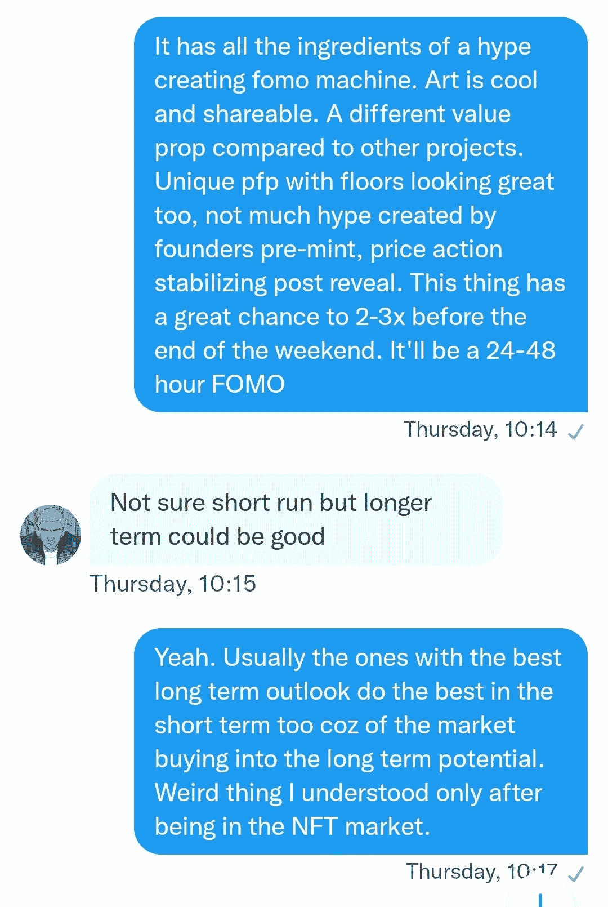

# 为什么你总是在顶部买入

> 原文：<https://medium.com/coinmonks/why-you-always-buy-at-the-top-49cdf90de2dc?source=collection_archive---------6----------------------->

## 不，不是你运气不好

Photo by [@chairulfajar_](https://unsplash.com/@chairulfajar_?utm_source=medium&utm_medium=referral) on [Unsplash](https://unsplash.com?utm_source=medium&utm_medium=referral)

你看到一些人改变了他们的 PFP 或者发推文谈论一个新项目。你忽略了它，因为你已经被泵和转储破坏了很多次。这让你对任何新项目都持怀疑态度。在接下来的几天里，你越来越多地看到它，并决定看得更深一点。你仍然不确定，还心存疑虑。突然，有一天你醒来，发现这个系列的底价涨了两倍。当你第一次看到它的时候，你会立刻后悔没有买下它。你恨自己错过了火车。然后，你决定继续前进。

但是 Twitter 不允许。日复一日，你看到地板价越来越高。此外，项目持有人也不断分享他们的喜悦。所以，即使你想继续，你也做不到。这就像在 Instagram 上跟踪你的前任，尽管你真的想继续前进。每个项目持有人都在分享为什么这将是下一个蓝筹股，为什么他们对这个项目如此有信心。大部分都不是恶意这么做的；他们已经完全接受了这个故事，并希望分享它。然后，清算的日子到来了。项目宣布了一些事情，或者项目中存在极大的买入压力。你不想再错过这趟火车了。你如此肯定这只是上升到月球的开始，并为进入下一个蓝筹股而感到兴奋。

第二天你醒来发现地板比你的买点还低。你立刻在推特上安慰自己。推特上有很多安慰的话。每个人都在说，为什么这只是一次下跌，我们会比以往任何时候都更强劲地反弹。每个人都如此“确定”,这注定要高得多。你决定继续持有，因为你讨厌亏损，尤其是当你已经说服你的大脑这是一个简单的 2-3 倍。你看着它一天比一天低，最后意识到你已经买了顶。

这是 NFT 空间中最常见的故事，与运气无关。把这归因于运气是你不断重复这个错误的唯一原因。我知道我犯了很多次这样的错误。那么，如果不是运气，那又是什么呢？

噪音和确定性。所有市场都交易这两样东西。大多数人不想花必要的时间自己研究一个项目，也不想自己写一篇论文。他们更愿意听别人讲的故事。根据别人的假设购买比自己提出假设要容易得多。这种策略的问题在于，你甚至不会根据少数人的假设采取行动。你需要所有人在一件事情上达成一致，并制造大量噪音来采取行动。

当噪音最大时，你最终会采取行动(购买)。这种噪音代表了所有市场参与者对一个故事的共识。这种共识导致大多数参与者的绝对确定性。但是，钱不是在某个特定的赌注中赚来的，而是在存在不确定性的时候赚来的。这种不确定性让更多的人变得不确定。随着这些人涌入这个项目，价格总是会上涨。当每个人都同意一个假设时，谁还能买呢？你是最后一个买这个故事的人，让你成为最棒的！

这就是为什么我避免在项目宣布当天购买项目，或者避免购买任何会让该项目成为所有相关市场参与者的赌注的项目。我喜欢在一个项目传遍 Twitter 之前，为购买这个项目创造自己的论点。当我心中有一个清晰的论点时，我会立即行动。我不需要所有的市场参与者来证实我的论点。如果我等他们，我会错过大部分的行动。以下是我在 Renga 的底价为 0.27 ETH 时买入该股的一个例子:

有了明确的论文之后就立马买了。我不在乎 Twitter 上的噪音或市场的确定性。我只是要确保我的论文是确定的。这是你所需要的。不管市场的噪音和确定性如何，都要交易。做出自己的论断，果断行动。在那之后，你所需要的只是一个心理止损，以防你的论文被证明是错误的。不要被证明是正确的。市场不在乎你，是中性的。关心资本的保护和增值。

所以，下次有什么引起你的注意时，把自己从市场中隔离出来。想出自己的论文然后找几个懂行的朋友来戳你论文的漏洞。(这不是必要的，但如果你错过了一个明显的事实，这将有助于你)然后在市场确定之前果断行动。你在市场不确定性中的确定性就是优势。利用这一点，但不要太依赖你的确定性。当每个人都开始同意你的论点时，你知道该怎么做。那是改天的话题！

干杯，
NFT 果

附:这些都不是财务建议。这只是我观察到的一些东西，想与你分享。

> 交易新手？试试[加密交易机器人](/coinmonks/crypto-trading-bot-c2ffce8acb2a)或者[复制交易](/coinmonks/top-10-crypto-copy-trading-platforms-for-beginners-d0c37c7d698c)