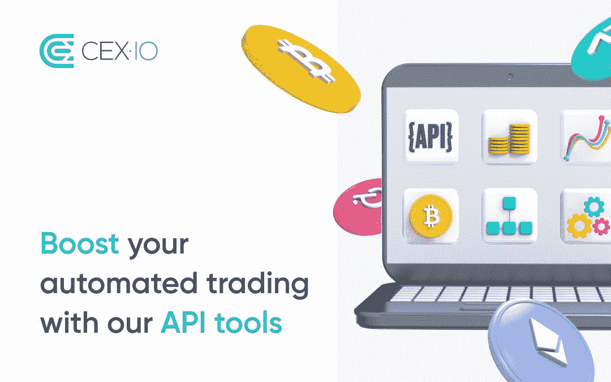

# 为什么你需要一个加密 API？

> 原文：<https://medium.com/coinmonks/why-you-need-a-crypto-api-fd04ddab3c5b?source=collection_archive---------14----------------------->

crypto API 市场的顶级玩家有哪些？

加密货币已经成为全球经济的重要组成部分。一些加密货币的价值现在非常高，预计它们将在一些国家取代传统货币。

如今，加密技术的发展达到了前所未有的高度，来自其他行业的新开发人员蜂拥而至，寻找“加密淘金热”。无论您是加密货币开发者、交易者，还是对所有加密事物充满热情，都有一些 API 可以让您的加密之旅更加顺畅。

但是什么是加密 API 呢？你能用加密 API 做什么？API 最好的加密货币有哪些？在这篇文章中，我们将涵盖所有关于加密 API 的内容，以及你可以用它们做什么。

# 什么是加密 API？

加密 API 是一组软件库和工具，允许开发人员使用区块链技术构建应用程序。它将使您能够与区块链、智能合约和其他分散技术进行交互。

加密 API 可用于构建与区块链或智能合约交互的应用程序。

# 加密基础设施是如何工作的？

加密基础设施是区块链的心脏。是它让你有可能和自己的个人钱包或者别人的钱包互动。加密基础设施还允许你创造新的硬币和代币，然后可以在比特币基地或币安等加密货币交易所交易。

加密基础设施是分散的:没有人拥有它，而是许多计算机同时运行(或“节点”)。每个节点都有其区块链的副本——这就是他们如何知道哪些硬币被创造出来以及谁拥有它们——但他们都作为一个实体一起工作，因为他们通过全球不同大陆上各自节点之间的对等连接来连接！如果一台计算机由于维护问题或其他超出其控制的原因而暂时停机，那么另一个附近的节点将接管，直到情况再次稳定。"

# 你能用加密货币 API 做什么？

从金融服务到游戏，加密 API 或应用编程接口(API)被用于许多不同的方式和行业。它们允许公司和开发者创建基于区块链技术的应用程序。这些应用程序可以是任何东西，从以太坊交易的智能合同，甚至是像 CryptoKitties 这样的游戏，你可以在以太坊网络上买卖数字猫！

1.  加密货币 API 是访问所有这些数据的关键。它允许您获得任何加密货币的最新价格信息和其他重要信息，包括其社交媒体账户、交易所列表等。
2.  您还可以使用 API 来查找世界各地的交易所目前还在交易哪些硬币。通过一个 API，你可以看到在任何给定时间有多少人在特定交易所交易比特币，或者最近是否有其他加密货币代码库的活动。
3.  加密 API 不仅仅可以用于交易。它们还可以用来创建新的应用程序、业务模型和服务。

示例-

1.  一个加密 API 可以帮助你创建一个移动应用程序，允许人们在手机上买卖加密货币，而不必下载区块链。该应用将使用标准支付平台(如 Apple Pay 或 Google Pay)，因此用户在手机上购买或出售加密货币时，不必担心通过互联网发送信用卡信息。
2.  另一个用例可能是构建一个应用程序，帮助公司找到对加密货币相关工作感兴趣的有才华的开发人员，方法是通过电子邮件或文本消息在云中与他们共享工作列表，通过 API 调用返回到我们的服务器，然后通过另一个 API 调用发送回响应，我们在返回响应之前检查是否有兴趣，如果没有，则不返回任何其他内容！

# 最好的加密 API 是什么？

1.  币安 API

币安是一个免费使用的 API，它使用第三方平台允许用户访问加密货币市场并进行交易。该 API 易于实现，问题或缺陷相对较少，因此不太可能需要额外的故障排除。通过这个免费使用的平台，你每分钟可以收到多达 1200 个请求。它使用 RESTful 架构，使得以前使用过 API 的任何人都可以相对容易地访问这个 API。

功能-

*   进入最大的市场之一
*   能够通过 API 直接购买和销售
*   高容量限制，每分钟可以发出大量请求以获取您需要的数据
*   完全免费使用
*   可以直接通过 API 取消交易

2.简单交换

[SimpleSwap](https://api.simpleswap.io/) 是一家加密货币交易所，拥有超过 500 种加密货币。SimpleSwap 团队为钱包和其他合作伙伴提供了一个奇妙的 API。它是完全免费的，实现起来也很简单。任何对实现交换服务感兴趣的人都可以获得 API 密钥，定制利润，并获得数千个加密货币对的访问权。API 使用 HTTP 协议，响应以 JSON API 格式交付。

功能-

*   API 是免费的
*   支持多种加密货币(500 多种硬币和代币)
*   交换金额 API 请求的响应时间≤ 5 秒
*   货币列表 API 请求的响应时间≤ 5 秒
*   exchange 创建 API 请求的响应时间≤ 10 秒
*   exchange 状态 API 请求的响应时间≤ 10 秒

3.比特币基地

比特币基地 API 是一个通用且安全的工具。兼容比特币、比特币现金、莱特币、以太坊。比特币基地以其将加密货币集成到现有应用中的能力而闻名。它允许你在一个现有的应用程序中包含加密功能，而不是丢弃它并重新开始。比特币基地工具是免费使用的，每日限额为 10，000 次请求。CoinbasePro 是一个具有更高级 API 的高级选项，也是可用的。它有很多令人兴奋的功能，比如程序化交易。

功能-

*   实时通知
*   简单的市场监控
*   连接到 4 种不同的货币
*   免费提供历史数据
*   用户之间的直接钱包连接
*   开发者为用户提供有用的教程

4.库科恩 API

[Kucoin](https://www.kucoin.com/api) 是一个交易 API，旨在使加密货币市场的访问和交易变得更加容易。

它们为您提供了访问各种加密货币的途径。它们还通过优先考虑声誉更好、易于使用的货币而不是鲜为人知或价值较低的加密货币形式来帮助用户。

汇率保持相对稳定，这可以保护您的用户免受加密货币市场波动的影响。它也是一个简单的汇率 API，适用于网络和移动应用程序。

功能-

*   流线型界面
*   拥有许多不同货币的巨大市场
*   优先考虑更可靠的货币，将不太可靠的选项放在列表的后面
*   稳定的汇率
*   与全球平均水平相比，价格是公平的

5.CEX。IO API

[CEX。IO](https://cex.io/cex-api) 提供了几个免费的 API，允许用户访问高级交易工具。你可以从 CEX 实时获得全面的市场数据。用于分析当前市场状况、回溯测试和制定交易策略的 IO API。CEX IO 提供了完整的 API 文档和大量代码示例，使用户能够轻松地将 API 集成到第三方交易平台和定制交易解决方案中。CEX。默认情况下，IO API 每 10 分钟提供 600 个请求，但是如果需要，请求的数量可以增加。

特征

*   免费使用
*   持久稳定的基于服务器的连接
*   与第三方交易系统轻松集成
*   通过 API 实现交易自动化和取消交易的能力
*   实时提供大量加密市场数据
*   为有抱负的交易者提供详细的文档和多个代码示例

6.Nownodes

[NOWNodes](https://nownodes.io/) 提供完整的节点和区块链探索者，可以快速方便地访问最受欢迎的区块链。这是一个区块链即服务解决方案，提供高质量的 API 连接。超过 40 台区块链可以通过可靠且经济高效的基础设施连接起来。

NOWNode 功能包括:

*   所有完整的节点和资源管理器都在一个地方，无需使用多个服务。
*   快速访问:1GB/秒的可靠连接
*   服务质量保证
*   节点由 NOWNodes 专家持续监控，并处于持续监视之下。

7.阿尔平实验室

如果你在印度，那么 [Alpyne Labs](https://alpyne.tech/) 就是你的一站式解决方案。我们是一家快速发展的公司，总部设在印度。我们帮助其他企业有效地让用户使用 web 3.0。我们提供简单安全的 API，方便用户使用。我们解决所有合规性问题，如 KYC、欺诈检查等。我们为所有代币和您的用户选择的任何固定支付提供方便的流动性。

功能-

*   快速集成，无需担心合规性
*   无缝提供新功能和专门支持
*   扩大用户漏斗，进入新的市场和垂直市场

最终，世界比以往任何时候都变化得更快。您和您的企业需要寻找市场上最好、最简单、最安全的 API。所以，请务必查看我们的列表，为您的下一个 API 预算做准备。另外，看看我们在[的上一篇帖子](/coinmonks/top-payment-apis-for-developers-in-2022-digital-payment-trends-in-india-4e20deaf339c)，在那里我们讨论了支付 API。

> 加入 Coinmonks [电报频道](https://t.me/coincodecap)和 [Youtube 频道](https://www.youtube.com/c/coinmonks/videos)了解加密交易和投资

# 另外，阅读

*   [block fi vs Celsius](/coinmonks/blockfi-vs-celsius-vs-hodlnaut-8a1cc8c26630)|[Hodlnaut 审核](/coinmonks/hodlnaut-review-best-way-to-hodl-is-to-earn-interest-on-your-bitcoin-6658a8c19edf) | [KuCoin 审核](https://coincodecap.com/kucoin-review)
*   [Bitsgap 审查](/coinmonks/bitsgap-review-a-crypto-trading-bot-that-makes-easy-money-a5d88a336df2) | [Quadency 审查](/coinmonks/quadency-review-a-crypto-trading-automation-platform-3068eaa374e1) | [Bitbns 审查](/coinmonks/bitbns-review-38256a07e161)
*   [密码本交易平台](/coinmonks/top-10-crypto-copy-trading-platforms-for-beginners-d0c37c7d698c) | [Coinmama 审核](/coinmonks/coinmama-review-ace5641bde6e)
*   [印度加密交易所](/coinmonks/bitcoin-exchange-in-india-7f1fe79715c9) | [比特币储蓄账户](/coinmonks/bitcoin-savings-account-e65b13f92451)
*   [OKEx vs KuCoin](https://coincodecap.com/okex-kucoin) | [摄氏替代品](https://coincodecap.com/celsius-alternatives) | [如何购买 VeChain](https://coincodecap.com/buy-vechain)