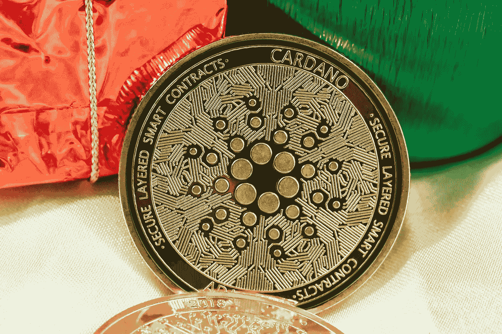

# 为什么您需要了解更多关于卡达诺国家的信息

> 原文：<https://medium.com/coinmonks/why-you-need-to-learn-more-about-cardano-nation-s-1f403b8a48d1?source=collection_archive---------15----------------------->

## 卡尔达诺区块链政纲与传统政府系统相结合以创造一个新型国家的想法是最需要理解的。

卡尔达诺的区块链平台收到了来自整个加密社区的很多仇恨，但我觉得这种仇恨和错误信息是竞争意图的结果，而不是卡尔达诺本身有任何问题。在许多方面，Cardano 都是开发最新一代加密货币的领跑者。

首先，它是利害关系的证明，这是它从释放开始的形式。股权证明不需要任何采矿机器，而是使用股权池铸造新的区块，这进一步有助于支持和发展卡尔达诺网络。此外，Cardano 的回报令人满意——直接下注时的平均赌注池可以通过 ISPO(初始赌注池发行)或 5%的 ADA 奖励(在某些情况下向慈善事业进行小额捐赠)给你象征性的奖励。虽然具有创新性，但卡尔达诺基金会的战略中最让我感兴趣的部分是围绕他们建立完全一体化的卡尔达诺国家的愿望。

在 Flickto 工作期间，我直接与基金会交流，了解了他们的做法。他们不想破坏和拆除传统系统，相反，他们在寻求一种和平、无缝和高效的整合，以提高传统政府和机构系统的可预测性、弹性和一致性。

让我们考虑一个像埃塞俄比亚这样的国家——那里的政府强烈希望实现数字化、现代化，让人民摆脱贫困。传统的经济和身份系统是不稳定和不可靠的——无论是护照、驾驶执照还是银行——当经济衰退、政府更迭或全球不稳定时，总会出现问题。通过与卡尔达诺的整合，可以将区块链作为国家基础设施的基础，实现这些系统的分离。

> 交易新手？试试[加密交易机器人](/coinmonks/crypto-trading-bot-c2ffce8acb2a)或者[复制交易](/coinmonks/top-10-crypto-copy-trading-platforms-for-beginners-d0c37c7d698c)

卡尔达诺基金会已经与埃塞俄比亚政府签署了一份谅解备忘录，以创建一个全国身份证系统----使用卡尔达诺区块链，这将是革命性的，使农村地区的人进入主流系统。这是一场马拉松的开始，要创造一个全球化的系统，在这个系统中有一致和安全的身份识别标准。

The achievement of Cardano’s high level goals by 2025 will put them on course to achieve Cardano Nation(s) especially in unstable economic and geopolitical environment.

例如，斯里兰卡——一个经济体系千疮百孔的国家——他们的政府已经被赶出了这个国家，现在他们寻求一个不依赖政府数字的系统的稳定性和可预测性。这将意味着普通人的金钱、身份和教育不会受到影响，因为他们不会过度依赖政府的国家货币——这有助于抵消过度通货膨胀、腐败和贪污的影响。

作为一个领域，我对它感兴趣的原因是，它对抗了传统的破坏、拆除和替换的隐秘叙事。这一扰乱传统金融体系和政府的过程将导致冲突、混乱，并且主要影响社会中最脆弱的人群。相反，旨在教育、培养和建立与政府的关系以帮助逐步和有效地将这些系统转移到区块链的方法是一种更安全和更人道的方法。

我认为，将身份识别、财务和治理的实际系统与人为错误和人性分离，建立一个基于区块链的系统，对人类进步至关重要。这将有助于通过创建一个开放、透明和负责任的系统来减少与欺诈、逃税和腐败相关的犯罪行为。它创造了不依赖于人类突发奇想的政府机构——它为大众创造了结构和稳定，同时阻止了富人和有权势的人逍遥法外。

我关于 Cardano 的投资论文主要集中在与遗留系统集成的叙述上。这些遗留系统已经存在了几个世纪；除非发生核战争、致命的疫情或恶性通货膨胀，否则这些遗留系统不太可能被完全拆除。相反，更有可能的是，最终像 Cardano 这样的区块链平台将在我们的社会背景中无缝运行。这类似于互联网——没有一家或另一家互联网公司完全主宰我们的生活；相反，它们有太多在后台运行，提供服务器、算法，并在人类生活中创造价值。

## 我很想听听你对卡尔达诺的看法，以及他们创造卡尔达诺民族的潜力。

## 你认为卡尔达诺可以帮助创造一个更加公平和公正的世界吗？

> 加入 Coinmonks [电报频道](https://t.me/coincodecap)和 [Youtube 频道](https://www.youtube.com/c/coinmonks/videos)了解加密交易和投资

# 另外，阅读

*   [瓦济里克斯 NFT 评论](https://coincodecap.com/wazirx-nft-review) | [比茨盖普 vs 皮奥克斯](https://coincodecap.com/bitsgap-vs-pionex) | [坦吉姆评论](https://coincodecap.com/tangem-wallet-review)
*   [如何使用 Solidity 在以太坊上创建 DApp？](https://coincodecap.com/create-a-dapp-on-ethereum-using-solidity)
*   [加密交易机器人](/coinmonks/crypto-trading-bot-c2ffce8acb2a) | [OKEx vs 币安](https://coincodecap.com/okex-vs-binance)
*   [币安 vs FTX](https://coincodecap.com/binance-vs-ftx) | [最佳(SOL)索拉纳钱包](https://coincodecap.com/solana-wallets)
*   [如何在 Uniswap 上交换加密？](https://coincodecap.com/swap-crypto-on-uniswap) | [A-Ads 审查](https://coincodecap.com/a-ads-review)
*   [加密货币储蓄账户](/coinmonks/cryptocurrency-savings-accounts-be3bc0feffbf) | [YoBit 评论](/coinmonks/yobit-review-175464162c62)