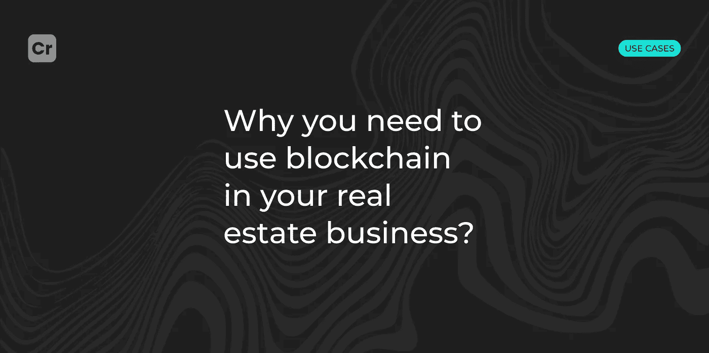

# 为什么你需要在你的房地产业务中使用区块链？

> 原文：<https://medium.com/coinmonks/why-you-need-to-use-blockchain-in-your-real-estate-business-af44f38ce751?source=collection_archive---------27----------------------->

*在数据传输的速度和可靠性非常重要的地方，尤其是在房地产领域，需要区块链。*

应用区块链可以在房地产行业发挥很大的作用。这可以消除对中介的需要，增加交易各方之间的信任，保存记录，加快所有过程，增加流动性，减少欺诈，降低成本和费用。[这是一个突破！](https://crypton.studio/en/blog/why-you-need-to-use-blockchain-in-your-real-estate-business)

# 区块链平台技术可以应用于房地产业务的许多方面。以下是其中值得关注的一些:

## 所有权

房地产区块链可以作为核实资产所有权的唯一真实来源。这包括通过令牌的部分所有权，这些令牌的所有持有者都将是公开的。

## 土地所有权

传统上用于离线，区块链技术允许存储和验证重要的房地产法律文件。

## 谎言

基于区块链的智能房地产合同不仅可以加快租赁过程，节省成本，还可以改善尽职调查身份验证，简化合同签署。

## 资产流动性

如果一项资产被 1000 个投资者而不是 10 个投资者令牌化，你就自动增加了该项投资的流动性。如果代币的买家和卖家更容易出售和购买特定资产的股份，那么退出策略和流动性问题就会大大减少。

## 处理

房地产交易的整个过程，如提交方案、核实所有权、接受和核实方案和资金。所有这些都可以在一种数字账本中得到验证和编码。

## 融资

使用区块链可以存储和验证信用检查、收入和身份证明、债务收入比等信息。在数据传输的速度和可靠性很重要的地方，尤其是在房地产领域，需要区块链。

# 代币是不动产中的价值储存手段。

在住宅或商业房地产区块链中，代币代表各种类别的所有权权益，如股权、债务或现金流。

*例如，*如果一栋 100 个单元的公寓楼由 50 个不同的受区块链保护的投资者所有，这些投资者中的每一个都可以拥有代币，以反映他们在该资产股权中的所有权。

在本例中，房地产区块链平台可用于记录、存储和验证这些令牌。代币可以很容易地出售或清算。区块链的真正价值不仅在于信任和效率，还在于流动性。

区块链将有能力验证身份和收入，并降低欺诈的可能性。

# 在不同国家标记财产时需要考虑的其他因素:

—需要香港证券及期货事务监察委员会( [SFC](https://www.sfc.hk/en/News-and-announcements/Policy-statements-and-announcements/Statement-on-Security-Token-Offerings) )的批准。他们将颁发营业执照。安全令牌被视为复杂的金融产品。

—新加坡金融管理局( [MAS](https://www.mas.gov.sg/regulation/capital-markets/Capital-Markets-Services-CMS-Licence) )将证券视为资本市场的产品，并为此提供资本市场许可证。

—在阿联酋，财产令牌化由证券和商品管理局( [SCA](https://www.sca.gov.ae/en/glossary.aspx) )监管。

—在美国，房地产令牌化是证券交易委员会( [SEC](https://www.sec.gov/) )和金融业监管局( [FINRA](https://www.finra.org/investors/insights/reits-alternatives-to-ownership) )的责任。

—瑞士有一个金融市场监管局( [FINMA](https://www.finma.ch/en/documentation/dossier/dossier-fintech/decentralized-finance-defi/) )，负责处理数字资产的交易、托管和结算。

# 有哪些用区块链做房地产的例子？

1.  2019 年 11 月底，DLT 互助银行宣布与 Natwest Bank 达成协议，使该银行的用户能够通过一款应用程序控制他们的购房行为。
2.  当地建筑巨头 Cyrela Brazil Realty 与初创公司 Growth Tech 合作，将名为“公证总账”的项目付诸实施。它允许您以数字方式请求和跟踪公证服务。它帮助开发商大大减少了销售房地产的时间，从平常的 30 天减少到 20 分钟。
3.  日本最大的银行集团之一瑞穗信托银行(Mizuho Trust & Banking)计划在年底前进行房地产令牌化，并向投资者出售证券令牌。

# 结果

美国、瑞士、新加坡、香港、日本和德国等国家的房地产令牌化取得了很大进展。这允许资源的有效分配。更广泛地采用区块链技术和进步的法规将推动令牌化的需求。

**你想在你的房地产生意中使用区块链吗？** [**联系我们**](https://t.me/crypton_studio_bot) **，我们将确保您的事务得到妥善修复。**

> 交易新手？试试[加密交易机器人](/coinmonks/crypto-trading-bot-c2ffce8acb2a)或者[复制交易](/coinmonks/top-10-crypto-copy-trading-platforms-for-beginners-d0c37c7d698c)