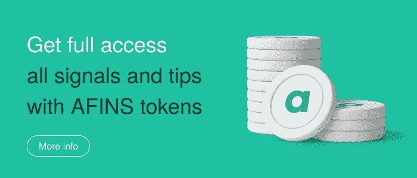

# 为什么您应该购买 AFINS 代币并成为 altFINS 社区的一部分！

> 原文：<https://medium.com/coinmonks/why-you-should-buy-afins-tokens-and-become-a-part-of-altfins-community-6563afa605a7?source=collection_archive---------23----------------------->

Source: altFINS

如今，市场上有数千种加密货币和数字资产可供交易。选择正确的交易并不容易，因为:1)市场高度分散，难以驾驭，2)直接在交易所交易对用户不友好，而且他们不提供交易前分析。

altFINS 为活跃的交易者创造了工具，用于发现加密货币市场内的交易想法和盈利策略。这是一个强大的平台，涵盖了交易流程的所有阶段，从交易想法发现、分析(交易前)到执行(交易)和监控(投资组合)。该平台还提供工具来汇总数据和新闻，分析替代方案(包括技术分析和基本面分析)，发现和执行交易想法，并监控交易所的投资组合。altFINS 也专注于密码交易教育和基础研究。

要成为奥特莱斯终身会员，您只需 HODL 阿芬代币:基本计划 1000 阿芬，基本计划 2000 阿芬，高级计划 3000 阿芬。您将获得 100%的 APY 成本节约。没有代币锁定或费用或每月付款。

**如何购买 AFINS 代币？**可以[直接在平台上购买 AFINS 代币](https://platform.altfins.com/subscriptions)。你可以简单地发送一个加密支付(、、戴等)。)从任何一家[交易所](https://youtu.be/kM2omyuYsvg?utm_source=sendinblue&utm_campaign=new%20way%20how%20to%20buy%20afins&utm_medium=email)或一个[钱包](https://youtu.be/oZ_uD1F6ynA?utm_source=sendinblue&utm_campaign=new%20way%20how%20to%20buy%20afins&utm_medium=email)中兑换，作为回报，你会收到一个 AFINS。

或者你可以在交易商 Joe DEX 上购买指纹。操盘手乔上 AFINS 的合约号是 0xb 648 fa 7 a5 F5 ed 3 B3 c 743140346 E3 DC 3 Fe 94 a 9125。

**什么是 AFINS？**

AFINS 是 altFINS 的一个有益令牌，是一个实用令牌，在平台上使用，可以免费终身访问基本、基本或高级计划。AFINS 是基于雪崩协议的。“我们选择 Avalanche 进行下一阶段的平台开发，是因为它的高性能。简而言之，Avalanche 速度快、可扩展、灵活、成本低且安全。这些都是 altFINS platform 下一代金融产品所需要的元素。”altFINS 公司的首席执行官兼创始人理查德·费泰科说

Avalanche 是一款经得起考验的区块链，即使没有通常与低延迟链相关的安全性权衡，也能每秒处理 4，500 个事务。

Avalanche consensus 结合了 Nakamoto consensus 的优点(鲁棒性、规模、分散性)和经典 consensus 的所有优点(速度、快速终结和能量效率),而没有缺点。

为什么要买和 hodl AFINS 代币？

保持在加密市场领先地位的最佳方式是使用 altFINS，这是为活跃的加密交易者提供的最佳加密分析交易平台。现在，如果你购买并持有 AFINS，你将终身免费使用该平台提供的付费功能。您可以使用 AFINS 令牌在 altFINS 平台上获得优惠，如免费访问图表模式、免费加密新闻和事件、免费制图、免费教育、免费基础研究等等。

要成为终身会员，您只需拥有 1000 个 AFINS 基本代币、2000 个 AFINS 基本代币或 3000 个 AFINS 高级计划代币。
T5！！！**准备好迎接 9 月和我们的新功能:altFINS 首席执行官 Richard Fetyko 的在线和离线交易视频。购买并持有 AFINS 以访问交易视频！**

**去哪里买 AFINS？**

你可以直接在平台上购买 AFINS 代币，并使用 USDT、USDC、BTC、瑞士联邦理工学院等支付。

所以你可以简单地发送一个加密支付(、、戴等)。)从任何一家[交易所](https://youtu.be/kM2omyuYsvg?utm_source=sendinblue&utm_campaign=new%20way%20how%20to%20buy%20afins&utm_medium=email)或一个[钱包](https://youtu.be/oZ_uD1F6ynA?utm_source=sendinblue&utm_campaign=new%20way%20how%20to%20buy%20afins&utm_medium=email)中兑换，作为回报，您将获得一个指纹。

或者你可以在交易商 Joe DEX 上购买指纹。操盘手乔上 AFINS 的合约号是 0xb 648 fa 7 a5 F5 ed 3 B3 c 743140346 E3 DC 3 Fe 94 a 9125。

**什么是 altFINS？**

[altFINS](https://platform.altfins.com/) 是最好的**密码分析交易**平台。平台**帮助**你找到合适的密码交易**机会。你**可以在**一个** **上升趋势**、**动量**或者**突破中搜索**币**。**

altFINS 是**完美的**供初学者学习**基础知识[技术分析](https://platform.altfins.com/curatedCharts) **用** [**加密货币**交易**课程**](https://platform.altfins.com/education) 、 [**图表**](https://platform.altfins.com/education) **和 [**图表** **形态**章节。](https://platform.altfins.com/tpatterns)****

****然而，**更高级的交易者可以用不同的交易策略创建自己的**屏幕**和**币** **提醒**。altFINS 是活跃的**加密货币**交易者和投资者的工具。

**通过**监控**您的硬币头寸和**允许** **他们** **到**交易**在**上多次交易**变得更有效率。找到交易思路，创造自己的交易信号。学会利用技术分析进行**到**到**的交易**。**保存**时间扫描**加密货币**进行交易。

altFINS 从 18 家****顶级加密货币** **交易所**中摄取实时价格和交易量数据**交易** **交易量。** **altFINS** 然后**计算**交易者识别趋势价格常用的技术指标**在** **加密货币中，**包括 SMA、EMA、MACD、RSI、OBV、布林线**波段、**终极**振荡指标、** Stockastic、**和** **更多。****alt fins 平台**将**这些指标**分成** 5 个时间间隔(15m、1h、4h、12h、1d)。

此外，平台会自动检测并标记某些交易模式(楔形、三角形、头肩底等。).

**该平台的主要特点:**

**仪表盘** —加密市场亮点、您的投资组合(或观察列表)的快速业绩摘要、交易信号和 Twitter 新闻(仅针对您的投资组合(或观察列表)
**筛选者** —创建并保存您的自定义过滤器
**加密图表模式** —查找具有可交易价格模式(上升楔形、头肩)的资产)********** 

**研究中心** —关于硬币选择和第三方研究的深度研究报告
**交易** —从一个点跨多个交易所交易

使用 altFINS，您可以找到处于强劲上升趋势或下降趋势的加密资产:

-**-**
-**超卖或超买**
- **正在开发或突破**技术价格模式(楔形、三角形、头肩顶、支撑和阻力)
-**经历过 SMA 或 EMA 交叉**(看涨或看跌)

这个平台适合您吗？了解自己并开始使用 altFINS 平台[现在](https://platform.altfins.com/)！

**成为 altFINS 社区的一员**

**altFINS 社区**正在为密码交易员和**投资者**提供一个**机会** **给**分享图表、技术分析、交易思路、经验**和**观点、**和**提问。成为 altFINS 社区的一员会给你日常交易和投资灵感。可以加入 altFINS 社交媒体频道，比如 [Telegram](https://t.me/altfinsofficialchat) 、 [Twitter](https://twitter.com/AltfinsA) ，或者 [Discord](https://t.co/uBvlTWgRgP) 。altFINS 愿意接受社区管理方面的任何帮助。

> 交易新手？试试[加密交易机器人](/coinmonks/crypto-trading-bot-c2ffce8acb2a)或[复制交易](/coinmonks/top-10-crypto-copy-trading-platforms-for-beginners-d0c37c7d698c)