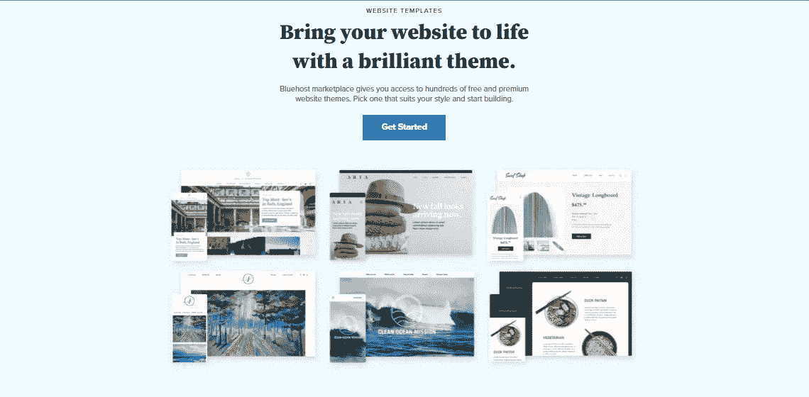

# 为什么你应该为你的业务和博客选择 Bluehost

> 原文：<https://medium.com/coinmonks/why-you-should-choose-bluehost-for-your-business-and-blog-90966dde87f9?source=collection_archive---------42----------------------->


Bluehost up to 70% off

Bluehost 是最受欢迎和信任的网站、企业和博客托管服务之一。Bluehost 在全球拥有 200 多万客户(大约相当于内布拉斯加州的人口)，是您的企业或博客的绝佳选择。我们整理了一份你应该选择 Bluehost 来托管你的业务和博客的理由列表。他们负担得起的计划选项、用户友好的界面、24/7 支持团队以及免费站点迁移和自动站点备份等附加服务使他们在其他提供商中脱颖而出。考虑一下为什么你应该选择 Bluehost 来托管你的业务或博客。请继续阅读，了解更多信息！

# **blue host 简介**


Bluehost 是一家位于美国犹他州的主机提供商。该公司是世界上最大的托管公司之一，自 2003 年以来一直存在。Bluehost 专门从事共享 WordPress 托管、电子邮件托管和域名注册。他们提供共享、经销商、VPS 和专用服务器托管计划，并在联合托管服务提供商(HSP)中拥有数据中心，如 Bluehost 是提供托管服务的互联网服务提供商(ISP)。托管服务提供服务器上的空间和带宽来存储、传输和显示网站。托管市场竞争激烈，全球有超过 40，000 家托管公司。Bluehost 是该领域最大的玩家之一，拥有超过 200 万客户(大约相当于内布拉斯加州的人口)。Bluehost 被许多博客作者和网络营销者推广。它们也是学生和小企业主的首选。

# **实惠灵活的计划选项**


Bluehost Price Plan

Bluehost 提供三种不同类型的主机方案——基本、高级和高级。基本是最便宜的计划，并附带一个免费的域名。如果需要更多磁盘空间、带宽或自定义域名，您可以升级到 Plus 和 Prime。所有这三个计划选项都有定价，并附带免费的自动站点备份、免费的站点迁移和免费的站点安全扫描。您可以根据自己的业务需求选择托管计划。如果你有一个成长中的网站，你可以在以后升级到更高的计划。如果您选择了基本计划，您将不得不在以后升级到更高的计划。您可以随时从 Bluehost 控制面板升级您的主机方案。如果您的网站发展壮大，您还可以申请免费升级。

# **人性化界面**



Mobile Responsive

Bluehost 提供了一个用户友好的界面，即使你是一个完全的初学者也很容易使用。他们的控制面板界面简洁，易于操作。您可以使用它来设置您的网站、创建电子邮件帐户以及管理您的网站内容。你也可以从 Bluehost 控制面板安装 WordPress 和其他流行的网站平台。Bluehost 使用 cPanel，这是许多主机公司使用的行业标准主机控制面板。Bluehost 还提供了广泛的教程和指南，以帮助您充分利用他们的托管服务。您可以在其网站的最终用户支持部分找到它们。Bluehost 也有一个活跃的社区，你可以在那里提问，获得提示和技巧，并与其他客户互动。

# 来自友军的全天候支持


Best customer service

Bluehost 由训练有素的友好员工提供 24/7 的客户支持。您可以通过实时聊天、电子邮件或电话联系他们的支持团队。您也可以查看他们的知识库，在那里您可以找到许多常见网站和主机问题的解决方案。此外，你还可以找到与迁移你的网站和安装 WordPress 相关问题的故障排除指南。您可以使用 Bluehost 的实时聊天功能与支持代理通话。你也可以在正常工作时间给他们发邮件或打电话。

# 免费网站迁移和自动备份


Website Migration

网站迁移是将网站从当前服务器移动到新服务器的过程。当您注册 Bluehost 时，您可以获得免费的网站迁移。这意味着 Bluehost 将免费把你的网站从你当前的服务器转移到他们的服务器上。你也可以把你的网站从旧的主机账户转移到 Bluehost。您也可以将您的网站上传到您的 Bluehost 帐户。Bluehost 还提供自动网站备份。这可让您在数据丢失的情况下保存网站数据。除了基本计划之外，您可以使用所有主机计划进行自动备份。Bluehost 会将您的网站数据备份到其安全的数据中心。您还可以下载您的网站数据，并在数据丢失的情况下进行恢复。

# 结论

```
Bluehost is a smart choice for hosting your business or blog. With more than 2 million customers worldwide, Bluehost can be a great choice for your business or blog. Their affordable plan options, user-friendly interface, 24/7 support team, and additional services like free site migration and automatic site backups make them stand out among other providers.
```


> 交易新手？试试[加密交易机器人](/coinmonks/crypto-trading-bot-c2ffce8acb2a)或者[复制交易](/coinmonks/top-10-crypto-copy-trading-platforms-for-beginners-d0c37c7d698c)