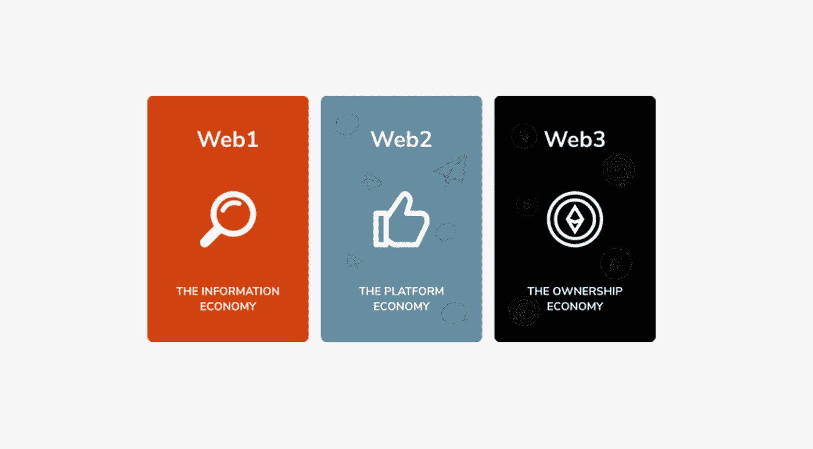

# 为什么你不应该把 Web3 创业公司看作普通的公司？

> 原文：<https://medium.com/coinmonks/why-you-should-not-think-of-web3-startups-as-normal-companies-6f332881f1d8?source=collection_archive---------13----------------------->

在 Web3 中，我们需要停止从产品的角度思考，而开始从经济的角度思考，因为一个 Web3 的初创公司并不通过销售产品和服务来产生销售额，而是通过…(阅读全文以了解它是什么)来产生收入。

在本文中，我想详细阐述四个彼此紧密相连的主题:

1)数字连接、声誉和所有权
2)区块链简而言之
3)中间商公司和信任
4) Web2 vs Web3 公司

**但首先，让我先介绍一下:**

我们大约 50%醒着的时间很容易花在看数字屏幕上。物理世界和数字世界越来越融合在一起。尽管人们试图积极减少屏幕时间，但现实是，即使屏幕时间减少，我们也会更加依赖和连接到数字世界。这种趋势正在增长，一直在增长，并将长期增长。

无论我们在互联网上做什么，发布什么，我们都在创造一种我称之为数字声誉的东西。我们正在留下数字痕迹。

在 Airbnb，当人们决定接待你时，你的数字声誉才是他们真正信任的。差评的后果可能是甚至不允许你留下来。

你的数字声誉可以让你得到一次约会，但更严重的是，它可能会在约会开始前就让约会失败。谁能抵挡快速滚动对方公开信息和图像的诱惑？

如果人力资源部门成功地检查了你的公共社交媒体渠道，并且在深入搜索谷歌搜索结果的过程中没有发现危险信号，那么可靠的数字声誉也可能让你获得一份高薪工作。

在过去的二十年里，我们都在数字世界中建立了声誉，不管我们是否愿意。我们不断地与人、公司和所谓的在线知识来源建立更多的联系。

想象一下，你在一个共同工作的空间里，在一次商务活动中，或者在你生活中的任何地方遇见一个新的人。你和他见面，握手，然后用数字连接交换联系方式。但更重要的是，在你们再次分开后，你可能会快速浏览他的个人资料、他的 LinkedIn、脸书，然后用谷歌搜索他的名字。

你的数字身份，你的数字数据，甚至更重要的是，你的数字声誉正慢慢变得比你的身体更重要。

但是问问你自己，当一切都依赖于你的数字声誉和网络关系时，你需要问自己的一个问题是:谁拥有它？

一个普通的互联网用户有 150 个不同的账户。然而，你不拥有任何数据。即使有欧盟的一般数据保护法规 GDPR，您仍然不拥有任何数据。

现在是做一个思想实验的时候了:想象一下你失去了你房子里的水源。最有可能的是，你会在别的地方买些水，修好它，然后继续你的生活。当你的电源连接坏了怎么办？同样的故事，最终，你会以某种方式修复它，然后继续你的生活。但是如果你失去了你的数字声誉和所有的网络联系呢？现实将是毁灭性的。你几乎需要重建 20 年来你在此期间建立的声誉，并再次建立所有的联系。

你这些年创作的所有创意内容:丢失。

所有的追随者和订阅者:永远消失了。

我们能够控制自己的数字生活，这是一个很大的错觉。

当你登录到你的计算机时，谁拥有你？当你在网上建立自己的声誉，联系所有有趣的人、公司、个人资料、博客和知识来源时，谁拥有你的数据？

*如果你在数字世界度过了半辈子，但你并不拥有你多年来在互联网上建立的东西，那么你的半辈子就不属于你。*

之所以会出现这种情况，是因为在今天的世界里，所有的数据都在集中的数据库里，由公司拥有和操作，而不是由你。对于我们每一个拥护自由开放世界的人来说，都存在系统性风险，而这正是区块链和 Web3 可以发挥巨大作用的地方。

**区块链简单来说**

从本质上讲，区块链只不过是一个数据库。这是一本公共账本。想象一个 Excel 表，它是开放的，每个人都可以贡献。然而，区块链不属于一家公司或一个人，它属于全世界数百万人，他们的个人电脑验证每一笔交易或添加到数据库中的每一个新行。本质上，区块链是数字交易的分类账。

每个有互联网连接的人都可以向区块链添加数据，但没有人可以操纵它。如果您想要更改数据，您必须发送一个新的事务，这将向数据库添加一个新行，并连接到前一个行。所有交易将被捆绑成块，加密保护，时间戳，并相互连接。如果有人试图操纵数据库的任何部分，其他 99.9%的计算机将意识到有些事情没有增加，并且不会允许它发生。这一特性及其加密部分使得区块链非常安全。

*这是对区块链的一个非常简单的解释，还有各种不同规格的区块链。*

为了更好地理解为什么区块链是这样一个突破性的创新，让我给你一点互联网的历史背景。这一切都始于现在叫做 Web1 的东西。在 20 世纪 90 年代，网站是相当静态的，从今天的角度来看，视觉上不是很有吸引力。人们访问网站主要是为了找到基本信息。它更多的是将物理世界的信息复制到新的数字世界。许多网站的功能就像名片一样，在主页上包含一些核心信息，如地址、电话号码和开放时间。

然后，大约 15 年后，用户第一次可以轻松地在线创建和上传内容——从文本和图像到视频。互联网的这个阶段现在被认为是 Web2。

脸书和其他社交媒体平台开始获得动力。用户与其他用户建立联系，相互关注和订阅，并开始在数字世界中建立类似声誉的东西。Web2 本质上允许人们联系和创建社区。这让他们成为数字创造者，创造了我们今天所知的数十亿创造者的经济。

但是，你需要问自己的一个问题是:谁拥有这些数据？

毫不奇怪，简短的答案是大型科技公司。

有一句名言，如果你不为服务付费，你就不是用户。你就是产品。公司通过他们的私有数据库从你的数据中获利。他们将你为他们创造的流量和注意力货币化。作为回报，他们几乎不给你任何东西。

尽管科技公司变得过于强大并从我们的内容中赚钱已经不再是秘密，但大多数人并不知道有一个解决方案。这就是 Web3、比特币、以太坊和区块链发挥作用的地方。本质上，Web3 是关于数字所有权的。随着数字所有权的出现，出现了无数新的可能性。

区块链科技让人们不再是所有这些网站和平台的被动用户，而是成为拥有自己数据的微型公司。

我们都可以拥有自己的内容、帖子和身份。我们可以允许其他人使用我们的数据，为我们赚钱，就像大型科技公司一直在做的那样。我们有潜力建立一个真正拥有我们的数据、声誉和联系的世界。当然，将你自己转变成你自己的微型公司并允许这一切发生并不是火箭科学。我的预测是，在大多数情况下，它可能只需要一次点击。这可能会成为新的常态。

在本文的下一部分，我将通过解释两个非常重要的概念:信息和价值，来谈论为什么区块链有如此大的潜力。我在之前的一篇文章中也提到了区块链的潜力。随意查看 [*这里*](https://given14.medium.com/the-challenges-with-blockchain-28de754e0fe6)

从技术上讲，人类相互交换的主要有两种东西:

**-信息**

- **值**

信息和价值的主要区别在于它的功能性。

一个可以复制，一个不可以。

1.  约翰向彼得发送照片、文本、视频或音频。现在约翰和彼得有了。两者都可以发送给更多的人。信息会被复制。所有参与者都有完全相同的文件。
2.  约翰将“价值”，例如钱，发送给彼得。最好不是复制品。钱要么在这里，要么在那里。不可能同时出现在两个地方。

然而，“价值”可以不仅仅是数字货币。它还可以是股票、期权、贷款、股息、商品、艺术品、合同、游戏中的物品、房地产、忠诚度积分等等。

互联网是交换“信息”的全球标准。在此之前，我们有专用网络，比如公司的“内部网”。那些已经是有用的网络，因为你可以给你的同事发送信息，你可以共享文件，你可以做很多事情——但都是在你的私人网络中。是全球互联网协议改变了游戏，因为它把这个星球上每一个能接触到它的人都联系了起来。

在此之前，所有这些网络都是孤立的网络，或者说是数据孤岛。

**然而，我们很长一段时间没有的是一个类似于全球数据库的东西，用于“价值”的交换。这是区块链。**

在此之前，世界需要依靠中间人来交换价值，因为不太可能在全球范围内安全地集体跟踪价值所有权。

想想今天存在的数千家银行。想想 Paypal、Wise、Revolut、股票经纪人、交易所、Visa、Mastercard 以及金融领域的所有参与者。他们都运营着自己的数据库来获取价值，并在自己的数据岛中跟踪所有用户的资金，这些数据岛通过 API 与行业中的其他参与者相连，因此你可以将价值发送给其他人。然而，并不是所有人和所有事都是联系在一起的。

解决方案将是一个公共数据库，能够实现“价值”的交换，这是一个保护我们隐私的新标准，并允许地球上的每个人都参与进来。它决不能由一个人、一家公司或一个组织控制。这就是区块链。

人们不再通过 API 连接数百万个数据岛，而是将他们的后端连接到一个区块链。这项技术将对我们的生活产生重大影响，就像互联网的发明一样。

让我给你举一个更实际的例子:想象在你的博客顶部有一个数字广告横幅。它也可以被认为是“价值”，因为它可以产生金钱。事实是，你并不真正拥有邮报，你甚至不拥有广告空间。在 EventScouts，我们现在正在建立的 web3 创业公司，你将能够拥有你的帖子和广告横幅，交易它，并从中赚钱。不会有像 Google Adsense 这样的中间人从中拿走大笔佣金。从本质上讲，我们把权力还给创作者，因为我们试图把广告横幅与区块链联系起来，让它可以与区块链生态系统中的所有其他价值进行交易和交换。

**关于中间商公司**

如果我们分析本文中提到的所有金融科技公司，我们应该意识到，它们除了所谓的中间人服务之外，什么也不提供。把钱从 A 点送到 B 点的目标是尽可能快、尽可能便宜地送到 B 点。最终用户的目标不是通过像银行或 Paypal 这样的中间人服务。作为人类，我们今天只是接受这些方法，因为我们没有更好的解决方案——直到现在。这样的中间人服务并没有给我们的世界增加多少价值，而且运行那些可信的第三方也有成本。他们对整个社会征税。

区块链将是这个问题的解决方案，因为它允许点对点的交易，换句话说，它允许人与人之间的直接交易。它实际上取消了中间商。Web3 是一场革命，它改变了我们相互交换价值的方式，改变了我们看待和管理信任的方式。

**但让我们快速了解一下为什么信任如此重要**

只有当人们能够相互信任时，他们才会相互购买商品和服务。自然，作为人类，我们不信任彼此。因此，多年来我们开始创建政府、系统和框架，最重要的是我们创建了公司。

在 Airbnb 出现之前，让一个陌生人睡在你的房子里绝对是疯了。Airbnb 彻底改变了游戏。这样做的原因是，你不信任陌生人，你信任 Airbnb，这个中间人公司。

科技公司优步实际上只连接了两个用户，一个寻找乘客的司机和一个寻找司机的乘客。他们使用自己的中央数据库来存储和管理这些数据。再说一次，仅仅在十年前，跳上一辆陌生人的车是不可想象的。人们这样做的原因是因为他们信任优步和应用程序参与者的数字声誉。

Web3 可以让这种不得不信任中间商公司的方法过时。一些区块链人提出了所谓的智能合约。基本上，智能合约是在区块链上执行自己的可编程代码。换句话说，它可以自动连接上述 Airbnb 和优步例子中提到的这两方，而不需要其他人的交互。智能合约能够处理从预订、支付到评级等各种事务。

谷歌(Google)和脸书等科技巨头通过收集用户数据并将其出售给广告商，赚取了大量收入，他们的部分核心业务从技术上讲可以被不同的区块链应用所取代。他们业务的很大一部分是数字中间商业务。想象一下广告业务模式，一边是内容和流量，另一边是希望接触到内容和流量的企业。

**最后一章，让我们来看看经济方面的情况:**

我们已经知道今天谁拥有我们的数据。大型科技公司。

现在，让我们来看看 Web2 社交网络如何赚钱，它与 Web3 有何不同，以及我们可以在行业中看到哪些趋势。

Web2 社交网络构建的平台允许用户创建内容并生成到其域的流量。收入要么来自企业，要么来自用户。他们允许用户建立社区，但不允许他们真正拥有自己的创作和人脉。如果平台死了，内容也就死了。如果他们想审查你，他们有权力这样做。

脸书和其他社交媒体平台让用户从中获利的比例为零。YouTube 等平台将收入的很小一部分重新分配给用户，这是唯一的原因，也是唯一的原因，这样做的目的是激励超级用户创作更多他们并不拥有的内容。

十年前，脸书是互联网上无可争议的终极社交活动中心。它确实垄断了市场。十年后，我们拥有了自己的数字空间，用于非常不同的环境，例如工作环境、休闲、社交活动、教育、游戏等等。我来解释一下:大多数应用程序都内置了某种社交功能，可以让你进行连接、订阅和投稿。通过金融应用，你可以追踪其他交易者。图书应用程序可以让你追踪有趣的作者或其他读者，旅游应用程序可以让你联系到你可能喜欢的人或内容。我们的手机上有几十个应用程序，它们都是为了满足我们的兴趣而开发的。我们还加入了多个社交网络，尽管它们感觉起来并不像是社交网络。

人们甚至使用多个 Twitter 账户来关注与工作相关的内容创作者和与爱好相关的创作者。越来越多的社交平台越来越多，这是一个明显的趋势。脸书正在失去活跃用户，新的社交媒体平台正以各种形式涌现出来。我们的联系建立在我们的声誉上，将在数字和虚拟世界中继续增长，并转变为现在所谓的元宇宙。也许最好的描述是一个融合了物理世界和数字世界的地方。

**区块链将把数据的所有权交给人。互联网用户应该拥有他们的数据，并有权用这些数据赚钱。**

未来是让人们通过使用区块链技术直接相互协作。Web3 将创造一个去中心化的环境，在这个环境中，一个用户可以进行交易并与另一个用户互动，而不需要中间人。想象一下，如果无数的 Web2 公司变得过时，仅仅是因为用户可以发送金钱和重视点对点，这对我们的社会会有什么样的长期影响。

> 这也意味着 Web3 初创公司与 Web2 初创公司有着本质的不同，因为我们不向最终用户或企业提供产品或服务。Web3 初创公司正在创造经济和工具，让人们可以通过智能合同直接进行点对点互动。
> 
> 这些智能合约的所有者代币持有者收取少量交易费。这就是价值所在。智能合约不局限于单个网站、单个平台或产品。可以有多个网站，多个前端，都连接到同一个公共数据库，区块链。一个 Web3 创业公司可以而且应该发展成一个在线经济，而不是一个公司。它是一个更大的分散生态系统的一部分。

创造者经济中新的去中心化的社交网络可能只有在几年后才会受到主流的关注。奖励拥有所有权的用户有助于吸引庞大的用户群，这些用户群有可能战胜现有的集中式用户群。这种假设的原因是，最终用户的所有权消除了社交网络背后的集中式公司与参与者(最终用户)之间的冲突。它确保所有利益相关者(投资者、用户、企业)更好地协调一致。

在 Web2 中，平台努力赚取尽可能多的收入，而用户则希望发现相关的内容和信息。这种错位是危险的。由于网络效应和所有权的缺乏，最终用户很难离开社交网络去寻找更好的选择。如果用户拥有自己的数据，这一切都可能改变。

我们将这项工作视为一个 Web3 平台，为用户提供以安全可信的方式相互交易的手段，而不是通过我们和我们的中央数据库。我们创建工具和框架，允许用户创建和拥有资产，然后直接与其他用户进行交易。

***Web3 不是销售产品或服务。这是关于创造经济。推动这些经济体的智能合约将收集在这些经济体中交易的部分价值。这些分散的经济体将会发展得比我们现在所能想象的要大得多。***

> *如果你喜欢这篇文章，也请给我发邮件，让我知道你的想法。*

我叫安德林，是 EventScouts 的创始人。我在这里是因为我们正在建立一个区块链协议，它将允许用户上传信息(在我们的案例列表中包含活动和事件)到一个共享的数据库，区块链。用户创建的内容将由用户拥有和控制，并允许他们直接用它赚钱。它基本上是第一个基于区块链，用户拥有的，事件和活动数据库。

[event-scouts.com](http://event-scouts.com/)

***

这篇文章也在 [LinkedIn](https://www.linkedin.com/pulse/why-you-should-think-web3-startups-normal-companies-renz-/?published=t) 上

这是我的[链接树](https://linktr.ee/andrinrenz)

> 交易新手？尝试[加密交易机器人](/coinmonks/crypto-trading-bot-c2ffce8acb2a)或[复制交易](/coinmonks/top-10-crypto-copy-trading-platforms-for-beginners-d0c37c7d698c)