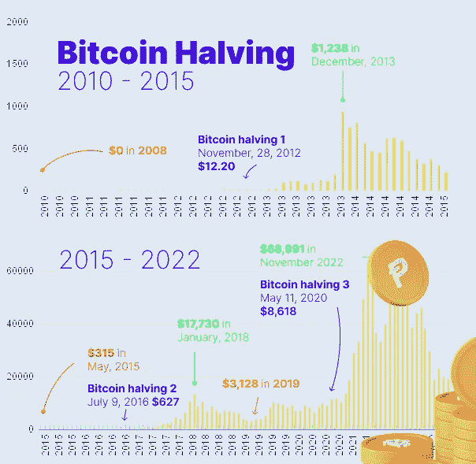

# 为什么你现在购买比特币会变得富有

> 原文：<https://medium.com/coinmonks/why-youll-get-rich-if-you-buy-bitcoin-right-now-8e6bbe77c572?source=collection_archive---------13----------------------->

随着 FTX 的崩溃，密码市场再次下跌。有人说这将是加密的死亡。这话已经说了 15 年了。在这 15 年里，比特币经历了暴跌，最终达到了新的天文数字。现在将是未来 3 年多购买比特币的最佳时机，因为价格可能会按照过去的趋势上涨 1000%。

自 2008 年发明以来，比特币的价格一直遵循 3-4 年的趋势。其原因是采矿奖励减半，加上每次减半前后的投机炒作。

## 什么是比特币挖矿？

比特币挖矿是验证交易并将其记录在账本中的过程。这是 cryptos 优于传统银行的安全性的基础。一种批评认为这对环境有害。股权证明作为一种环境选择而兴起，最初因以太坊而普及，你可以在这里阅读关于[的内容。](/@aidanmcmurray/why-proof-of-stake-is-the-future-5d885f6d0dea)

## 减半如何影响比特币的价格？

矿工因有奖励而受到激励。每四年，他们因验证区块链内的一个区块而获得的比特币数量会减半。这导致比特币越来越稀缺。**采矿和投资在每减半之前和之后都会增加。**和往常一样，价格走势一旦形成，就可能成为自我实现的预言。

根据之前的价格走势，比特币极有可能在未来几年达到一个新的峰值。

Designed in Figma

*   **第一次减半:** 2008 年从 0 美元开始，到 2013 年 12 月飙升至 1238 美元。
*   **第二次减半:**价格在 2015 年 5 月再次下跌至 315 美元，但在 2018 年 1 月反弹至 17，730 美元(涨幅 5628%)。
*   **第三次减半:**价格再次暴跌至 3128 美元。随后反弹至新高 68991 美元(涨幅 2205%)。这一切都与采矿奖励减半的时间完全吻合，而且很可能会再次发生。

剩余炒作蔓延到整个加密市场，影响新的硬币，并为更高的投资回报率创造机会(**或重大损失**)。

从 2012 年到 2017 年，价格上涨了 5628%，从 2018 年到 2022 年，价格上涨了 2205%。接下来的增长百分比可能会小于上次。这种模式是，随后的每一半增长下降 50%，这将导致下一个峰值达到 1000%的增长。从目前的低点上涨 1000%将导致下一个峰值达到下降趋势底部的 10 倍。此时**大约是每比特币 154，000 美元。**

## 现在是买比特币的好时机吗？

这将是一个很好的时机，有可能在未来几年获得 1000%或更高的投资回报。这不是一个期待快速而丰厚回报的投资时机。

下一次比特币减半预计将发生在 2024 年 3 月至 2 月之间。每开采 210，000 个区块就会减半。

**现在是比特币的大好时机，如果:**

1)美国政府不开启加密。

2)你打算持有你的投资几年

虽然这一趋势已经持续了近 15 年，但这个世界比以往任何时候都充满了更多的不稳定性，这让我想到了我的下一个观点(实际上是一个法律免责声明)。

*   **这不是财务建议。投资风险自担。做更多的研究，试着理解你投资的任何东西。**

## 最后的想法

10 年后，当价格不再有大幅波动的空间时，会发生什么？

这会让比特币成为一种实用的货币吗？

我个人不认为比特币的价值来自于作为货币使用。我认为它被称为数字黄金是有道理的。虽然没有活跃的团队像以太坊一样做出改变，但它在加密方面具有历史意义，我相信它会巩固其作为顶级加密货币的地位。你有什么想法？

*   [了解股权证明如何使加密货币变得环保，并减少以太坊能源使用 99.95%](/@aidanmcmurray/why-proof-of-stake-is-the-future-5d885f6d0dea)

> 交易新手？尝试[加密交易机器人](/coinmonks/crypto-trading-bot-c2ffce8acb2a)或[复制交易](/coinmonks/top-10-crypto-copy-trading-platforms-for-beginners-d0c37c7d698c)