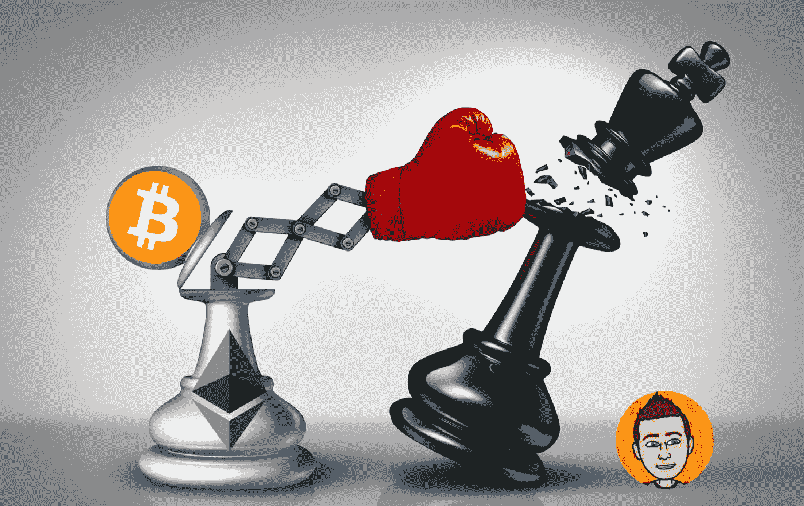

# 为什么你会在替代硬币投资中亏损

> 原文：<https://medium.com/coinmonks/why-youll-lose-investing-in-altcoins-8195dab797f9?source=collection_archive---------7----------------------->

在密码学中有一个理论，你可以选择任何硬币，并从中获得巨大的利润。在过去的牛市中，这种信念更加坚定，因为它经常被证明是正确的。如果你可以选择任何硬币，你为什么会选择比特币这样的密码？由于其更大的市值，它的价格将很难上涨，你可以在低市值硬币中看到更高的百分比收益。