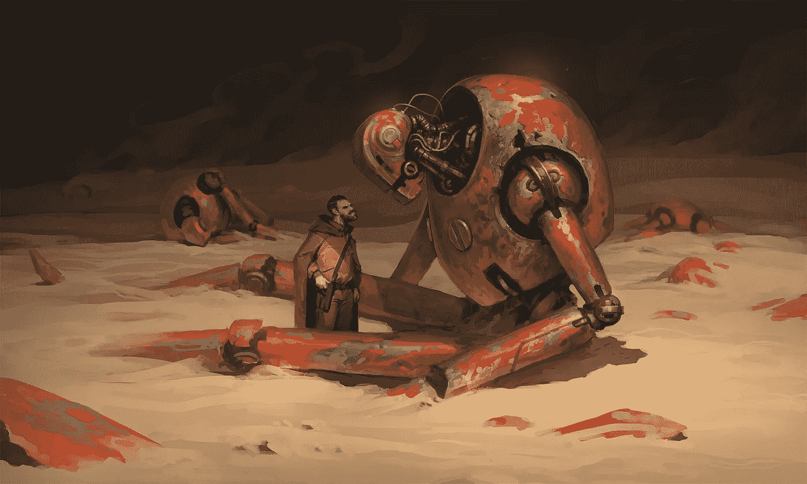

# 为什么你的加密交易机器人不盈利——第一部分

> 原文：<https://medium.com/coinmonks/why-your-crypto-trading-bot-isnt-profitable-part-1-f9a5322360e9?source=collection_archive---------0----------------------->

有什么比准确地理解为什么你想要建造的东西不能做你想要它做的事情更有用的呢？以及为什么每个人都认为一个有利可图的交易机器人迫在眉睫。

[https://www.artstation.com/artwork/qAG4nn](https://www.artstation.com/artwork/qAG4nn)

**第 1 部分，共 3 部分:外延论和交易模式盈利的幻觉**

# 外同态