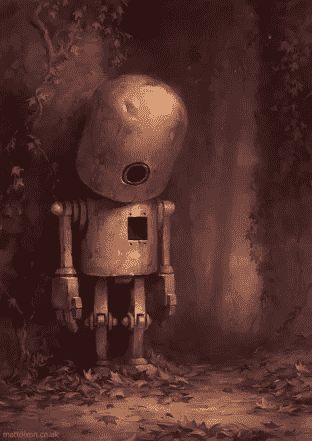

# 为什么你的加密交易机器人不盈利——第二部分

> 原文：<https://medium.com/coinmonks/why-your-crypto-trading-bot-isnt-profitable-part-2-9c7bd845dffa?source=collection_archive---------1----------------------->

‘Hollow’, a digital painting by Matt Dixon via [deviantART](http://browse.deviantart.com/#/art/Hollow-364261189?hf=1).

在 [**第一部分**](/@gk_/why-your-crypto-trading-bot-isnt-profitable-part-1-f9a5322360e9) 中，我们研究了一种常见的交易策略，并对其进行了回溯测试，以展示它如何(假设)产生利润。在下一节中，我们将更深入地探讨为什么这些策略在现场交易中会失败。