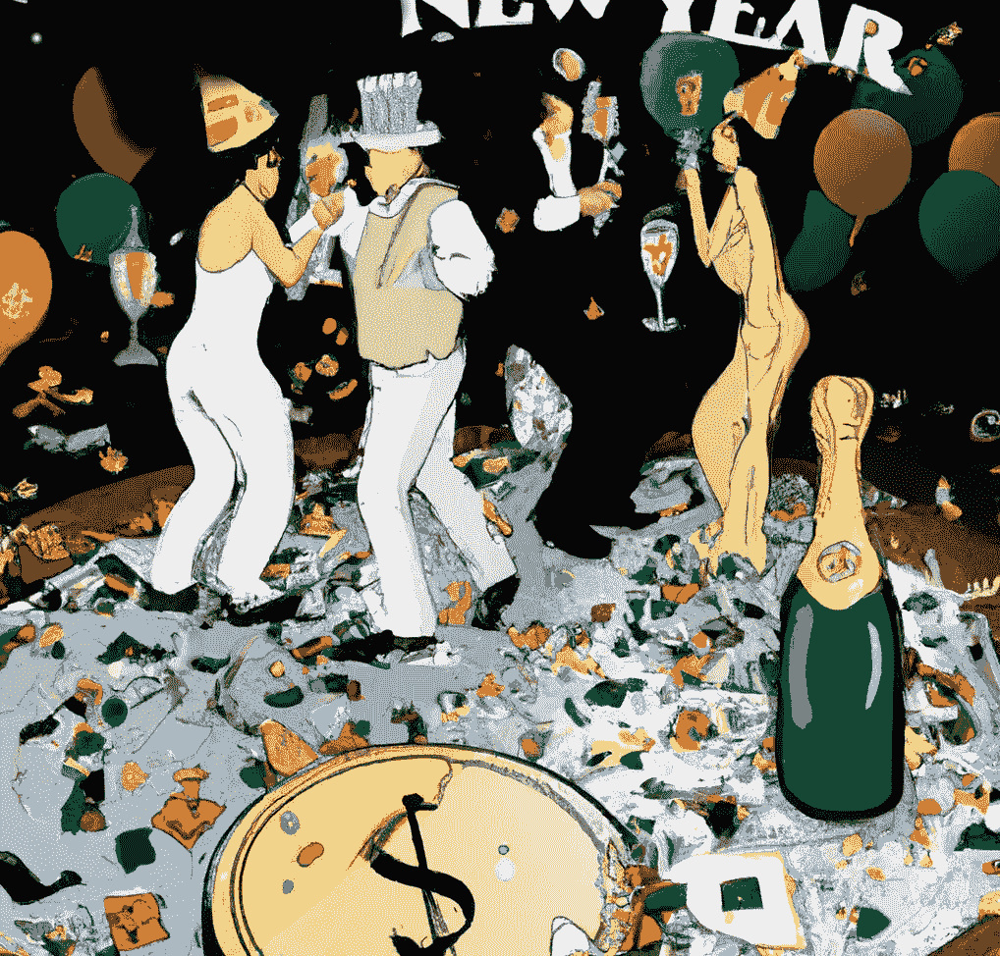

# 2023 年对 Crypto 来说会比 2022 年更好吗？

> 原文：<https://medium.com/coinmonks/will-2023-be-better-for-crypto-than-2022-eb8a45466d95?source=collection_archive---------19----------------------->

随着 2022 年接近尾声，我们期待明年会出现市场好转的迹象。

加密货币市场在 2022 年上半年经历了停滞和困难，比特币和以太坊等主要加密货币的价值从历史高点下跌了一半以上。市场受到了公司倒闭、利率上升和金融危机的影响