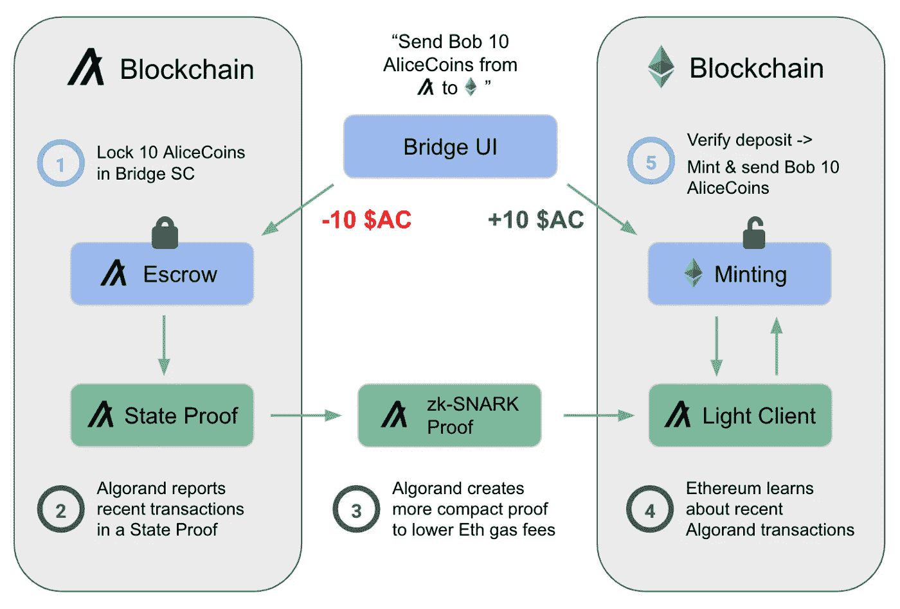
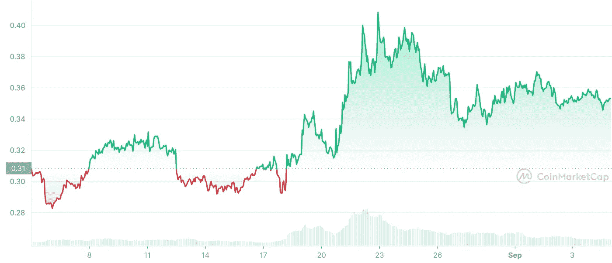

# 既然州证明已经成为一件事，阿尔格兰德会接管吗？

> 原文：<https://medium.com/coinmonks/will-algorand-take-over-now-that-state-proofs-are-a-thing-2ae505683309?source=collection_archive---------27----------------------->

9 月 7 日，Algorand 宣布了一项改变游戏规则的协议更新——状态证明和无信任交叉通信。此外，交易能力从 1200 万亿次提升至 600 万亿次。交易现在可以在不到 4 秒的时间内完成。这使得 Algorand 超过了 Visa，更不用说其他加密货币了。Algo Twitter 对这一新的更新赞不绝口，一些人甚至宣布击败以太坊，因为期待已久的合并已经完成。

为了实现这一目标，Algorand 将其块大小增加到 5 MiB，并将平均循环时间(块延迟)减少到<4s. By fitting more transactions into each block and producing blocks more frequently, the Algorand blockchain will be able to handle roughly 26,000 transactions per block at peak throughput, translating to 6,000 TPS. ([源](https://developer.algorand.org/articles/algorand-boosts-performance-5x-in-latest-upgrade/)

各地的算法专家都将这一更新视为游戏规则的改变者。在阿尔格兰德宇宙中，我们的目标是一个所有区块链人都可以一起玩的世界，而这次新的更新旨在实现这一目标。

“随着今天的发布，阿尔格兰德再次证明，去中心化不需要以牺牲性能或安全性为代价，”阿尔格兰德创始人希尔维奥·米卡利说。

“区块链之间的互操作性是未来的发展方向，而阿尔格兰德州证明是网络间通信的关键安全特性。我们为这一创新感到非常自豪，并相信它将推动整个区块链景观向前发展。”

[https://medium.com/algorand/algorand-state-proofs-707d64038e35](/algorand/algorand-state-proofs-707d64038e35)

那么像状态证明和不可信交叉通信这样的升级到底意味着什么呢？实际上，它们对阿尔格兰德的发展至关重要。阿尔格兰德公司高级产品经理诺亚·格罗斯曼说:

> “介绍阿尔格兰德州证明是一个新的区块链基础设施，连接阿尔格兰德和更广阔的世界。ASP 是一个【不可变的证据链】([https://people . csail . MIT . edu/nickolai/papers/micali-compact cert-eprint . pdf](https://people.csail.mit.edu/nickolai/papers/micali-compactcert-eprint.pdf))证明了阿尔格兰德区块链的状态。他们可以让任何人在低功耗环境中跟踪 Algorand 交易、余额和应用数据，如手机、智能手表，甚至在区块链智能合同中，而不会损害安全性——每个 ASP 都是由相同的分散网络产生的，这些网络在新的区块上达成[共识]([https://www.algorand.com/technology/pure-proof-of-stake])([来源](/algorand/algorand-state-proofs-707d64038e35))

Algorand 状态证明支持链到链的传输，而不需要具有高攻击脆弱性的不可靠的第三方桥。这些状态证明本身就变成了桥梁，可以很好地与任何利害关系证明区块链玩。

在 Algoverse 的所有网站中，对最新更新版的反应都很乐观。这就是让 Algorand 成为新的第 1 层王者的意义所在，尽管在撰写本文时 Ethereum 2.0 已经过时。

在撰写本文时，更新已在 Algorand Blockchain 上完全实现。这是否会产生阿尔戈兰德社区人士所说的影响？大约在 9 月中旬，当州政府公布证明时，Algorand 经历了一次价格上涨。从那时起，Algorand 的价值就开始稳步上升。只要看看 Coinmarketcap，你就会发现 Algorand 已经上涨，而 Ethereum、Polygon 和 Cardano 等公司的股票却在同一时期下跌。

$ALGO 1-month price history

我认为这次更新在价格上涨中发挥了重要作用，而且趋势慢慢开始向有利于 Algorand 的方向发展。尤其是在安东尼斯卡拉穆奇(Anthony Scaramucci)的新书发布之后，他作为一名机构投资者，在书中宣称阿尔戈兰德将是统治所有这些公司的人。FIFA+ NFT 系列将在世界杯之前推出，这将是 Algorand 的又一个利好。

更多的发展空间是一个积极的迹象，新的球员来建立产品的阿尔戈兰德区块链，这是迄今为止最不朽的改进之一。随着我们进入真正的寒冬，对 Algorand 来说，这可能并不是一个真正的数字寒冬。

> 交易新手？试试[加密交易机器人](/coinmonks/crypto-trading-bot-c2ffce8acb2a)或[拷贝交易](/coinmonks/top-10-crypto-copy-trading-platforms-for-beginners-d0c37c7d698c)