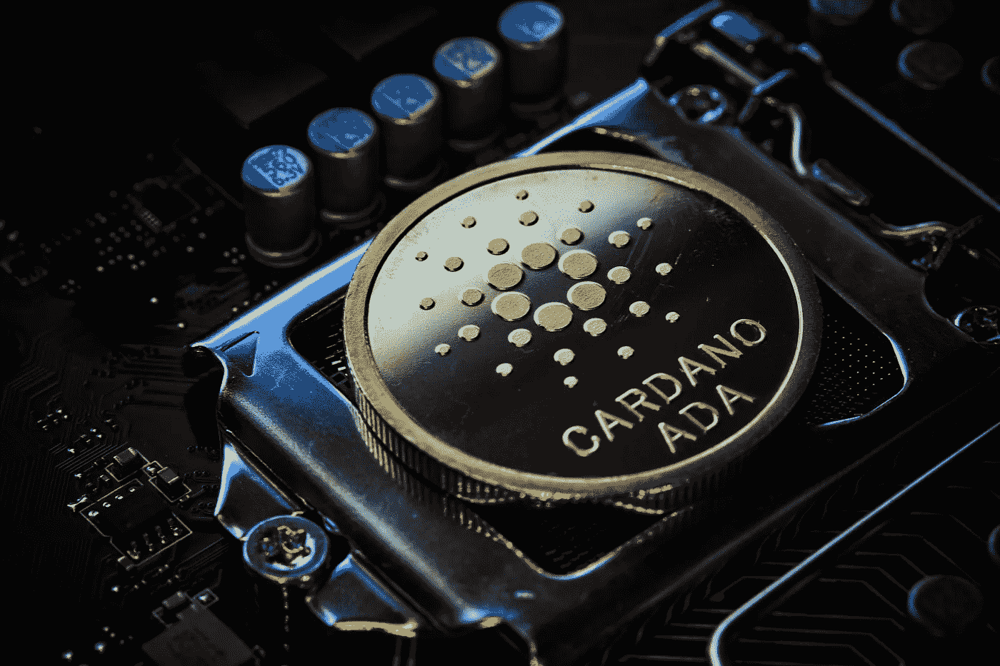
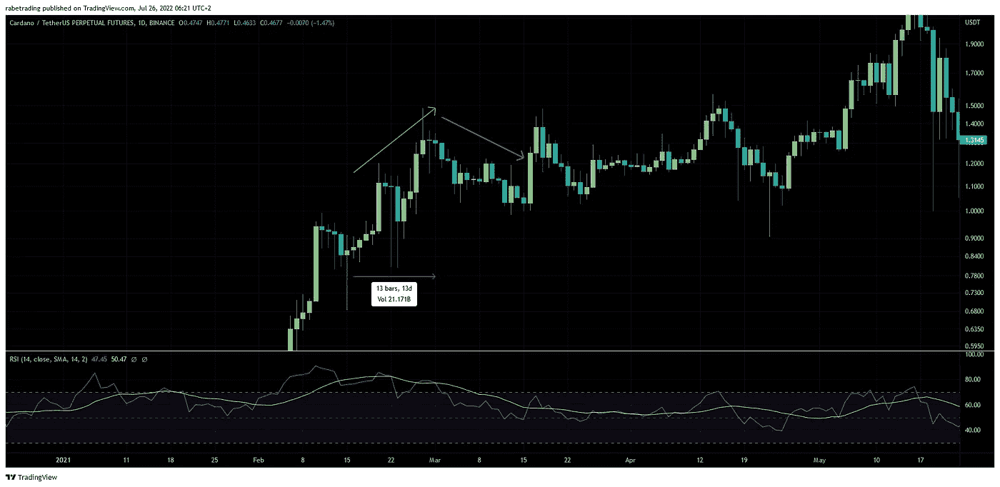
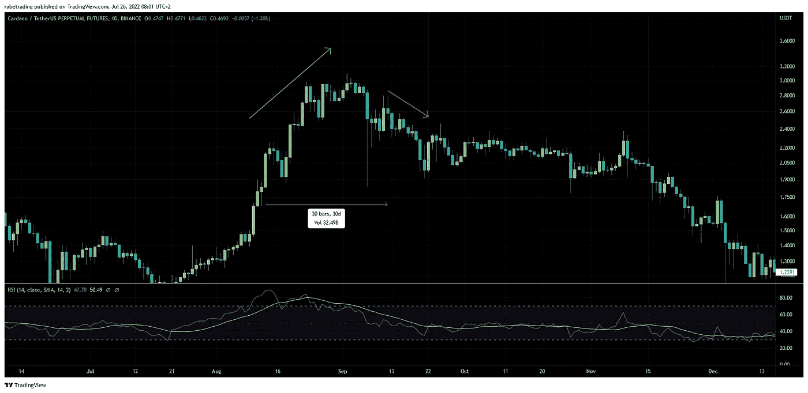
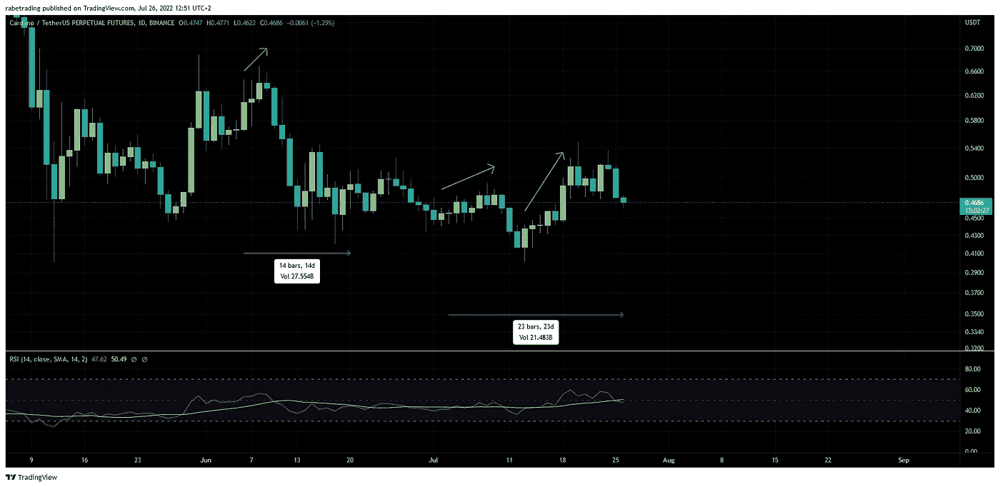

# 卡尔达诺本周最受期待的事件会影响其价格吗？

> 原文：<https://medium.com/coinmonks/will-cardanos-most-anticipated-event-this-week-make-it-s-price-move-7e7b98c1cb91?source=collection_archive---------37----------------------->

## 卡尔达诺的价格预计将在本周末有所上涨

上周，与其他加密货币一道， **Cardano ADA** 以 *14%的价格上涨*收盘。

然而，本周，**卡尔达诺硬币的价格**预计会有所动作，因为这是在 7 月 3 日宣布成功硬分叉测试网之后，预计 mainnet **Vasil 升级**的一周。

> “Vasil 升级将提供一些关键功能，以启动更多项目，并为现有 DApps 提供升级途径(带来更高的速度、交易能力和更强大的脚本)。有了 Vasil hard fork， *d* 参数也将被删除，因为批量生产现已完全分散；这将阻止重新联合”——蒂姆·哈里森

这些是社区&生态系统@输入输出全球副总裁 Tim Harrison 在他的[博客文章](https://iohk.io/en/blog/posts/2022/07/04/cardano-s-approaching-vasil-upgrade-what-to-expect/)中提到的**Vasil 升级**的主要好处。

## **这对卡达诺期货价格意味着什么？**

**卡尔达诺的价格**历来对硬分叉事件做出反应。

ADA/USDT price chart with focus on the period of the Mary Hard Fork event, Source: TradingView

*2021 年 2 月 16 日*Mary Hard Fork mainnet 发布会宣布于*2021 年 3 月 1 日*举行，如图所示 **ADA/USDT** 的价格开始上涨，导致 2021 年 2 月 24 日*发布会的确认消息*推动价格继续上涨，直到发布当天，之后价格下跌了近 21%。

ADA/USDT price chart with focus on the period of the Alonzo Hard Fork event, Source: TradingView

上图显示了从阿隆佐硬分叉事件宣布日到产品发布日的价格走势。虽然，这一次价格在发布前一周开始下跌，因为大量 FUD 导致整个市场下跌。

ADA/USDT price chart , Source: TradingView

*2022 年 6 月 6 日*2022 年 6 月 29 日 mainnet 上宣布 Vasil 升级，导致价格小幅上涨一段时间，如上图所示，之后由于负面消息影响整个市场而抛售。

后来，2022 年 6 月 20 日**mainnet**Vasil hard fork**被宣布延迟，以便能够确保升级将正确实施。然而，新发布日期的估计是在七月的最后一周。**

**2022 年 7 月 3 日*宣布 testnet 硬分叉成功，导致价格在倾销前开始缓慢上涨，然后回升并继续上涨。***

***考虑到 **Cardano ADA price** 在 Hard Fork 事件发生前几天的历史表现，预计在事件发生日之前的几天内价格将会上涨，之后将会下跌。***

***然而，不要忘记，以前的类似行为发生在牛市期间，而当前市场的性质是熊市，这会影响预期的结果。***

*   ********* 这篇博文只是一种观点，这不是一个财务建议或任何类型的建议，所有使用的信息都是在互联网上公开找到的！***

> ***交易新手？尝试[加密交易机器人](/coinmonks/crypto-trading-bot-c2ffce8acb2a)或[复制交易](/coinmonks/top-10-crypto-copy-trading-platforms-for-beginners-d0c37c7d698c)***