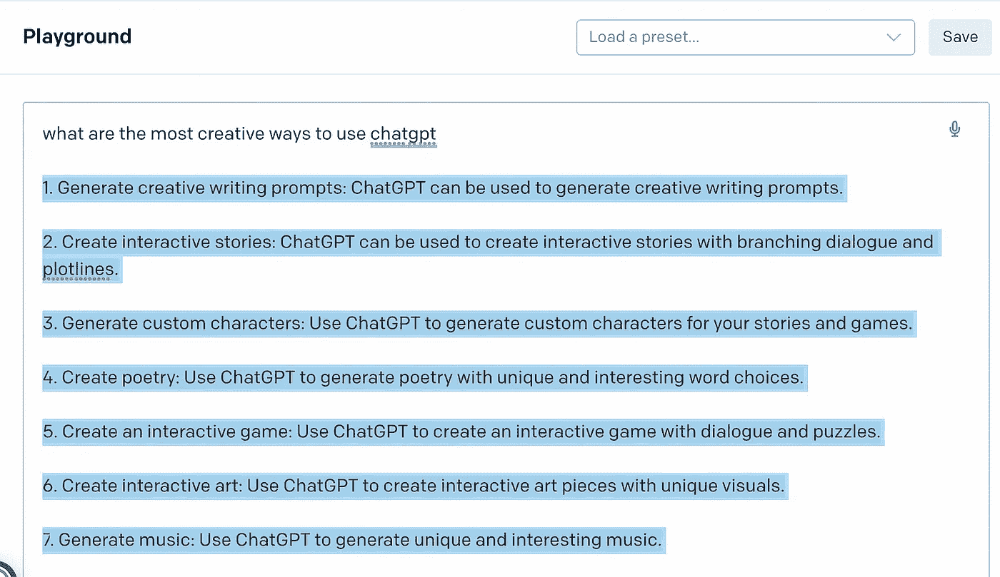
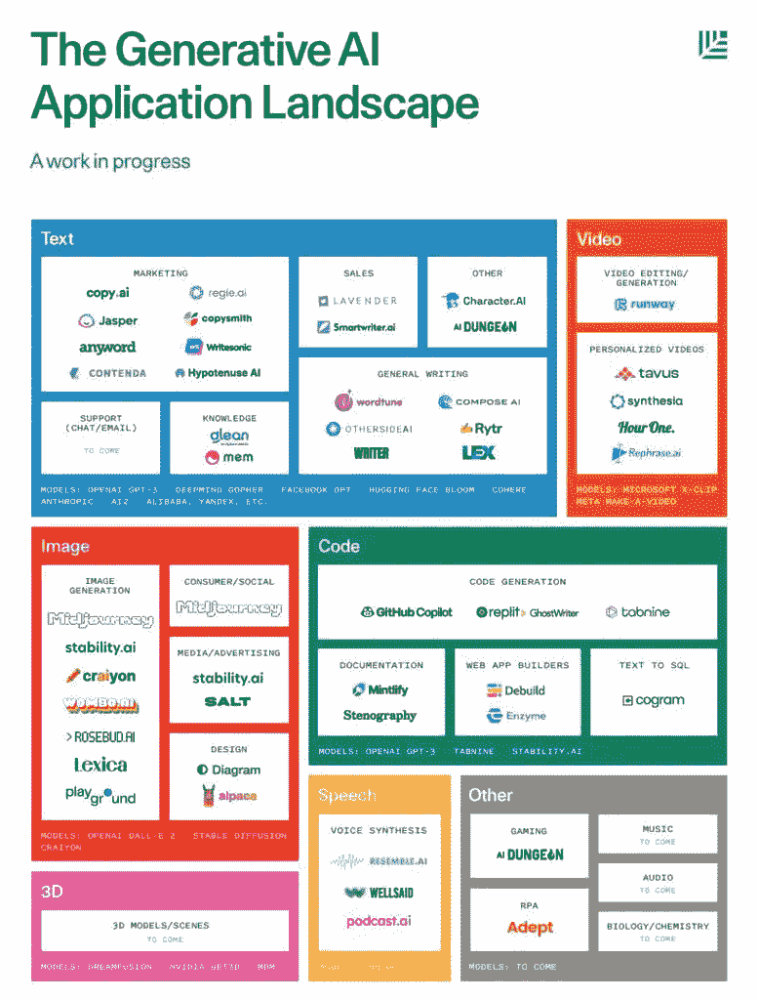
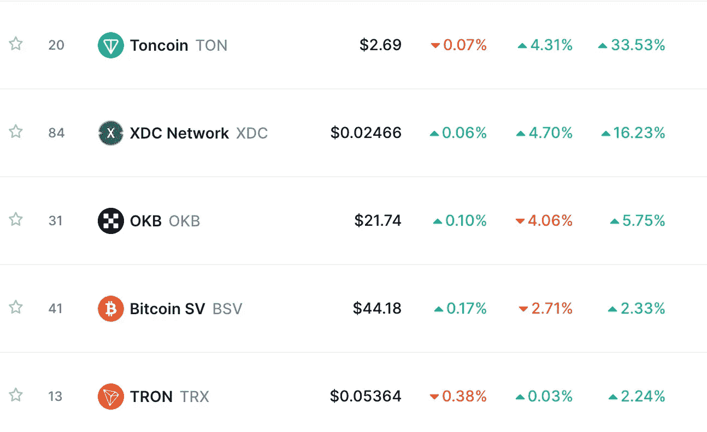

# 🤖ChatGPT 会改变世界吗？

> 原文：<https://medium.com/coinmonks/will-chatgpt-change-the-world-af49217f6625?source=collection_archive---------11----------------------->

*   🤖什么是 ChatGPT？
*   🦾什么是 Open.ai？
*   🦿How:人工智能正在迅速改变世界吗？
*   💰本周硬币
*   📰在 web3 世界里
*   🙏🏻感激…什么是 ChatGPT？

# 🤖什么是 ChatGPT？

ChatGPT 是由 [Open.ai](http://open.ai/) 开发的聊天机器人框架，它使开发人员能够快速轻松地创建虚拟代理或聊天机器人，可以与用户进行自然的、类似人类的对话。它由强大的自然语言处理(NLP)引擎提供支持，使其成为创建对话体验的理想工具。

在过去的几天里，有很多关于 ChatGPT 的报道，我们需要分享一些我们的研究，并了解这项令人惊叹的技术。

# 🦾什么是 Open.ai？

OpenAI 是一个致力于推进人工智能(AI)技术的研究实验室。OpenAI 由企业家埃隆·马斯克(Elon Musk)和萨姆·奥尔特曼(Sam Altman)于 2015 年创立，是一家由大量投资、拨款和捐赠资助的非营利研究机构。OpenAI 的使命是确保人工通用智能(AGI)造福全人类。OpenAI 致力于广泛的研究课题，包括计算机视觉、自然语言处理和机器人技术。

这些答案听起来很简单，但这项技术是一次革命性的飞跃，它将永远改变我们与人工智能的互动方式。聊天机器人已经发展了几十年，但最近发布的 chatGPT 非常不同，原因如下:

## 您可以用 ChatGPT 做什么:

*   翻译任何语言的文章
*   编辑
*   用任何计算机语言编写代码

嗯……我们来问问 ChatGPT:

现在你有了它…

1.生成创意写作提示:ChatGPT 可以用来生成创意写作提示。

2.创建交互式故事:ChatGPT 可以用来创建带有分支对话和情节主线的交互式故事。

3.生成自定义角色:使用 ChatGPT 为你的故事和游戏生成自定义角色。

4.创建诗歌:使用 ChatGPT 生成具有独特和有趣的单词选择的诗歌。

5.创建一个互动游戏:使用 ChatGPT 创建一个有对话和谜题的互动游戏。

6.创建互动艺术:使用 ChatGPT 创建具有独特视觉效果的互动艺术作品。

7.生成音乐:使用 ChatGPT 生成独特有趣的音乐。

8.创建教育内容:ChatGPT 可用于创建教育内容，如交互式测验和课程。

9.生成教学视频:使用 ChatGPT 生成具有引人入胜的视觉效果和对话的教学视频。

[赠送礼品订阅](https://yarocelis.substack.com/subscribe?&gift=true)

10.生成营销内容:使用 ChatGPT 生成广告和宣传视频等营销内容。

> ***这个为什么重要？*** *ChatGPT 是有史以来创造并发布的最先进的人工聊天机器人。谷歌有*[*deep mind*](https://www.deepmind.com/)*，这是一个非常先进的人工智能聊天机器人项目，但远不如 ChatGPT 透明，他们的发布也没有向公众开放。*
> 
> *许多科技作家和企业家认为，谷歌应该关注 ChatGPT 的功能和快速用例，因为它可能会挑战谷歌的搜索霸主地位和数字垄断地位，* ***作为回应，谷歌最近为 ChatGPT 创建了一个浏览器扩展，(添加到您的浏览器中*** [***这里***](https://chrome.google.com/webstore/detail/chatgpt-for-google/jgjaeacdkonaoafenlfkkkmbaopkbilf) ***)，并正在悄悄开发 deepmind 以增强其搜索和聊天服务。***

# 🦿人工智能是如何迅速改变世界的？

聊天机器人只是生成性人工智能应用前景的一小部分。就在我们说话的时候，有数百个应用程序正在由非常有创造力和聪明的企业家和投资者开发。正如我们所知，这些应用正在迅速改变世界。

[捐赠订阅](https://yarocelis.substack.com/subscribe?&donate=true)

除了上图中包含的应用程序，还有其他公司，将人工智能带到了另一个水平。那个层面是直达大脑层面的。

[贝莱德神经科技](https://blackrockneurotech.com/)成立于 2008 年，是全球领先的 BCI 技术平台公司，站在实现人类 BCI(脑机接口)的最前沿。Blackrock 是世界上唯一一家拥有植入式穿透阵列的公司，每个设备上有近 100 个电极，已经获得 FDA 批准并用于人体。有些病人甚至使用几个设备。

迄今为止，全世界有 36 名患者患有 BCI，其中 32 人使用了贝莱德的技术。在创造大脑接口方面取得巨大进步的其他公司有 [Neuralink](http://neuralink.com/) 、 [Paradromics](http://paradromics.com/) 和 [synchron](https://synchron.com/) 。

**BCI** ，是大脑的电活动和外部或内部设备之间的直接通信路径，最常见的是计算机或机器人肢体。脑机接口通常旨在研究、绘制、辅助、增强或修复人类的认知或感觉运动功能。根据电极与脑组织的接近程度，脑机接口的实施范围从非侵入性([脑电图](https://en.wikipedia.org/wiki/Electroencephalography)、[脑磁图](https://en.wikipedia.org/wiki/Magnetoencephalography)、 [EOG](https://en.wikipedia.org/wiki/Electrooculography) 、[核磁共振](https://en.wikipedia.org/wiki/Magnetic_resonance_imaging))和部分侵入性( [ECoG](https://en.wikipedia.org/wiki/Electrocorticography) 和血管内)到侵入性([微电极阵列](https://en.wikipedia.org/wiki/Microelectrode_array))。

AI 能够每分钟创建数千幅图像，数千或数百万用户可以使用不同的同时生成文章，编辑文本，翻译，生成艺术，并生成视频和音频。这项技术可以学习如何混合和控制音轨，让许多音频工程师失业。它可以比任何编辑团队更快地编辑视频，并学习如何根据制作人的偏好和风格进行编辑。它能够更准确地检测疾病，因为它来自数百万个数据点，这可能会改变医疗行业的游戏规则。程序员现在必须更有创造力，因为只写代码的能力可能更适合机器人。

天空是这项技术的极限。正如爱因斯坦曾经说过的，“想象力比知识更重要。”今天，这句话比以往任何时候都更重要。提出更好的问题的能力将比以往任何时候都更重要，因为我们仍在为这些技术创造提示。

**想象**不同的新艺术形式，**创造**解决问题和自动化事物的新方法，让人工智能执行将是人类的超能力。

# 💰本周硬币

[Toncoin (TON)](http://ton.org/) 是加密消息平台 Telegram 于 2018 年开发的一种去中心化[第一层区块链](https://coinmarketcap.com/alexandria/glossary)。该项目随后被放弃，由 TON 基金会接管，并从“电报开放网络”更名为“开放网络”。

自 2020 年以来，这项技术一直在发展，这要归功于一个非商业性的支持者团体和一个自称为 TON 基金会的独立爱好者社区。Toncoin，原名 Gram，是 TON 网络的原生加密货币。

最初的想法是将 TON 集成到一个易于使用的应用程序中，允许用户购买/发送/存储资金。客户支付交易费用，并使用 TON 来结算付款或验证交易。Toncoin 利用[利益证明](https://coinmarketcap.com/alexandria/glossary/proof-of-stake-pos) (PoS)共识模型实现网络可扩展性和可靠性。根据该项目网站，该平台为其客户提供快速、透明和安全的支付服务，以最少的费用和第三方应用程序促进交易。

[团购](https://yarocelis.substack.com/subscribe?group=true)

# 📰在 web3 世界里

*   [无银行公司在英国和欧洲国家推出加密支付卡](https://www.coinspeaker.com/unbanked-crypto-card-uk-european-countries/)
*   柴犬代币的涨幅达到两位数；这对 SHIB 来说意味着什么
*   [以太坊鲸在 5 年不活动后转移了价值近 3000 万美元的 ETH](https://beincrypto.com/ethereum-whales-transferred-nearly-30m-worth-eth-5-years-inactivity/)
*   [价值 100 多万美元的无聊猿收藏被盗，社会工程再次来袭](https://bitcoinist.com/1m-bored-ape-collection-stolen/)
*   [比特币价格和以太坊预测；突破形态将推动价格走势](https://cryptonews.com/news/bitcoin-price-ethereum-prediction-breakout-patterns-will-drive-price-action.htm)
*   [唐纳德·特朗普可能在推出之前就已经打造了自己的 NFTs:分析师](https://beincrypto.com/donald-trump-may-minted-own-nfts-before-launch-analyst/)
*   [尼日利亚将通过承认比特币和加密货币的法案](https://cointelegraph.com/news/nigeria-set-to-pass-bill-recognizing-bitcoin-and-cryptocurrencies)

> 交易新手？试试[加密交易机器人](/coinmonks/crypto-trading-bot-c2ffce8acb2a)或者[复制交易](/coinmonks/top-10-crypto-copy-trading-platforms-for-beginners-d0c37c7d698c)