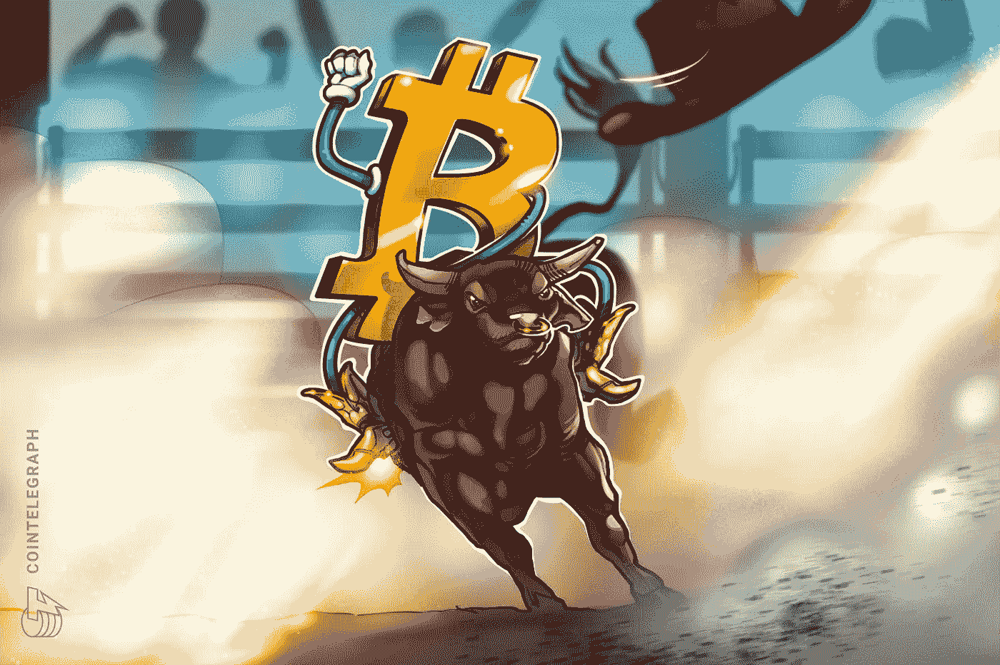
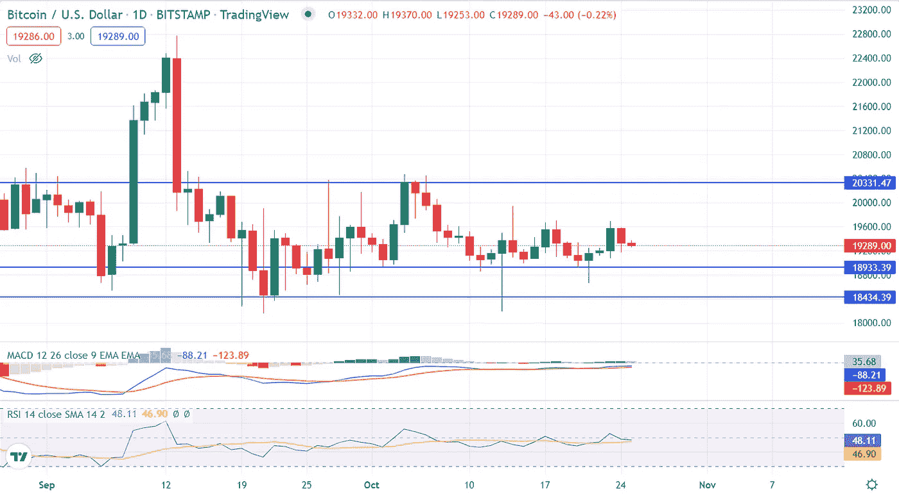
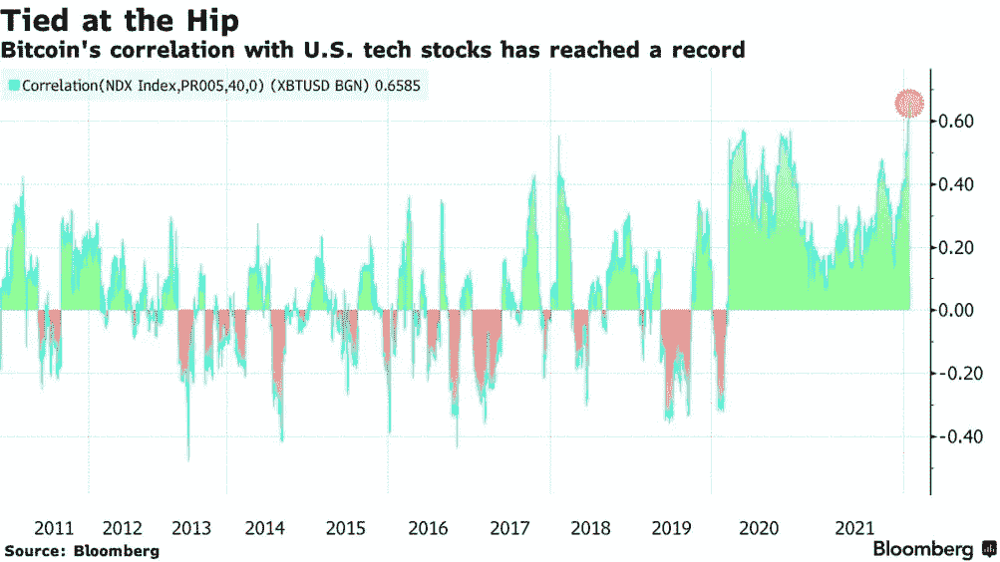

# Crypto 会恢复吗？下面是现在要考虑的！

> 原文：<https://medium.com/coinmonks/will-crypto-recover-heres-what-to-consider-now-829057cf255e?source=collection_archive---------32----------------------->

Image Source: Cointelegraph

2022 年，市场将迎来熊市反弹。去年 2021 年 11 月，比特币和其他替代硬币达到了 68000 美元的历史最高水平，以太坊几乎突破了 4500 美元。

然而，监管干预和不确定的地缘政治事务造成了供应紧缩的通胀，并在整体货币市场上引发了衰退的生态系统。

美联储为控制通胀而加息和缩减流动性，牺牲了货币市场的增长。随着我们进入 2023 年，市场可能会扭转局面，为乐观情绪的投资者带来积极的影响。

从市场图表来看，比特币挂在 19000 美元的支撑上，给出了一个好坏参半的信号，要么继续下跌，要么标志着牛市的开始。

随着世界进入 2023 年，还有两个月的时间，作为一名投资者，这里有一些事情需要考虑。

## 排名第一的比特币价格显示出整个月的稳定性:

1-day Bitcoin price chart showing stable price movement between upper resistance (upper blue line) and middle blue line support averaging around $19,000

加密市场以其最高的波动指数和巨大的风险回报而闻名。这一次，比特币惊人地保持稳定，在 19000 美元的支撑位更具预测性。遵循比特币图表模式，其他替代币目前在固定价格带宽内移动。

美国联邦政府的货币政策对利率上升时的价格波动有很大的影响。但这一次，负面的 CPI 报告和加息并没有像 2022 年 9 月之前那样对货币市场产生显著影响。

比特币在利率上升的情况下保持弹性，表明投资者在积累比特币，持有人多于卖家。再过几个月，加密市场就要迎来比特币的涨势了！

## # 2 加密货币市场与股票市场有着完美的相关性:

Image Source: [Bloomberg.com](https://www.bloomberg.com/news/articles/2022-01-25/bitcoin-is-moving-in-tandem-with-stocks-like-never-before-chart) — 0.6 is the current correlation index showing the highest in 2022 for Bitcoin with the stock market.

加密货币属于投机资产，对财富管理公司来说，回报快，风险高。加密市场的[工作原理与股票市场非常相似。](/coinmonks/know-how-cryptocurrency-and-economics-go-together-833a1e7bd3a5)

在过去的两个月里，比特币已经证实了其价格变动与实时股市价格变动的关系，并为希望获得更多可预测性的投资者建立了强大的相关性。

在最近的趋势中，比特币正在强烈追随标准普尔 500、纳斯达克和其他股票市场的市场模式，其余的替代币也在追随比特币的脚步。

## #3 澳大利亚成为首个发布央行数字货币白皮书的国家:

Image Source; The Coin Republic

2022 年 9 月 27 日，澳大利亚发布了关于其 CBDC(央行数字货币)的白皮书，以探索加密货币的优势，并为其经济中的数字美元制定发展计划。

它陈述了将澳元转换为区块链技术的目的、目标和行动计划。

拥有 CBDC 有助于实现交易问责制，并确保投资者买卖加密货币的可信数字货币媒介。银行也可以为加密货币提供银行方案和设施。

## 底线是:

> 专业投资者有句谚语，“在每个人恐惧时投资，在每个人贪婪时卖出”。

对于寻求投资加密市场的投资者来说，购买比特币或以太坊以及像币安币这样的关键货币，索拉纳币是一个完美的选择。

 [## Prajwal Barate -培养基

### 阅读 Prajwal Barate 在媒体上的文章。学生、山地自行车手、加密货币分析师和有抱负的内容…

medium.com](/@barateprajwal25) 

> 感谢阅读这篇文章，更多更新和见解，请点击上面的链接关注我的个人资料，并为下面的努力鼓掌。

> 交易新手？试试[密码交易机器人](/coinmonks/crypto-trading-bot-c2ffce8acb2a)或者[复制交易](/coinmonks/top-10-crypto-copy-trading-platforms-for-beginners-d0c37c7d698c)