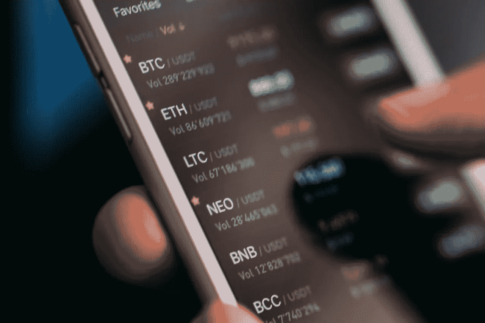

# 2023 年加密货币会增长吗？

> 原文：<https://medium.com/coinmonks/will-cryptocurrency-grow-in-2023-be21882ad1ce?source=collection_archive---------13----------------------->

加密货币是一种数字或虚拟货币，它使用加密技术来实现安全性，并且是分散的，这意味着它不受任何单一实体的控制。近年来，加密货币(特别是比特币)的兴起引起了人们的极大关注，许多专家预测，在未来几年，加密货币只会继续增长。以下是加密货币有望在 2023 年实现显著增长的一些原因。

# 主流企业采用率提高

广泛采用加密货币的最大障碍之一是缺乏主流企业的支持。然而，随着越来越多的公司开始接受加密货币作为一种有效的支付形式，这种情况开始发生变化。这包括像微软、Overstock.com 和美国电话电报公司这样的大公司，以及不同行业的小公司。

随着越来越多的企业开始接受加密货币，消费者使用加密货币将变得更加方便，这反过来将导致更多人采用加密货币。这将形成一个正反馈循环，更多的企业开始接受加密货币，因为更多的消费者正在使用它，而更多的消费者开始使用它，因为更多的企业正在接受它。

# 改进的法规

加密货币发展的另一个主要障碍是缺乏明确的监管。这使得企业难以接受加密货币，消费者也难以放心使用。然而，随着全球越来越多的政府开始为加密货币制定明确的法规，这一障碍将开始消失。

完善的监管将为企业和消费者提供更大的法律确定性，这将使他们更容易使用加密货币。这也将使企业更容易将加密货币集成到他们现有的支付系统中，进一步增加其采用。

# 机构投资增加

近年来，加密货币市场的最大趋势之一是机构投资者越来越多的参与。这包括主要的投资银行、对冲基金和其他金融机构。这些投资者被加密货币提供高回报和多样化投资组合的潜力所吸引。

随着越来越多的机构投资者进入市场，他们不仅会带来资本，还会带来管理风险和驾驭金融市场的专业知识。这将提高加密货币市场的整体稳定性，使其对企业和消费者都更具吸引力。

# 更易接近和方便用户

加密货币尚未被主流采用的一个主要原因是，非技术用户可能难以理解和使用。然而，随着加密货币背后的技术不断发展，它变得越来越容易获得和用户友好。

例如，现在有许多加密货币钱包被设计为易于使用，即使对于那些没有加密货币经验的人也是如此。还有越来越多的服务允许用户使用信用卡等传统支付方式轻松买卖加密货币。

随着加密货币变得更容易获得和用户友好，它将对更广泛的受众更具吸引力，从而导致更多的采用。

# 结论

自首次推出以来，加密货币已经走过了漫长的道路，但在被主流采用之前，它还有很长的路要走。然而，随着主流企业采用率的提高，监管的改善，机构投资的增加，以及更好的可访问性和用户友好性，毫无疑问，加密货币将在 2023 年及以后出现显著增长。

> 交易新手？试试[加密交易机器人](/coinmonks/crypto-trading-bot-c2ffce8acb2a)或者[复制交易](/coinmonks/top-10-crypto-copy-trading-platforms-for-beginners-d0c37c7d698c)
> 
> 加入 Coinmonks [电报频道](https://t.me/coincodecap)和 [Youtube 频道](https://www.youtube.com/c/coinmonks/videos)获取每日[加密新闻](http://coincodecap.com/)

# 另外，阅读

*   [复制交易](/coinmonks/top-10-crypto-copy-trading-platforms-for-beginners-d0c37c7d698c) | [加密税务软件](/coinmonks/crypto-tax-software-ed4b4810e338)
*   [网格交易](https://coincodecap.com/grid-trading) | [加密硬件钱包](/coinmonks/the-best-cryptocurrency-hardware-wallets-of-2020-e28b1c124069)
*   [密码电报信号](/coinmonks/top-3-telegram-channels-for-crypto-traders-in-2021-8385f4411ff4) | [密码交易机器人](/coinmonks/crypto-trading-bot-c2ffce8acb2a)
*   [最佳加密交易所](/coinmonks/crypto-exchange-dd2f9d6f3769) | [印度最佳加密交易所](/coinmonks/bitcoin-exchange-in-india-7f1fe79715c9)
*   开发人员的最佳加密 API
*   最佳[密码借贷平台](/coinmonks/top-5-crypto-lending-platforms-in-2020-that-you-need-to-know-a1b675cec3fa)
*   [免费加密信号](/coinmonks/free-crypto-signals-48b25e61a8da) | [加密交易机器人](/coinmonks/crypto-trading-bot-c2ffce8acb2a)
*   杠杆代币的终极指南