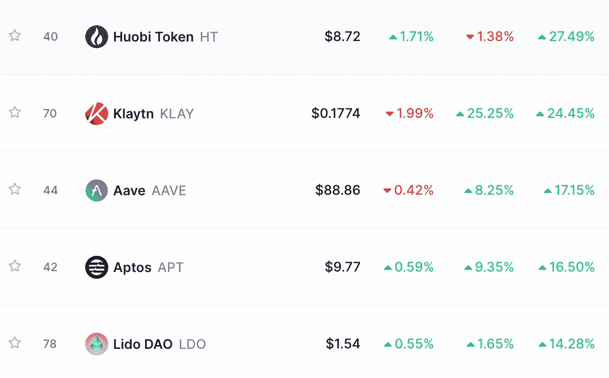

# DeFi 会被监管吗？

> 原文：<https://medium.com/coinmonks/will-defi-be-regulated-a8abce35dd23?source=collection_archive---------52----------------------->

*   👮DeFi 会被监管吗？
*   🗳️为中期选举筹集秘密资金
*   💰本周硬币
*   🌾高产农业:指南。
*   📰热门阅读
*   🙏🏻感激…

# 👮DeFi 会被监管吗？

今年对 DeFi 来说是缓慢的一年，也是平淡无奇的一年。但是这项技术在前两年经历了指数增长。2020 年 2 月中旬，分散融资(DeFi)应用程序锁定的总价值首次超过 10 亿美元。在 2020 年夏天的刺激下，不到一年时间，它就翻了 20 倍，达到 200 亿美元(T3)，再过 10 个月就达到 2000 亿美元。鉴于目前的增长速度，想象 DeFi 市场在一两年内达到一万亿美元似乎并不奇怪。

鉴于这一领域的分散性，这给监管者造成了两难境地。大多数[加密](http://ycobitcoin.com/)平台对客户端有很强的 KYC 要求。在 DeFi 空间，不需要这样的要求，允许任何人，包括匿名玩家，带着钱包参与。

对许多投资者来说，这是分散融资的主要目的，对监管者来说，这是一个危险信号。本周，山姆·班克曼-弗里德(他的首字母缩写为 SBF)写了一份草案[和一套标准，该行业可以在等待全面的联邦监管制度时制定这些标准，以提高透明度并保护消费者。](https://www.ftxpolicy.com/posts/possible-digital-asset-industry-standards)

这位美国企业家、亿万富翁和投资者共同创立了加密货币交易所 FTX，他提到这将被视为行业规范手册，试图建立共识，他们相信这种结构并不完全正确——这只是一个草案。

另一方面，比特币基地首席执行官 Brian Armstrong 说分散化的金融应该受到保护，避免监管过度。

> ***‍Why 这个重要吗？像 Sam 这样的投资者和企业家开始对该领域的监管大声疾呼，许多投资者在这个非常重要的问题上偏袒一方。我们可以期待在这个问题上有更多的反馈，并且肯定会有更多因地理区域而异的规定。***
> 
> 监管机构认为，大量非法获得的资产在 DeFi 协议中自由交易，必须采取措施阻止这种情况，并揭露这些交易的幕后黑手。对于我们其余的人来说，这意味着更多的税收，更少的使用我们选择的任何协议的自由。

# 🗳️为中期选举筹集秘密资金

美国中期选举将于 11 月 8 日举行。通常，候选人依靠现金捐款。2021 年和 2022 年选举的州候选人、政党委员会和投票措施委员会预计将筹集超过 70 亿美元，一项新的 [OpenSecrets](https://www.opensecrets.org/news/2022/10/state-level-midterm-election-fundraising-on-track-to-exceed-7-billion/) 对州级竞选财务披露项目的分析显示。

今年情况有所不同，因为秘密筹款初创公司将目光投向了中期选举捐款。Engage Raise 是 Engage Lab 于 2022 年 7 月推出的捐赠平台，目前与 16 名国会候选人合作，以促进加密货币捐款。

[团队](https://blockworks.co/crypto-fundraising-startup-sets-sights-on-midterm-election-donations/)拒绝评论候选人通过该平台收到了多少捐款，但表示平均每个捐款人大约 1000 美元。最受欢迎的捐赠代币是 USDC 稳定币，其次是以太坊的本地币[ETH](http://ycobitcoin.com/)。

> ***这为什么重要？****——在资本主义政治经济中，金钱主宰一切。你的腰包越鼓，候选人传达信息的营销能力就越强，他/她在选民中就越受欢迎。秘密捐款意味着捐赠者可以从世界任何地方以更匿名的方式捐钱，但仍然有一个议程给接受他们捐款的候选人。*

[捐赠订阅](https://yarocelis.substack.com/subscribe?&donate=true)

# 今天的时事通讯由[优托邦之旅](https://youtopianjourney.substack.com/)为您带来

> 你拥有伟大的内在！YouTopian Journey 在这里用我们定制的漫画书中改变生活的知识和独特的艺术作品来帮助你唤醒它！YouTopian Journey 提供每周激励和智慧，帮助你变得更加强大，实现你的潜力。

# 💰本周硬币

> [*火币令牌*](https://coinmarketcap.com/currencies/huobi-token/) *(HT)过去一周涨幅接近 28%。原因之一是* [*Tron*](http://tron.network/) *创始人孙正义透露，他拥有* [*火币*](https://beincrypto.com/price/huobi-token/) *的“数千万”，天后加入该平台担任顾问。消息传出后，硬币的价格几乎翻了一番。*

HT 是加密货币交易所 Huobi Global 的原生令牌。它是一种基于以太坊区块链的分散式数字资产，符合 ERC-20 协议。HT 的价值部分依赖于 Huobi 加密交易所的声誉，但其他因素也有影响。

# 🌾高产农业:指南。

收益农业是一种投资加密货币**以获得额外回报**的方法。产量农场是依赖智能合约的分散式金融投资工具。对于优先考虑积极回报的投资者来说，收益率农场可能会提供高利率，包括超过 100%。

# 快速事实:

*   收益农业是代币持有者在各种 DeFi 平台上最大化奖励的过程。
*   收益农民向各种代币对提供流动性，并以加密货币赚取回报。
*   高产农业协议包括 Aave、Curve Finance、Uniswap 和许多其他协议。
*   由于价格波动、拉地毯、精明的合同黑客等原因，高产农业可能是一种有风险的做法。

# 高产农业的类型:

*   **流动性提供者**:用户将两枚硬币存入一个 DEX，提供交易流动性。交易所收取少量费用来交换这两种代币，并支付给流动性提供者。这项费用有时可以用新的流动性池(LP)代币支付。
*   **贷款**:硬币或代币持有者可以通过智能合同将 crypto 借给借款人，并从贷款利息中获得收益。
*   借款:农民可以用一个代币作为抵押，获得另一个代币的贷款。然后，用户可以用借来的硬币耕种。通过这种方式，农民保留了他们最初持有的硬币，随着时间的推移，这些硬币可能会增值，同时也从他们借来的硬币中获得收益。
*   **赌注**:在 DeFi 的世界里有两种形式的赌注。主要形式是在区块链的[proof-of-stage](https://blockworks.co/proof-of-work-vs-proof-of-stake-whats-the-difference/)上，用户向网络抵押他们的令牌以提供安全保障，从而获得利息。第二种是用流动性来抵押从提供 DEX 中获得的 LP 代币。这使得用户可以赚取两倍的收益，因为他们为 LP 代币提供流动性而获得报酬，然后他们可以下注以赚取更多的收益。

# 风险

风险农业有许多风险，投资者在开始之前应该了解。在 DeFi yield 农业领域，欺诈、黑客、地毯和波动性导致的损失并不罕见。对于任何希望使用 DeFi 的人来说，第一步是研究最值得信赖和经过测试的平台。

[分享](https://yarocelis.substack.com/p/will-defi-be-regulated?utm_source=substack&utm_medium=email&utm_content=share&action=share&token=eyJ1c2VyX2lkIjo4NzI4NzQyLCJwb3N0X2lkIjo4MDA4MzMzNywiaWF0IjoxNjY2NTc5NzU4LCJleHAiOjE2NjkxNzE3NTgsImlzcyI6InB1Yi0yODIwMjIiLCJzdWIiOiJwb3N0LXJlYWN0aW9uIn0.PxHVpts8XQhV5xDPlOclD0iU6nSHFCeef64jm6OSP5Q)

# 📰热门阅读

*   [XRP 在市场不确定期间以红色交易](https://www.newsbtc.com/analysis/xrp/xrp-trades-in-red-during-the-market-uncertainty/)
*   [市场:比特币、以太、多边形增益；美国股市出现 6 月以来最大涨幅](https://forkast.news/headlines/markets-bitcoin-ether-polygon-equities-june/)
*   [快速的技术采用和人才使印度成为全球网络 3 市场的重要参与者:研究](https://cryptopotato.com/rapid-tech-adoption-and-talents-make-india-a-key-player-in-global-web3-market-study/)
*   [芒果市场黑客 rugpulls Mango Inu 警告投资者“肯定会输掉你所有的钱”](https://cryptoslate.com/mango-markets-hacker-rugpulls-mango-inu-after-warning-investors-would-definitely-lose-all-your-money/)
*   [比特币基地首席执行官 Brian Armstrong 表示，分散式金融应该受到保护，避免监管过度](https://dailyhodl.com/2022/10/23/coinbase-ceo-brian-armstrong-says-decentralized-finance-should-be-protected-from-regulatory-overreach/)
*   [比特币将在 2023 年激增——但小心你的愿望](https://cointelegraph.com/news/bitcoin-will-surge-in-2023-but-be-careful-what-you-wish-for)

> 交易新手？试试[加密交易机器人](/coinmonks/crypto-trading-bot-c2ffce8acb2a)或者[复制交易](/coinmonks/top-10-crypto-copy-trading-platforms-for-beginners-d0c37c7d698c)