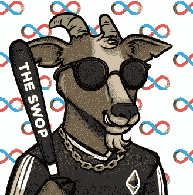

# 电子竞技会成为密码产业的主要贡献者吗？

> 原文：<https://medium.com/coinmonks/will-esports-be-a-major-contributor-to-the-crypto-industry-638729040be1?source=collection_archive---------27----------------------->

随着电子竞技游戏(或称电子竞技)的持续增长和吸引更多关注，它也开始与加密货币的世界相交。随着职业球员和球队在锦标赛和联赛中争夺巨额奖金，一些人转向加密货币作为支付手段。但这两个新兴产业之间的关系是什么，加密货币可能对电子竞技的未来产生什么影响？

加密货币对电子竞技的主要吸引力之一是其促进国际交易的能力。电子竞技比赛的奖金通常可以达到数百万美元，而转移如此巨额资金的传统方法可能既慢又昂贵。另一方面，加密货币提供了一种方便、安全的方式来进行这些交易，而无需银行或其他金融中介。

> 交易新手？在[最佳密码交易所](/coinmonks/crypto-exchange-dd2f9d6f3769)上尝试[密码交易机器人](/coinmonks/crypto-trading-bot-c2ffce8acb2a)或[复制交易](/coinmonks/top-10-crypto-copy-trading-platforms-for-beginners-d0c37c7d698c)

除了让转移奖金变得更加容易，在电子竞技中使用加密货币还可以吸引更多的赞助商和投资者进入该行业。赞助商和投资者总是在寻找新的和创新的方式来参与新兴产业。在电子竞技中使用加密货币可以被视为该行业愿意接受新技术并保持领先的信号。

然而，值得注意的是，加密货币和电子竞技之间的关系仍处于早期阶段，很难准确预测它将如何发展。虽然加密货币可能在电子竞技的增长和发展中发挥作用，但它只是影响该行业的众多因素之一。

在电子竞技中采用加密货币的一个潜在挑战是，它仍然是一项相对较新且复杂的技术，许多人可能需要帮助理解它的工作原理，或者对使用它犹豫不决。对于那些需要更加熟悉加密货币，并可能被使用加密货币进行交易的想法所吓倒的人来说，这可能尤其如此。

*重要注意事项👇*

为了克服这一挑战，电子竞技组织和团队有必要提供关于加密货币如何工作以及如何在行业中使用的清晰简明的信息。这可能包括教育材料、支持资源和客户服务，以帮助人们开始在电子竞技中使用加密货币。

*(👆这正是山羊玩家道的目标🐐💡)*

在电子竞技中采用加密货币的另一个潜在挑战是，它是一种高度不稳定的资产，价格波动很快。这可能会让团队和玩家难以规划未来，因为他们可能需要计算出特定加密货币在任何特定时间的价值。

为了应对这一挑战，电子竞技组织应该开发更稳定的加密货币形式，或者结合加密货币使用更传统的货币形式。例如，他们可以使用各种加密货币和法定货币(政府发行的货币，如美元)来提供更稳定和可预测的支付形式。

尽管存在这些挑战，但在电子竞技中使用加密货币有可能成为行业和技术的双赢。对于电子竞技来说，采用加密货币可以带来更多的赞助商和投资者，以及更有效和安全的转移奖金的方式。对于加密货币来说，电子竞技等不断增长和受欢迎的行业的采用可能会增加其主流接受和采用。

随着电子竞技和加密货币之间的关系继续发展，关注这两个行业如何互动以及它们如何塑造彼此的未来将是至关重要的。虽然很难准确预测未来会发生什么，但很明显，电子竞技和加密货币都有可能从彼此日益增长的联系中受益。

山羊游戏玩家的文章🎮🐐

推特🔗👇
[https://twitter.com/GoatedGamerDAO](https://twitter.com/GoatedGamerDAO)

Swop 推特🔗👇https://twitter.com/The_Swop

加入我们的 DSCVR 游戏门户网站🎮🔗👇
[https://dscvr.one/p/gaming-portal](https://dscvr.one/p/gaming-portal)

> 加入 Coinmonks [电报频道](https://t.me/coincodecap)和 [Youtube 频道](https://www.youtube.com/c/coinmonks/videos)了解加密交易和投资

# 另外，阅读

*   [8 大加密附属计划](https://coincodecap.com/crypto-affiliate-programs) | [eToro vs 比特币基地](https://coincodecap.com/etoro-vs-coinbase)
*   [最佳以太坊钱包](https://coincodecap.com/best-ethereum-wallets) | [电报上的加密货币机器人](https://coincodecap.com/telegram-crypto-bots)
*   [交易杠杆代币的最佳交易所](https://coincodecap.com/leveraged-token-exchanges) | [购买弗洛基](https://coincodecap.com/buy-floki-inu-token)
*   [3 commas vs Pionex vs Cryptohopper](https://coincodecap.com/3commas-vs-pionex-vs-cryptohopper)|[Bingbon Review](https://coincodecap.com/bingbon-review)
*   [加密复制交易平台](/coinmonks/top-10-crypto-copy-trading-platforms-for-beginners-d0c37c7d698c) | [如何在 WazirX 上购买比特币](/coinmonks/buy-bitcoin-on-wazirx-2d12b7989af1)