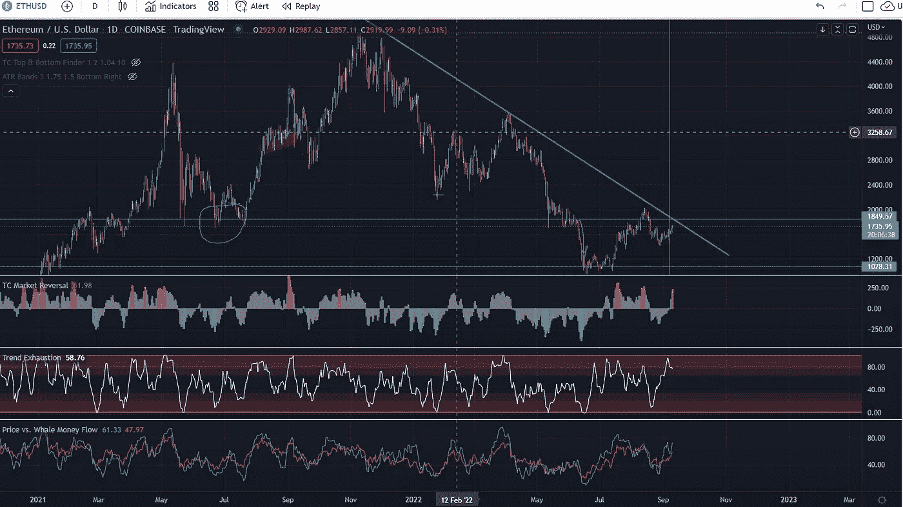

# 以太坊会打破临界阻力反弹吗？

> 原文：<https://medium.com/coinmonks/will-ethereum-break-critical-resistance-and-rally-55227b4cb3af?source=collection_archive---------37----------------------->

我的回答是双重的…

根据指标，我的猜测是否定的。也就是说，有很多因素可以在其中发挥作用，但我会给你我的技术分析，为什么我认为它不会，然后我会检查几个原因。

因此，首先我们有一个关键的上方阻力仍有待突破。一些传言称，合并可能会在接下来的 24 小时到 9 月 20 日之间发生。但是在他们真正宣布之前我们不会知道。

阻力线目前位于 1850 点左右，如果我们在触及该水平之前基本上从这里上涨，而没有一系列的盘整或上下波动。我将在下面的图表中展示这一点。

所以看趋势线，我们看到一个主要的阻力还没有被打破。除此之外，在 4 小时和每天的时间框架内，我们还有趋势衰竭和价格对鲸鱼资金流动，这是即将下跌的另一个技术指标。

但是，我们也知道，零售 FOMO，可以超出正常趋势和周期的价格，并与合并快速接近的零售交易商仍然购买炒作。问题是它是否足以推动以太坊越过主要阻力，还是会停滞不前。答案真的取决于合并何时完全实现。如果它明天推出，我认为我们不会看到超过阻力线的反弹，并将继续熊市周期，并看到另一次大跌。如果他们再等一两个星期，散户投资者相信炒作，我们可能有足够的汽油让我们超过那个门槛，看到牛市。作为投资者，你能做的最好的事情就是等待确认或测试，并在你做出任何重大的买入或卖出决定之前崩溃。！！

此外，总结一下，如果您想更清楚地了解主要的市场变动，请加入我们的社区，查看我们的惊人指标，这些指标一直完美地预测了瑞士联邦理工学院和 BTC 的最近 9 次主要变动…

电报链接:[https://t.me/alphacallseth](https://t.me/alphacallseth)

> 交易新手？试试[密码交易机器人](/coinmonks/crypto-trading-bot-c2ffce8acb2a)或者[复制交易](/coinmonks/top-10-crypto-copy-trading-platforms-for-beginners-d0c37c7d698c)