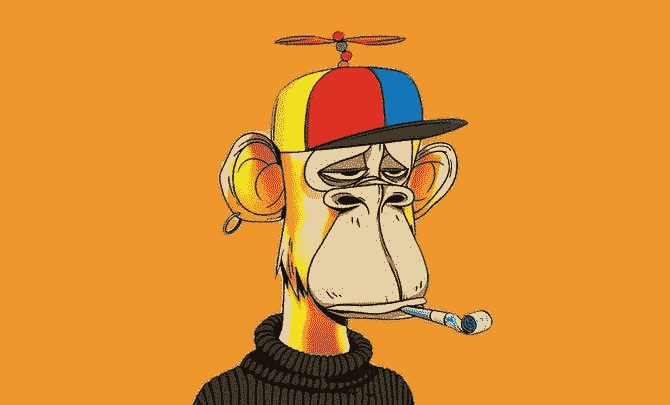

# 非传统艺术会取代传统艺术吗？

> 原文：<https://medium.com/coinmonks/will-nfts-replace-conventional-art-50f32be29d3b?source=collection_archive---------47----------------------->

[**NFT 会取代艺术吗？—Dusable Lewis | Spotify 上的播客**](https://open.spotify.com/episode/1wkkgp8ZWXarDrR9f6q1c4?utm_campaign=Dusable%20Experience%20-%20blog%20&utm_medium=email&utm_source=Revue%20newsletter)**——**[**open.spotify.com**](https://open.spotify.com/episode/1wkkgp8ZWXarDrR9f6q1c4)
在 Spotify 上听 dus able Lewis 的这一集。dusablelewis.com

> nft 是用来盗窃艺术品的吗？有些人会说是的，当谈到抄袭和公然剽窃时，这实际上是狂野的西部。

**·窃贼是如何利用 NFT 盗取艺术品的？**

由于大多数 NFTs 的店面都是自动化的，只有区块链验证，没有人验证这些艺术作品的合法性。随后，这导致了对他人艺术的猖獗盗窃。每个店面都是独立的，不会与其他店面交互，例如，如果你在 opensea.com 上发布一次性购买，你也可以发布到其他店面。现在一种 nft 被多人拥有，这是不理想的。你可以在多个平台上发布一个 nft，而且这个 nft 可能有多个所有者，这实际上是很不诚实的。是的，你总是可以提出法律索赔，但对于数字艺术来说，这将非常困难，因为核实是谁创作的几乎是不可能的。

**为什么人们不谈论 nft 盗窃？**

人们不谈论 ntfs 被用于盗窃，因为他们正处于蜜月期，他们相信这是下一个大事情，它使更多的人更容易获得艺术品。尽管这与事实相去甚远，因为你永远无法用电脑上的字母和数字来代替实物艺术。数百万人可以下载 nft 的图像。从技术上讲，你应该能够验证谁是真正的所有者，谁不是，但没有人会让别人打开一个应用程序并证明这一点。没有人谈论 nft 被用于盗窃，因为没有人希望被避开。没有人愿意因为反对支持它的大众而被排斥。

**·我们如何阻止 neft 盗窃？**

当涉及到盗窃艺术品时，我们总是有办法来验证什么是真的，什么是假的。有成千上万的工具被用来区分艺术品的真伪，但那只是在物理形态上。当谈到数字艺术时，很难确定它属于谁，甚至很难确定它最初是谁创作的。当涉及到数字艺术时，我们必须先去购买谁上传的图像，这并不能决定谁制作了图像，它只能决定谁是最快上传到互联网的人。没有办法真正知道是谁制作了一件数码艺术品，你只能知道是谁先上传的。你可以提出这样的论点，有人可以窃取一件实物艺术品，并作为自己的艺术品出售，但人们更有可能窃取数字资产，而不是实物资产。确实没有办法阻止 nft 市场上的艺术品盗窃。甚至没有办法追踪谁买了什么或者谁真正上传了它。

**·NFT 是否被用于洗钱？**

艺术品因被用于洗钱而声名狼藉，ntf 也不例外。长期以来，富人一直将艺术作为逃避税收和其他财务责任的一种方式。历史上，它还被用来促进富人可能喜欢的特定艺术家的销售。有钱人用他们的钱来为他们的朋友和家人增加收入，这一直是电影和音乐等许多其他类别的事情，但最容易用艺术来实现。人们可以听到一首歌并知道它很糟糕，或者看到一部电影并知道它很糟糕，但告诉某人他们的艺术不好并不容易，因为它比其他的要主观得多 视觉或听觉艺术的形式。说到艺术，不管是数字的还是物理的，都是这个星球上最主观的东西。 一根粘在墙上的香蕉可以卖到数百万美元…..还需要我多说吗？

【ntfs 会取代实体艺术吗？

物理艺术在人类出现之前就已经存在，而且不会很快消失。你不能用 ntfs 装饰你的房子，仅凭这一点永远不会让数字艺术取代实体艺术。尽管实体艺术和数字艺术都存在抄袭问题，但数字艺术资产永远不可能真正独一无二，因为任何人都可以从互联网上复制和粘贴它。如果你想让赝品成为一种物理艺术，你必须真正坐下来制作它，这不像从网上复制粘贴那么简单。所以没有数字艺术永远不会取代实体艺术

我们随时都可能陷入黑暗时代，不会有数字艺术，只有实物艺术。

> 加入 Coinmonks [电报频道](https://t.me/coincodecap)和 [Youtube 频道](https://www.youtube.com/c/coinmonks/videos)了解加密交易和投资

# 另外，阅读

*   [Godex.io 审核](/coinmonks/godex-io-review-7366086519fb) | [邀请审核](/coinmonks/invity-review-70f3030c0502) | [BitForex 审核](https://coincodecap.com/bitforex-review)
*   [10 本关于加密的最佳书籍](https://coincodecap.com/best-crypto-books) | [英国 5 个最佳加密机器人](https://coincodecap.com/uk-trading-bots)
*   [ko only Review](https://coincodecap.com/koinly-review)|[Binaryx Review](https://coincodecap.com/binaryx-review)|[Hodlnaut vs CakeDefi](https://coincodecap.com/hodlnaut-vs-cakedefi-vs-celsius)
*   [MoonXBT vs Bybit vs 币安](https://coincodecap.com/bybit-binance-moonxbt) | [硬件钱包](/coinmonks/hardware-wallets-dfa1211730c6)
*   [火币交易机器人](https://coincodecap.com/huobi-trading-bot) | [如何收购 ADA](https://coincodecap.com/buy-ada-cardano) | [Geco。一次审查](https://coincodecap.com/geco-one-review)