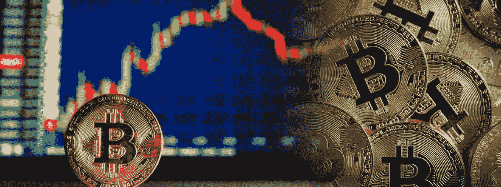
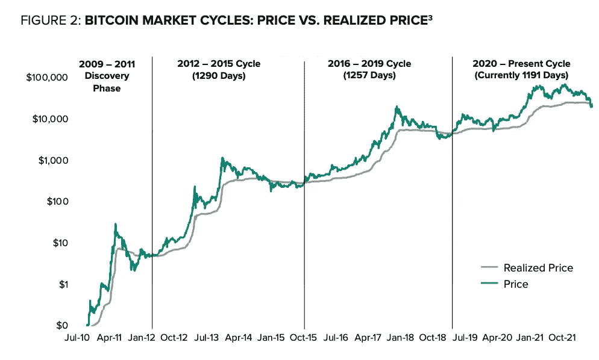

# 加息会造成更多传染吗？

> 原文：<https://medium.com/coinmonks/will-rate-hikes-create-more-contagion-445de6950a96?source=collection_archive---------16----------------------->

在今年三次加息后，美联储预计将在 7 月 26 日至 27 日再次加息，预期利率为 0.75 个百分点。研究人员认为，这不会是美联储 2022 年试图控制通胀的最后一次加息。

作为一名投资者，重要的是要放眼全球:这并非美国独有。加拿大、英国、澳大利亚、印度、韩国、巴西和俄罗斯等国今年也提高了政策利率。但它实际上如何影响经济的各个部门，这些连续加息会产生更多的传染吗？

加息会如何影响商品、股票、密码和其他投资？

在央行收紧货币政策的最初迹象出现时，加密货币和其他风险资产开始见顶。但在 2022 年，随着美联储的这些行动将持续抑制通胀变得越来越明显，股市开始下跌，而利率开始上升。

这是周期性市场的一个自然过程:它们会适应全球利率上升的现实，而通常在利率较低时上涨的资产受这些调整的影响最大。

*   BTC 比 2021 年 11 月的 ATH 下降了 60%以上；
*   瑞士联邦理工学院的 ATH 下跌了 70%以上；
*   2022 年道琼斯下跌 13%，S&P 下跌 18%，纳斯达克下跌 26%。

更高的利率会增加债务成本，并可能降低某些资产的价格，从而降低人们的消费能力和财富心态。由于缺乏购买力，经济放缓——在几个国家发生了同样的事件，加息也影响了商品和服务的净贸易。

它还会影响房地产行业，降低房地产价格，拖累经济，减少收入——这是一种级联效应，反映在不同的经济部门。债务利率上升，更多的违约发生，资产价值下降。

一般来说，加息会引发一段时间的波动，表明市场的悲观情绪。当这种情况在全球范围内发生时，留意那些可能推动你所投资的行业价格上涨或下跌的催化剂是至关重要的。

**展望密码领域**

正如[花旗](https://www.coindesk.com/markets/2022/07/22/citi-says-crypto-contagion-appears-to-have-ceased/)所言，由于稳定的资本流入和秘密的 ETF 流出已经停止，秘密传染已经显示出停止的迹象。换句话说，大部分杠杆已经在加密中被冲掉了，所以预期的短期底部测试不像以前那样可能了。尽管如此，考虑到利率上升，没有足够强大的催化剂来推动价格突然上涨。

其他可能的催化剂可能会推动另一轮抛售，如相关国家(美国、中国、俄罗斯)之间的政治或外交事务产生的宏观影响，甚至是公开市场因收益降低而出售资产产生的下行压力。

根据我经历过的其他周期，最有可能发生的情况(在我看来)是:在未来 12-18 个月，市场将上下波动，与股票和真实状态的价格稳定性作斗争。正如[gray](https://blockworks.co/crypto-bear-market-may-drag-on-another-8-months-grayscale/?utm_source=Sailthru&utm_medium=email&utm_campaign=Daily%20NL%20Thursday%206.21.22&utm_term=Daily%20Newsletter)所说，我们将经历的这段熊市时期将是一个高价值买入机会的时期。

如果你缩小视野，展望 2025 年及以后，你有 12-24 个月的时间对公允价值资产做出正确的决策，并以可能需要数年才能再次发生的方式最大化你在加密资产中的利润。

[*乔·罗伯特*](https://joerobert.com/) *现任罗伯特风险投资公司首席执行官，拥有超过 20 年的资产管理经验。自创办以来，乔已经为投资者和合伙人创造了可预见的两位数回报。Joe 已经投资了股权和代币的种子轮，以及比特币、以太坊和其他顶级加密货币的投资组合。*

*如果您是合格投资者，并想了解更多关于我们产品的信息，请联系我们。*

> 交易新手？尝试[加密交易机器人](/coinmonks/crypto-trading-bot-c2ffce8acb2a)或[复制交易](/coinmonks/top-10-crypto-copy-trading-platforms-for-beginners-d0c37c7d698c)