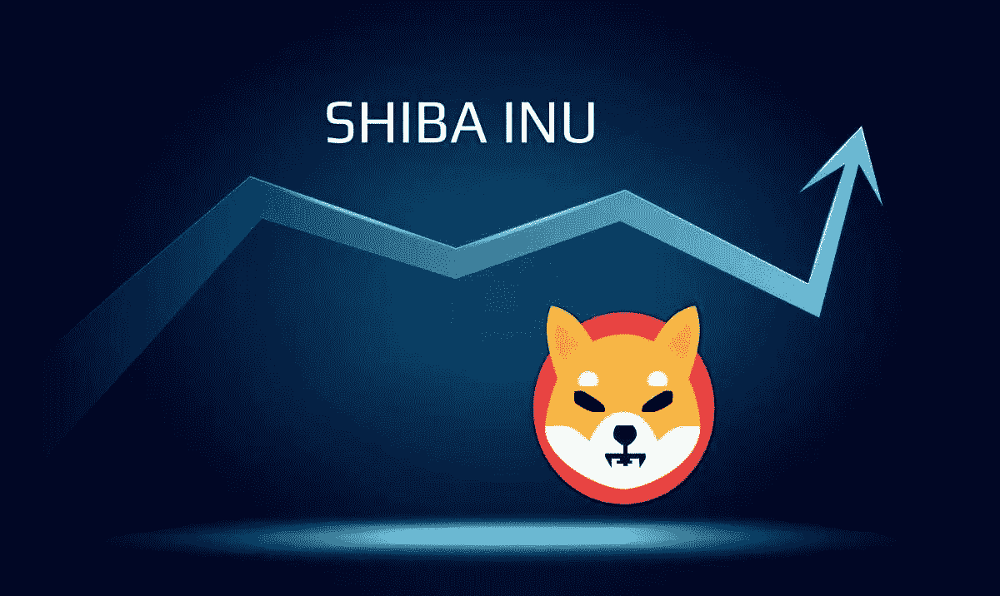

# 🚨柴犬会挺过这次熊市吗？📈📊

> 原文：<https://medium.com/coinmonks/will-shiba-inu-survive-this-bear-market-9581c6a9cc2e?source=collection_archive---------26----------------------->

柴犬币是一种相对较新的加密货币，由于其有趣的吉祥物和与 Doge meme 的联系而广受欢迎。该硬币创建于 2020 年 8 月，是一种去中心化、开源、点对点的加密货币。

Shiba Inu

柴犬币的一个独特之处就是供应量极其有限。只有 1000 万枚柴犬币…