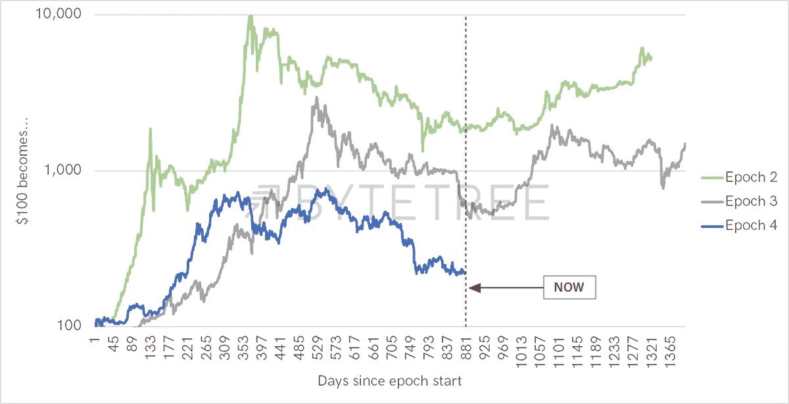
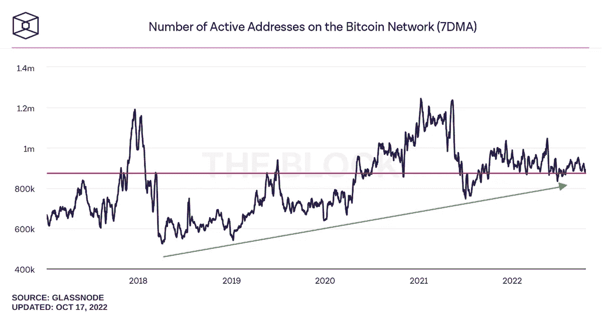
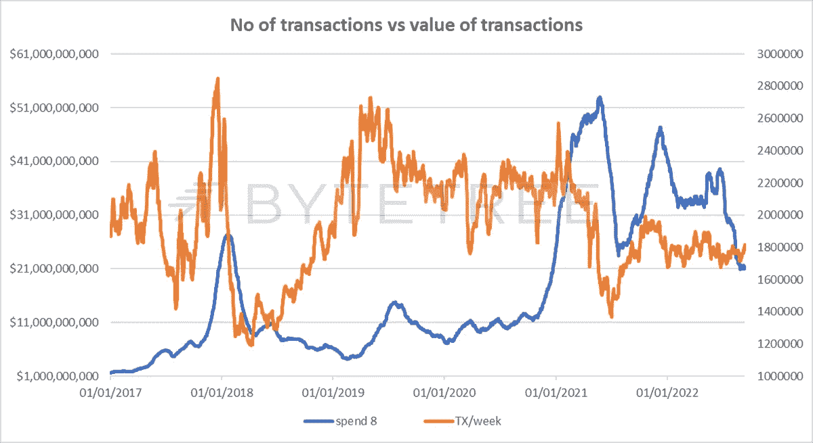

# 比特币减半周期会‘三连冠’吗？

> 原文：<https://medium.com/coinmonks/will-the-bitcoin-halving-cycle-three-peat-b44672421ab3?source=collection_archive---------9----------------------->

比特币在其短暂的存在中经历了两个明显的“减半”周期，从 2012 年至 2016 年和 2016 年至 2020 年(下图中的时代 2 和时代 3)。我们忽略了第一个纪元，因为这个资产太年轻、太原始(甚至对它来说)而没有任何用处。这些周期在 4 年的“减半”时结束，此时新铸造的比特币供应进入市场的一半。根据 ByteTree 终端数据，下一次减半将于 2024 年 4 月 9 日到期[。现在距离这一天只有 18 个月了，用市场术语来说，这意味着是时候坐下来关注一下了。](https://terminal.bytetree.com/bitcoin/blockchain)

虽然历史很短，但模式非常相似。开始时兴高采烈，中间萧条，最后复苏。不需要天才就能意识到，如果这种模式在这一次重复，我们正处于一个极其有趣的时刻。

Source: [ByteTree](https://bytetree.com/api)

然而，仅仅因为以前发生过的事情，就认为它会再次发生，这既自满又简单化。

让我们首先考虑为什么我们可能 ***而不是*** 看到循环的重现。

首先，比特币可能已经达到了接受的高峰。我们不相信会是这种情况，但事实上，过去几年的数据在这方面并不特别令人鼓舞。

Source: [The Block](https://www.theblock.co/data/on-chain-metrics/bitcoin)

活跃地址数量与 2017 年 10 月(红线，上图)持平，超过 5 年前。这很难说是指数增长型资产的行为。为其辩护，我们可以看看绿线趋势的上升低点。任何向上的突破都是值得庆祝的，但我们离那还有很长的路要走。作为一种网络效应资产，这在很大程度上解释了最近的价格疲软。

我们可以从网络交易额(花费 8)和交易数量(发送/周)得出类似的悲观结论，如下所示。交易数量一直在稳步下降，而支出则回到了 2020 年的水平。

Source: [ByteTree](https://bytetree.com/api).

这可能不像最初看起来那么消极，因为交易所的增长意味着更多的活动发生在链外。此外，人们很容易忘记比特币是一种金钱技术，像所有技术一样，它将不断找到改进的方法，这可能是变革性的。我稍后将讨论这个问题。

从表面上看，比特币似乎不太可能再次被挤兑。然而，我们的观点仍然是，这个纪元将会与先前的纪元相呼应，尽管就其规模而言，振幅较低。这有几个原因。

首先，我们必须理解为什么比特币的应用如此缓慢。主要是因为世界上大多数人都被禁止或不鼓励拥有它，更不用说交易了。在日常生活中，人们绝对没有参与比特币的冲动，除非你生活在一个失败或即将失败的国家，或者对去中心化的账本技术有着强烈的好奇心(在这种情况下，你可能已经超越了比特币)，或者对世界金融体系的未来极度悲观，认为比特币是救生船。在监管清晰之前，主流机构不会拥有它，而且它很难在 ESG 盒子里打勾。当然，一些家族理财室会坚持己见，而对冲基金和投资银行会使用复杂的工具在它们之间进行交易，但问题是——在法律环境允许的情况下，比特币的采用仍将处于边缘地位。

这种情况会改变吗？监管机构迟迟没有伸出援手，鉴于比特币号称是一种替代货币，这一点并不令人惊讶。火鸡终究不会为圣诞节投票。事实上，这是比特币理念的矛盾之一——一个以脱离中央权威而闻名的货币网络，希望成为现有机构的一部分，并最终取代现有机构。它能两者兼得吗？很有可能它会成为投资者军械库中的另一个工具，就像今天的黄金或房地产一样。没有理由认为它不能与其他金融工具相提并论。

监管将在某个阶段到来，除非它变得非法(这在自由市场经济中似乎不切实际，也不太可能)，否则它将把比特币带到下一步:散户投资者拥有比特币作为储蓄投资组合一部分的能力。这将是其潜在市场的巨大飞跃。在这方面，重要的地理位置是美国，其他国家落在后面。如果在这个时代的某个阶段看不到某种解决方案，那将是令人惊讶的，因为央行数字货币的潜在推出将使加密架构合法化并得到更广泛的使用。

比特币的最后一步将是被接受为法定货币，但除非出现某种史诗般的法定货币崩溃，否则很难看到这种情况发生——即使是在中期——这使得它成为未来时代的讨论话题。

这就把我们带到了供给/需求动态。令许多人感到惊讶的是，在 2 万美元的价格下，比特币每天需要找到 1800 万美元的新资金来吸收新创造的供应，即每月约 5.4 亿美元。这一供应量再减少一半，意味着这个数字将降至每月 2.7 亿美元，即每年约 32.4 亿美元。这可能看起来很大，但它在事物的计划中是微不足道的；仅在 2022 年 6 月，英国政府债务的应付利息就高达 194 亿英镑！如果监管允许更广泛的机构所有权，比特币很容易被挤得更高。

第三，我们需要考虑技术。请记住，“比特币”由两个元素组成:比特币网络，它是系统基础设施，以及比特币，在它上面运行的交换单位。大幅提高基础设施利用率的解决方案正在快速开发和部署。位于比特币网络(被称为第一层)之上的闪电网络(Lightning Network)以极低的成本实现了近乎即时的点对点交易。这些支付可以用法定货币进行，并通过闪电网络进行，搭载比特币网络的安全性，并将其用作结算协议(类似于在晚上结束时支付酒吧账单)。如果这种规模扩大，那么比特币网络可以成为一个全球支付网络。这给了比特币一个巨大的用例，并立即将叙事从“数字黄金”转移到更实际的东西(同时保留黄金的硬通货特征)。

最后，外部宏观力量将发挥作用。在当前的紧缩周期中，所有面值的风险资产都面临对美元的压力。根据通胀的持久性和/或政府容忍较低增长的能力，我们有理由认为，在这个减半时期的剩余时间里，我们会看到变化率的调整。仅此一项就将提振比特币。目前，流动性不足已经开始阻塞金融体系。如果出现问题，当局似乎很可能会再次开动印钞机，这正是比特币等硬资产蓬勃发展的条件。

总之，明星们正在为之前减半周期行为的“三连冠”而努力。这项技术将使其更容易使用，并扩大其用例，监管将提供更大的投资透明度，惩罚性的宏观逆风将减弱。这将给一个正面临另一次供应冲击的生态系统带来更大的活力。如果这是正确的，接下来的几个月应该是积累的最佳时间。

本文由 ByteTree 资产管理公司首席执行官 **Charlie Erith** 撰写。这篇文章是从我们的网站上交叉发布的，最初发表于 2022 年 10 月 19 日[。](https://bytetree.com/research/2022/10/will-the-bitcoin-halving-cycle-three-peat/)

访问 [**ByteTree 终端**](https://terminal.bytetree.com/) 获取实时跟踪的**比特币**链上数据。我们还跟踪**以太坊**、**黄金**和**白银**资金流、传统**ETF**和前 100 名**加密令牌**。

[**订阅**](https://bytetree.com/mailing) 我们的邮件列表，每周免费更新。

> 交易新手？试试[密码交易机器人](/coinmonks/crypto-trading-bot-c2ffce8acb2a)或[复制交易](/coinmonks/top-10-crypto-copy-trading-platforms-for-beginners-d0c37c7d698c)