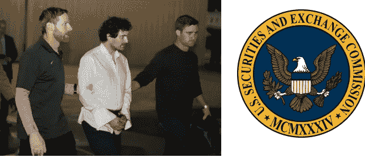

# SEC 会用山姆·班克曼-弗里德和 FTX 来最终监管 crypto 吗？

> 原文：<https://medium.com/coinmonks/will-the-sec-use-sam-bankman-fried-and-ftx-to-finally-regulate-crypto-80cdd1964d0?source=collection_archive---------30----------------------->

SBF in handcuffs

SBF 被指控证券和商品欺诈。政府在证券和商品收费上两面下注。无论另类投资证券还是大宗商品的争论落在哪个方向，它们都覆盖了 SBF。

> 从顶级交易者那里复制交易机器人。免费试用。