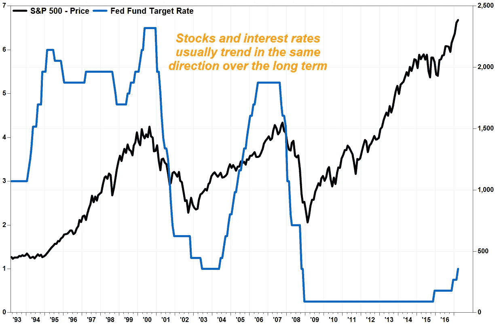

# 🤔本周的美联储会议会打破市场反弹吗？

> 原文：<https://medium.com/coinmonks/will-this-weeks-feds-meeting-break-the-market-bounce-53a047291eb0?source=collection_archive---------41----------------------->

# 内容(3 分钟阅读):

*   🤔本周的美联储会议会打破市场反弹吗？
*   👎特斯拉套现 9.36 亿美元比特币。
*   👍**比特币基地股票暴涨 14%**
*   👨‍👩‍👧‍👧[startup y](https://beta.startupy.world/membership/?ref=yarocelis)——社区管理的搜索引擎
*   👮 [**前比特币基地员工被控……**](https://url-e.coinmarketcap.com/ls/click?upn=3XGtgU0aTcvSIJEH-2F-2B3WuJkIhkYd79WXDZ3slvXMJhsOMlj0gMvmn6-2BH91MDv4lPlc6jGKBGyFEOm-2Fs6o6J9P4iS2wWBmmthau1qrjCQiG2qM8bXQtBbn3uYGDakXoMtppVAegyiamTwEQ-2Bh-2F03wPwKFho9nUERVrNle17fXwA4-3DBsLm_uYqL4p72S3BV1QzvSAJ8EqylmF8Q7x3AgZrHIqFEc2-2F9oGZ80P932XQ2R-2FFPdsM2TZlmlBAC8S4v35hwhInEo6zHoCKVZvC86Tn-2FeuNYzIz6W-2FTQTIahd9k-2BkpBQsRnMk5PUPExIGmhrnosP5DxIZKmVmmVFc358Mty-2FjPSaHtQP-2BBpnayoASrlJ9LVQ-2B3LOTmLaeNwBucFaCcjBQiXeJM3VwjoLsHzu1ZU2cHhbycUnqtcGojv7DJNWS6PmJBJnMTwSmv6kYljLI-2BJSfjHuvdqmfSzm8Q7t7P9g7lnPzw9mxCeWZlfGivlA311XZ-2F9yjEAi1CMUAUGmWfH7037nNKyW8URTe0kudYD1cDDmKjUK-2FKrS4T7zQbt-2Fs19KU1WALTFarQ4j-2FebL-2BOnGg9pEgb-2BlharrVExjJvx-2BVBdLUWIIBeUR1xPZUhCkS3AVsP51-2BW0gkT0ApO9uMcls1fbxLVRKtlYtdzwUvfJQMSlX4rgZR8ABJnbEv3mLgeZ1hcFFA9VXr3yPbSq35FRKesJQ3-2BR7Z1H6yzcj6jrxYG-2BjAjHmu4LzPmKlki4IezfEf2KyzRc5DwiZqhfoNEUIx7ykPSE2WAoCxvKYUrXkHtoVB84wA1-2F0l7j2GHL3GJouHbGB2p-2Fq6ewrTiD1eLrkGUHTZ0ZuwQx70E-2FinEld7anUk8-2FtYXtaOdo7YLmuwQl22o5840sX-2BjrEeWJeFRHVxVhSjLduJOAy81NvO6CdRW0ANXzW72VFysp-2FBBD0vikp-2B0FZ9mqEamwnOLCFuTYd2lIL4xI8RR2PG-2FRMzGRttp6RDnqYFYrny-2BGk3wfHyhVm6eaJiM-2FS64WvTMZzWGdEsPLtp9QYvHPg6r-2Fx3sBiYE4t0LT9QmOnHZnup8THmGxBAu2PWRFVrDsVZjVZWdqO66W4tT2clsxqfkeO8UCPj0GohSh-2B-2FW1bbwx0XTvk9lcV4KPBT-2FbQLlf7OYdk9Vfgn9ggyrbJK-2FqVKjFv8nIP-2BJIgMqfrHgSmYGKbDT9k8X2hK-2Bud)
*   🏖️个人退休帐户，避税帐户
*   📰基督教青年会
*   🙏🏻感激…

# 🤔本周的美联储会议会打破市场反弹吗？

在过去的一周里，大多数风险资产都出现了强劲反弹，包括股票、比特币和高收益固定收益证券，但也包括美国国债。

这种上升有许多原因，包括美元指数的下降，这意味着美国商品在国外市场上更便宜。进口商品更贵，游客到以美元为官方货币的国家旅游时购买力更强，反之亦然；对于那些用美元赚钱的人来说，去美元不是官方法定货币的其他国家旅行变得更加昂贵。

Yaro on Tech、Blockchain 和 Web3 是一份读者支持的出版物。为了接收新帖子和支持我的工作，考虑成为一个免费或付费用户。

[立即订阅](https://yarocelis.substack.com/subscribe?utm_medium=web&utm_source=subscribe-widget-preamble&utm_content=65566208)

7 月 27 日星期三，美联储将再次开会提高利率。我们预计加息 50 个基点，但最近资产价格的上涨可能会导致利率比预期更高。观察美联储会议前两天的市场表现，并与本周其他时间进行比较，将会非常有趣。

市场是非理性的，人们带着情绪交易。如果我们继续看到风险资产估值的升值，特别是在全球加密领域，FOMO 可能会介入，但超过 50 个百分点的利率上调可能会促使投资者将资本投入更稳定、波动性更小的投资。

消费者信心是另一个需要跟踪的指标，因为尽管我们正在经历 40 年来最高的通胀数字，但消费者仍在持续稳定地支出。随着夏季即将结束，学校即将开学，假期即将结束，我们不断听到裁员、冻结招聘以及推迟或取消公司投资的消息，这种情况可能会很快发生变化。

> *投资者对下周加息的反应以及市场在美联储周三会议前的表现将决定资产价格是否能进一步推动这轮反弹，或者我们是否会测试新的底部。*

来自 [MarketWatch](https://www.marketwatch.com/story/stock-market-investors-should-cheer-fed-rate-hikes-not-fear-them-2017-03-15) 的上图表明，标准普尔 500 指数和利率直接相关，但这种相关性在过去几个月里没有那么强。总是有许多不同的变量影响市场；技术、技术的快速发展以及当今信息传播的速度和我们交易的速度对市场估值和投资决策有许多影响。

# 👎特斯拉套现 9.36 亿美元比特币。

特斯拉在新的投资者文件中表示，该公司在 2022 年第二季度放弃了价值 9.36 亿美元的加密货币，将其比特币持有量削减了 75%。

特斯拉在 2021 年积极拥抱比特币，在首席执行官埃隆·马斯克(Elon Musk)宣扬比特币优于标准法定货币的同时，向比特币投资了 15 亿美元。在一年的部分时间里，特斯拉的客户可以使用比特币购买汽车。

但最近几个月，特斯拉的盈利能力受到“比特币减值”的影响，它在第二季度的[财务总结](https://tesla-cdn.thron.com/static/EIUQEC_2022_Q2_Quarterly_Update_Deck_J8VLIK.pdf?xseo=&response-content-disposition=inline%3Bfilename%3D%22tsla-q2-22-update.pdf)中表示。

> 迈克尔·塞勒猛烈抨击特斯拉出售其 75%的比特币。 *这位 MicroStrategy 的首席执行官长期以来一直是加密领域最乐观的声音之一。赛勒写道:* ***“如果你卖掉 75%的比特币，你将只剩下 25%的比特币。”这表明他对埃隆·马斯克通过剥离特斯拉的加密投资来释放流动性的决定非常恼火***

# 👍比特币基地股价上涨了 14%

比特币基地表示，它与几家倒闭的加密公司没有交易对手风险敞口，试图减轻人们对该行业流动性危机对其业务影响的担忧。

该公司周三在博客[帖子](https://blog.coinbase.com/institutional-insights-our-approach-to-crypto-financing-cf550bda891a)中表示，比特币基地对 Celsius、Three Arrows Capital 和 Voyager Digital“没有融资敞口”。在数字代币价格暴跌引发高杠杆头寸的一连串清算后，每家公司都申请了破产保护。

该公司股价周三收盘上涨逾 14%。

该公司表示:“这些公司中有许多杠杆过高，短期负债与长期非流动性资产不匹配。”

[启动-](https://beta.startupy.world/membership/?ref=yarocelis)

我很高兴地宣布，我已经成为 Startupy 的策展人和成员。一个社区管理的搜索引擎。零 SEO BS。我邀请你加入这个为漫游、研究和思考而设计的知识和见解的令人愉快的图书馆。

# 👮[前比特币基地雇员被起诉…](https://url-e.coinmarketcap.com/ls/click?upn=3XGtgU0aTcvSIJEH-2F-2B3WuJkIhkYd79WXDZ3slvXMJhsOMlj0gMvmn6-2BH91MDv4lPlc6jGKBGyFEOm-2Fs6o6J9P4iS2wWBmmthau1qrjCQiG2qM8bXQtBbn3uYGDakXoMtppVAegyiamTwEQ-2Bh-2F03wPwKFho9nUERVrNle17fXwA4-3DBsLm_uYqL4p72S3BV1QzvSAJ8EqylmF8Q7x3AgZrHIqFEc2-2F9oGZ80P932XQ2R-2FFPdsM2TZlmlBAC8S4v35hwhInEo6zHoCKVZvC86Tn-2FeuNYzIz6W-2FTQTIahd9k-2BkpBQsRnMk5PUPExIGmhrnosP5DxIZKmVmmVFc358Mty-2FjPSaHtQP-2BBpnayoASrlJ9LVQ-2B3LOTmLaeNwBucFaCcjBQiXeJM3VwjoLsHzu1ZU2cHhbycUnqtcGojv7DJNWS6PmJBJnMTwSmv6kYljLI-2BJSfjHuvdqmfSzm8Q7t7P9g7lnPzw9mxCeWZlfGivlA311XZ-2F9yjEAi1CMUAUGmWfH7037nNKyW8URTe0kudYD1cDDmKjUK-2FKrS4T7zQbt-2Fs19KU1WALTFarQ4j-2FebL-2BOnGg9pEgb-2BlharrVExjJvx-2BVBdLUWIIBeUR1xPZUhCkS3AVsP51-2BW0gkT0ApO9uMcls1fbxLVRKtlYtdzwUvfJQMSlX4rgZR8ABJnbEv3mLgeZ1hcFFA9VXr3yPbSq35FRKesJQ3-2BR7Z1H6yzcj6jrxYG-2BjAjHmu4LzPmKlki4IezfEf2KyzRc5DwiZqhfoNEUIx7ykPSE2WAoCxvKYUrXkHtoVB84wA1-2F0l7j2GHL3GJouHbGB2p-2Fq6ewrTiD1eLrkGUHTZ0ZuwQx70E-2FinEld7anUk8-2FtYXtaOdo7YLmuwQl22o5840sX-2BjrEeWJeFRHVxVhSjLduJOAy81NvO6CdRW0ANXzW72VFysp-2FBBD0vikp-2B0FZ9mqEamwnOLCFuTYd2lIL4xI8RR2PG-2FRMzGRttp6RDnqYFYrny-2BGk3wfHyhVm6eaJiM-2FS64WvTMZzWGdEsPLtp9QYvHPg6r-2Fx3sBiYE4t0LT9QmOnHZnup8THmGxBAu2PWRFVrDsVZjVZWdqO66W4tT2clsxqfkeO8UCPj0GohSh-2B-2FW1bbwx0XTvk9lcV4KPBT-2FbQLlf7OYdk9Vfgn9ggyrbJK-2FqVKjFv8nIP-2BJIgMqfrHgSmYGKbDT9k8X2hK-2Bud)

一名前比特币基地雇员被[指控](https://coinmarketcap.com/alexandria/article/ex-coinbase-employee-charged-with-insider-trading-of-cryptocurrencies)从事加密货币内幕交易。**据称，伊山·瓦希参与了决定哪些硬币将在何时上市的“高度机密过程”。检察官声称他与他的兄弟和一名商业伙伴分享秘密信息，后者最终通过交易加密货币获得了 150 万美元的收益。如果罪名成立，这三个人都可能面临 20 年监禁。**美国司法部长达米安·威廉姆斯(Damian Williams)表示，这是第一起涉及加密市场的内幕交易案件，他补充道:**“今天的指控进一步提醒我们，Web3 不是一个不受法律约束的区域。”**

加密货币是这些天每个人都在谈论的东西之一。有各种不同的交易所进行加密交易……但是许多人没有意识到他们在税费上损失了多少。

iTrustCapital 允许其客户通过个人退休账户或个人退休帐户投资 crypto，而不必担心税收或费用。

IRA 是避税账户，这意味着你所有的加密交易都是免税的，并且可以随着时间的推移免税增长**。**

没有隐藏的费用。[要了解更多信息，请点击此处并开通免费账户。](https://itrustcapital.com/referral100?utm_source=partner&utm_medium=youtube&utm_campaign=partner637&oid=10&affid=637)

[分享 Yaro 的技术& WebX 简讯](https://yarocelis.substack.com/?utm_source=substack&utm_medium=email&utm_content=share&action=share)

# 📰基督教青年会

*   [特斯拉的比特币转储让会计师们迷惑不解](https://forkast.news/headlines/teslas-bitcoin-dump-accountants-puzzled/)
*   [以太坊卡在关键区间，为什么 1480 美元是关键](https://www.newsbtc.com/analysis/eth/ethereum-stuck-range-1480/)
*   [加州推翻政治秘密捐款禁令](https://blockworks.co/california-overturns-political-crypto-donations-ban/)
*   [日资银行 SMBC 计划发展 NFT 业务](https://forkast.news/headlines/japanese-bank-smbc-develop-nft-business/)
*   加密平台 Zipmex 表示，它正在考虑与“感兴趣的团体”合作的可能性
*   [比特币和以太坊正确涨势，Altcoins 出现看跌迹象](https://cryptonews.com/news/bitcoin-and-ethereum-correct-gains-altcoins-show-bearish-signs.htm)
*   据说 FTX 正在就收购南韩密码交易所 Bithumb 进行谈判
*   [到 2030 年，加密用户总数可能达到 10 亿](https://forkast.news/headlines/crypto-users-at-1-billion-by-2030-report/)
*   [宇迦实验室“不当诱导”BAYC 投资者:集体诉讼](https://cointelegraph.com/news/yuga-labs-inappropriately-induced-bayc-investors-class-action)
*   [TVL DeFi 公司在 Q2 股价暴跌 67%](https://forkast.news/headlines/defi-tvl-plunged-67-in-q2/)
*   [OP 促使投资者“乐观”，股价上涨 67%，这要归功于……](https://ambcrypto.com/op-induces-optimism-in-investors-with-67-rally-thanks-to/)
*   [塞浦路斯证券交易委员会批准 CryptoCom 提供加密服务](https://cryptopotato.com/cyprus-sec-greenlights-cryptocom-to-offer-crypto-services/)

> 交易新手？尝试[加密交易机器人](/coinmonks/crypto-trading-bot-c2ffce8acb2a)或[复制交易](/coinmonks/top-10-crypto-copy-trading-platforms-for-beginners-d0c37c7d698c)