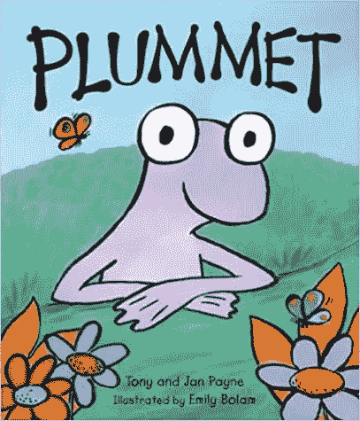
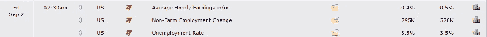
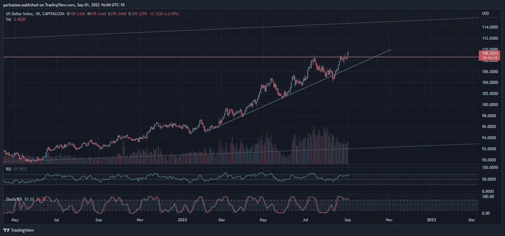
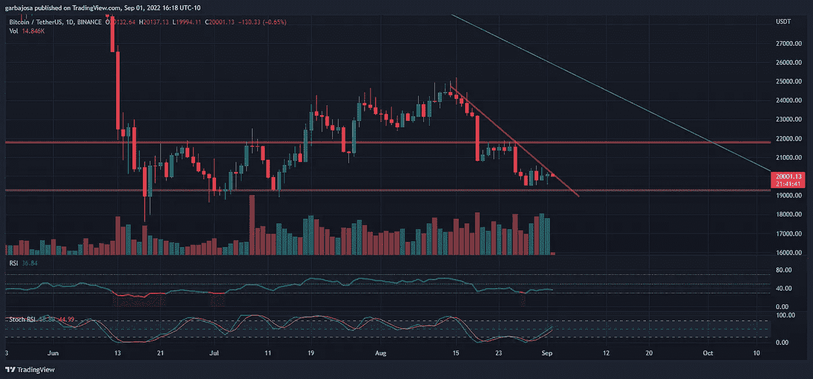
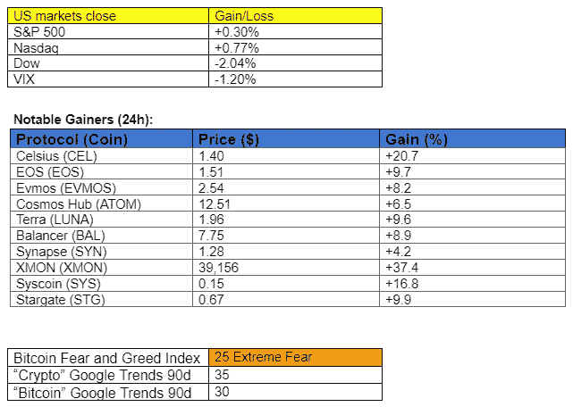
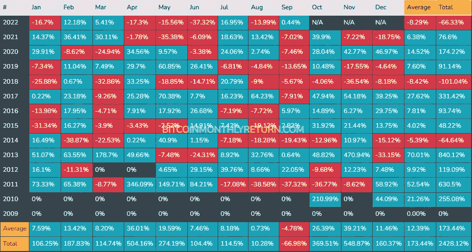

# 这一令人担忧的经济数据会导致密码价格暴跌吗？

> 原文：<https://medium.com/coinmonks/will-this-worrisome-economic-data-plummet-crypto-prices-3f94c0036871?source=collection_archive---------21----------------------->

## 每日征服第 073 期

您需要了解的当今快速发展的密码市场的一切

密码市场是一个狂野、奇妙而令人生畏的地方；不要一个人跋涉！订阅加密征服者，让我们成为您的向导。

S [*订阅*](https://tradergabi.substack.com/subscribe?) *本刊每日快讯，永不错过一期。*

**概述**

*   就业数据将决定市场行动
*   市场:美元指数冲破阻力。
*   不可阻挡的域名增加了加密电子邮件支持。
*   维塔利克·布特林的书已经准备好接受预订，随 NFT 一同推出。
*   比特币 9 月份的月度回报。

早上好，家人，

美国股市暂停了看跌价格的行动，等待将于今日盘前公布的失业率和非农就业数据。专家预测失业率为 3.5%，与上个月的 2.7%相比有显著变化。在美联储积极加息和量化紧缩的情况下，市场将密切关注这一百分比，以衡量经济的健康状况。

如果利率高于预期，市场可能会做出积极反应，因为这将迫使美联储重新考虑其鹰派立场。另一方面，如果就业数据保持强劲，市场可能会开始调整，以适应杰罗姆·鲍威尔(Jerome Powell)采取的进一步抗通胀措施。

*来源:* [*密码技术*](https://www.cryptocraft.com/calendar#graph=122957)

# 市场更新🌍

**DXY 1D**

美元指数(DXY)每次看起来都更恐怖。DXY 昨日突破主要阻力，突显出尽管通胀高企，但投资者对美元安全性的需求。在美元需求减弱之前，市场心态将保持“规避风险”

*高清* [***图表***](https://www.tradingview.com/x/6drk4Tfg/)

**BTC/USDT 1D**

有趣的是，比特币恐惧指标昨日上涨了 5 个点，从 20 升至 25，这是一天内的显著复苏，尽管价格仍保持平稳。比特币一直停留在 20.5 美元和 19.5 美元之间，并继续试探 19.2 美元的支撑位。BTC 每日蜡烛收盘上涨 0.41%，至 20，131 美元。

*高分辨率* [***图表***](https://www.tradingview.com/x/xhimRaKX/)

如果你喜欢这份报告，并且认为它值 20 分(0.01 美分)，请点击下面的鼓掌按钮来支持我的写作。(最多 50 次！)谢谢！

# 新闻观察📰

前 CFTC 专员加入 FTX 美国衍生品委员会。前 CFTC 专员吉尔·萨默斯加入了 T2 FTX 美国衍生品公司。Sommers 在金融市场有着良好的记录，并在乔治·布什总统和奥巴马总统任内两次被提名为 CFTC 专员。FTX 美国衍生品是由 CFTC 监管的数字货币期货和期权交易所和票据交换所。

**无法阻挡的电子邮件。加密域名服务提供商 Unstoppable Domains 已经集成了 Skiff Mail，允许用户通过加密钱包发送加密邮件。Skiff 首席执行官安德鲁·米利奇补充道:“现在是隐私保护的有趣时期。我们的邮件产品是免费和开源的，我们已经尽一切可能让您的身份归您所有。”**另外，事务所现在** [**允许**](https://twitter.com/unstoppableweb/status/1564716219890077697?s=20&t=hhmnwcGIvesZdGsOCa_-vQ) **的免费造币一枚”。区块链”域名。****

币安冻结了俄罗斯枪支制造商的加密钱包。币安冻结了俄罗斯枪支制造商 Vladislav Lobaez 的加密钱包，该公司筹集了 21，000 美元的捐款为驻乌克兰的俄罗斯军队制造武器。

**新闻花絮:**

*   罗宾汉[名单](https://twitter.com/WuBlockchain/status/1565340316508749826?s=20&t=hhmnwcGIvesZdGsOCa_-vQ)卡尔达诺(ADA)。
*   维塔利克·布特林的书《利害关系的证明》已经可以预订。此外，你可以得到一个签名的数字副本和 NFT。
*   LG 将在海德拉区块链推出首款名为“Wallypto”的加密钱包。
*   摄氏温度法规[更新](https://twitter.com/nikhileshde/status/1565419327163187201?s=20&t=mSM6BofzbrMPXYNZzmRwzA)。

**协议级花絮:**

*   扎实的[升级](/@seraph333/solidly-upgrade-decf1033a05f)。
*   和谐一号[推出](https://twitter.com/harmonyprotocol/status/1564884255573950466?s=20&t=d02kP2uzYNFgElPE7ofpag)USDS 本土稳定版。
*   [介绍](https://twitter.com/AriesMarkets/status/1564935033978097664?s=20&t=9o8YrvsEpS5r1q1njpExrQ)白羊座市场。
*   巴比伦金融公司因未能恢复 Rari 黑客效应而关闭。
*   虎鲸协议[将](https://twitter.com/0xMetropolis/status/1565015299186909186?s=20&t=un80_Ws1KZPYsj7SjzJ-rQ)改名为大都会。

**NFT &元宇宙更新🐵**

**以太坊上的绿色 NFTs。区块链软件公司** ConsenSys 准备[推出](https://consensys.net/blog/news/consensys-to-launch-one-of-the-first-green-nfts-on-ethereum-mainnet/)以太坊上首批绿色 NFT 系列之一，以纪念为合并做出贡献的专业人士。铸造将在合并当天开始，并向所有人开放。

NFT 花絮:

*   Opensea 将单独[支持以太坊](https://www.theblock.co/post/166940/opensea-commits-to-solely-supporting-nfts-on-proof-of-stake-ethereum-blockchain?utm_source=telegram1&utm_medium=social) PoS 链。

**我的五分钱..**

九月对股票市场和密码业来说都是艰难的一个月。那么比特币在过去 9 月份的表现有多糟糕呢？

下图显示了一些关于月度回报的有趣数据。9 月是比特币表现最差的一个月。这是唯一一个平均回报为负的月份！此外，在过去五年中，比特币每年 9 月都会出现亏损。这五年的平均损失为-8.34%。如果本月发生类似的损失，比特币的价格将达到 18430 美元。

*来源:【Bitcoinmonthlyreturn.com】*

*历史上看起来并不太热，但在池塘的另一边，10 月和 11 月是比特币最好的几个月。所以，对可能的痛苦做好心理准备，但也要为前方更美好的前景做好准备。*

*祝你周末愉快，周一见！*

# *加布里埃尔·m*

**关注我* [*推特*](https://twitter.com/web3_gabri) *每日更新！**

*订阅 *这份每日简讯，永不错过任何一期。**

> *交易新手？尝试[加密交易机器人](/coinmonks/crypto-trading-bot-c2ffce8acb2a)或[复制交易](/coinmonks/top-10-crypto-copy-trading-platforms-for-beginners-d0c37c7d698c)*