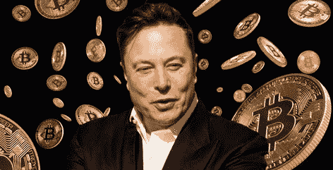
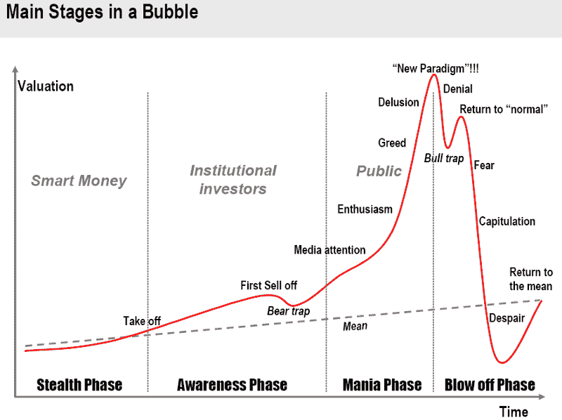
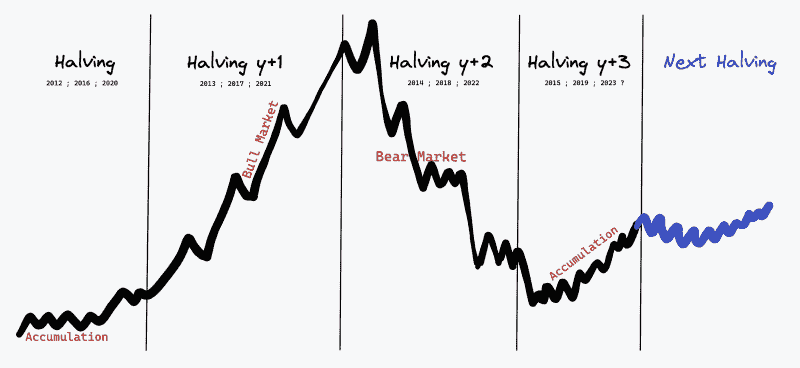
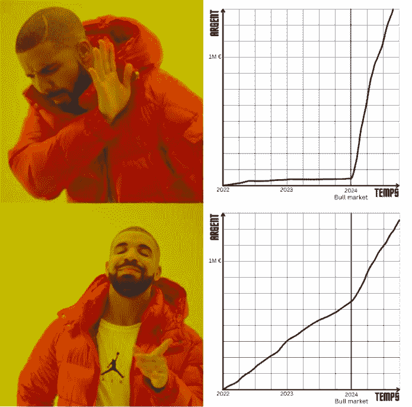

# 2024 年前你会成为百万富翁吗？

> 原文：<https://medium.com/coinmonks/will-you-be-a-millionaire-before-2024-3c0a2b641f?source=collection_archive---------52----------------------->

## 让我在 5 分钟内解释给你听

## 首先，为什么是 2024 年？

密码市场，像其他市场一样，循环往复。自 2008 年比特币诞生以来，它经历了由牛市和熊市组成的周期。牛市阶段，也称为牛市🐃通常是加密货币价格强劲上涨的时期。它们也是加密市场的**创新和扩张的同义词。正是在牛市期间，投资者(个人和专业人士)倾向于进入和/或获得**更多的加密市场**。这不是无关紧要的，因为它们在一定程度上是有利于投资的全球经济形势(极低利率、低通胀)的直接原因。**

相反，熊市阶段，也称为熊市🐻，是牛市的必然延续。所有上涨的东西都必然会下跌，这还不是特别糟糕。相反，熊市往往是“噪音”消失的时候。媒体过度曝光停止，有影响力的人找到其他赚钱的方法，没有基本面的项目分崩离析。**这是建造的最佳时机**🏗并花时间优化那些出现在之前牛市阶段的创新。

当市场下跌时积累你的财富，当市场上涨时你就会变得富有

总的来说，一个周期看起来像这个图表。不同的是，熊市中达到的最低价接近或超过上一次牛市的最高价。根据历史数据，下一个周期是**预计发生在 2024 年。**

## 比特币的历史和预测

首先，我们将介绍减半的概念，这是每个周期背后的事件，除非证明不是这样。

加密货币是通过矿工获得的奖励创造的。每个区块都有奖励，因为我们知道区块会在区块链上一个接一个地产生🔟分钟。

在比特币诞生之初，这一奖励是每块 50 BTC，但一种名为“减半”的现象每四年一次，每次都会将这一奖励减少 2 倍:2012 年，每块 25 BTC；2016 年，每块 12.5 BTC；自 2020 年以来，每块 6.25 BTC。就这样，我们一点一点地走向总额为 2100 万₿.的目标

换句话说，每四年，比特币的创造数量就会减半，这就是比特币成为通缩货币的原因。

以下是根据减半的阶段顺序的简化图:

因此，如果这种模式重演，下一轮牛市应该在 2024 年至 2025 年之间开始。这给了我们很多时间来准备…

这两年做什么？

在隐秘的宇宙中，术语熊市指的是两年:下跌的一年和积累的一年。

一步一步地描述在这两年中要采取的**行动和采用**的心态将是[这篇文章](/@DouussCrypto.eth/pourquoi-il-faut-se-préparer-maintenant-au-prochain-bull-market-82c34343587b)的重复。下面是提到的六个说明:

1️⃣教育自己，

2️⃣建造而不是观看，

3️⃣在赚钱，

4️⃣同意你的观点，

5️⃣研究经济和金融，

6️⃣成为一名专家。

我们明确一点，这个行动计划是好的。任何在熊市中运用它的人都会在接下来的牛市中赚很多钱。然而，我必须对它加以限定，因为它并不完全完整。它缺少了那一点能引导任何人走向成功的东西。更糟糕的是，它只是帮助人们为下一个周期做准备，而没有给他们任何在牛市前赚钱的短期策略。

就在那时，我问了自己以下问题:*在最终在 crypto 赚到很多钱之前，等待这么长时间是强制性的吗？难道没有优化自己时间的方法吗？2024 年前我能成为百万富翁吗？*

## 真的有必要等这么久才最终在 crypto 赚得盆满钵满吗？

许多人的答案将是**一个大大的肯定。他们可能是对的。罗马不是一天建成的，此外，两年的时间创造了记录。但是不要忘了我们是在加密:**我们甚至没有计算这个市场带来的*成功故事*的数量。如果你愿意，你可以相信他们都是 100%基于运气，但这不是我的观点。****

因此，我观察并分析了密码和 Web 3 生态系统中众多专家的**职业道路、选择和心态**，这让我理解了他们成功的**共同因素。当然，运气也是一部分。我们的运气将是**牛市的来临:**如果有牛市，我们将是幸运的，如果没有，那就太糟糕了。**

在我与业内人士的讨论中，一个想法经常出现:在经历熊市后的第二次牛市期间，我们才真正开始变得富有。因此，2021 年牛市的大赢家是那些在 2017 年末(以及随后几年)进入 crypto 的人。

但是今年，有一点不同。机构投资者正在参与进来，光是他们的存在就可能破坏这四年一次的周期。他们不在乎减半，只是在等待监管方的绿灯**进入市场。所以，现在就开始建造**做好准备是极其重要的。****

要做到这一点，你需要有条不紊，专注于那些能让你在中短期内致富的技能，创造一个坚实的财务基础，然后利用下一轮牛市创造财富。

认为等待市场再次上涨是致富的唯一途径是近乎荒谬的**。**

以下是前几轮最大赢家的共性列表:

## 1️⃣.在 Web 3 生态系统中找一份工作。

不管你的技能和行业基础如何，Web 3 公司都可能有你的位置。如果没有，**那就自己创造机会。**

进入这个行业有几种方法。最简单的是做你已经在做的工作，但是是在一家加密公司。例如，如果你是一名记者，写关于加密的文章并申请专业媒体，在那里你会被加密和新闻世界的专家包围。

在商展上建立联系，专注于某个特定的分支(例如加密税收)，利用勤工俭学的杠杆作用，或者建立自己的企业:**所有的方法都是好的**。目标是无论如何都要在生态系统中工作，细节并不重要。

原因很简单:不仅薪水将是你积累财富的重要收入来源，而且最重要的是，在 Web 3 中工作将迫使你了解正在发生的一切，并与生态系统的参与者保持联系。

## 2️⃣.对创新持开放态度，尝试一切。

我们在这里不仅仅是利用已经做好的东西，**我们是来快速创造财富的**。即使这意味着冒险，即使这意味着一头冲进我们遇到的每一个机会，即使这意味着被骗。

我经常听到叔本华(错误地)引用这句话，他说所有的创新都要经历三个阶段。

先是嘲讽，然后是强烈反对，才觉得理所当然。

那些在比特币被嘲笑时抓住机会的人现在变得非常富有，以太和 DeFi 或 NFTs 也是如此。接下来的创新也可能如此。

当然，有很多骗局和谎言，所以你必须能够衡量。然而，对新事物保持开放的心态，并在这类项目中处于“早期”会有很大的回报。最新的机会是 APTOS 项目空投 APT 令牌，将自己定位为以太坊的直接竞争对手。所有满足特定条件的钱包(比如测试网络上正在构建的特定应用程序)都被给予相当于 1500 到 15000 美元的 APT。

思想开放不需要付出任何代价，**但是思想不开放的代价可能真的很高**，所以我建议关注生态系统中正在发生的事情。您可以通过 Cryptoast 或 Cointelegraph 等专业媒体了解自己。或者和 Twitter，Medium，YouTube，mirror.xyz，甚至 Discord，Reddit 这样的社交网络。

没关系，**只要监控完成了。**

## 3️⃣.学习交易的基本原理

投资很简单。**低买高卖**。复杂的是**知道什么时候价格“低”**会涨，反之什么时候价格“高”会跌。

这正是你在学习交易时将学到的东西:理解市场上正在发生的事情，知道今天谁在做什么，努力预测明天谁会做什么。

交易是有风险的，需要技巧。不要犹豫使用**付费课程来节省时间并获得正确的指导。**

知道如何交易是迄今为止任何加密投资者必须拥有的最重要的技能，如果他们想在市场上优化他们的进场和出场价格(因此，推而广之，他们的收益)；**了解并控制他们在金钱受到威胁时的心理**和情绪；或者**创造一个短期收入来源**来增加他们的常规长期投资(例如:DCA)。

我明白不是每个人都注定要成为交易者。然而，为了了解你所投资的市场每天都在发生什么，有一些基本知识你绝对必须知道。

以下是一些可以遵循的提示:

*   **市场心理学** (FOMO，认知偏差，风险管理)
*   **技术分析基础**(趋势、斐波那契、订单块、流动性)
*   **情绪分析基础**(做市、下单、未平仓)

## 4️⃣.创建社区或者成为社区的一部分。

即使这种可能性越来越小，但在 2022 年，属于 Web 3 生态系统是“极客的事情”你每天花几个小时坐在电脑前，经常独自呆在房间里。你的心理健康会受到打击。属于一群志同道合的人，在我看来是**永远保持专注**的唯一方法；**在亏损时不退出**或丢面子(因为，是的，确实有亏损)，以及**永远学习更多关于生态系统的知识**。它还允许你开始创建内容(讨论、Twitter 帖子、视频、播客、文章等)。).

不管是一个不和谐的团体，一家 Web 3 公司，一个 NFT 项目，还是一个 YouTuber 或 streamer 的用户社区。**主要是属于一个(或多个)群体**。我亲自创造了我自己的。

## 结论:

在生态系统中工作，尝试创新，学习如何交易，以及加入一个团队是四个杠杆，这四个杠杆合在一起将带给你:在目前正在形成的加密货币世界中取得成功所必需的**金融背景**、**技能、**和**人脉**。不管你为哪家公司工作，测试了多少创新，学习了多少交易策略，加入了多少社区。会有一些路径比其他的更快，但是它们都通向罗马🙂 ).

[这里的](/@DouussCrypto.eth/seras-tu-millionnaire-avant-2024-924d2e43a2a8)是这篇论文的法文版。

> 交易新手？尝试[加密交易机器人](/coinmonks/crypto-trading-bot-c2ffce8acb2a)或[复制交易](/coinmonks/top-10-crypto-copy-trading-platforms-for-beginners-d0c37c7d698c)