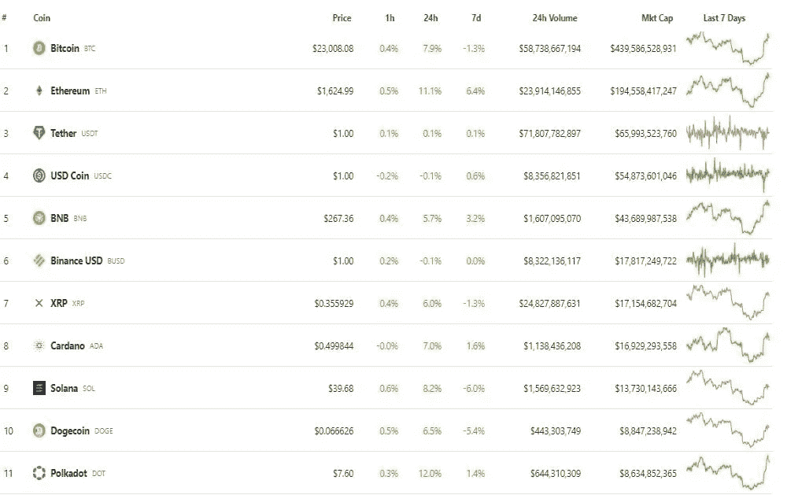
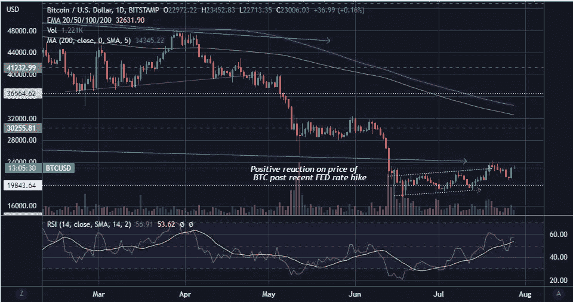

# 我想知道为什么美国金融市场没有对美联储最近的加息做出负面反应

> 原文：<https://medium.com/coinmonks/wonder-why-the-us-financial-markets-have-not-reacted-negatively-to-feds-recent-interest-rate-hikes-8113c5903e4e?source=collection_archive---------29----------------------->

美国市场对美联储加息 75 个基点反应积极。

人们可能会认为，随着美联储加息、CPI 通胀数据高企以及衰退前景的迫近，市场将进一步走低。

## 让我们来看看市场对美联储加息声明的总体反应

**道琼斯工业平均指数图表-**

DJI 指数反映了美国 30 家主要公司的综合价格表现。DJI 被认为是美国经济表现的晴雨表。

[Tradingview](https://www.tradingview.com/x/BOlXG48B/)

DJI 对美联储加息消息的反应是价格小幅上涨。

**主要阻力**在*33000 价位*。

注意-: *价格目前低于 200 简单日均线(紫色线)和 200 均线，尽管它高于 200 周均线(蓝色线)。*

牛市的确认将使价格突破主要价格阻力范围(33，037 美元)和 200 日均线(34，156 美元)和 200 均线(33，261 美元)。

**标准普尔 500 指数(S & P 500 指数)**

S&P 指数衡量 500 只市值最大股票的总体表现。这个指数是显示整个经济总体表现的晴雨表。该指数中包含的公司来自所有行业。

[Tradingview](https://www.tradingview.com/x/wMyBtiB1/)

S&P 对美联储宣布加息反应积极，主要价格阻力位于 4082 美元。

注-: *价格目前低于 200 简单日均线(紫色线)和 200 均线(指数均线)，尽管它高于 200 周均线(蓝色线)。*

牛市的确认将使价格突破主要价格阻力范围(4082 美元)和 200 天均线(4348 美元)和 200 均线(4190.52 美元)。

***纳斯达克***

纳斯达克衡量主要科技股的价格表现。

From [Tradingview](https://www.tradingview.com/)

该指数昨日试图突破 12，683 美元的主要阻力位，绿色大蜡烛显示出对美联储加息声明的积极反应。

注-: *价格目前低于 200 简单日均线(紫色线)和 200 均线(指数均线)，尽管它高于 200 周均线(蓝色线)。*

牛市的确认将使价格突破主要价格阻力范围(12，683 美元)和 200 日均线(14，244.4 美元)和 200 均线(13，398.5 美元)。

**黄金**

黄金是一种主要的商品资产，传统上被认为是避险资产。

From [Tradingview](https://www.tradingview.com/)

黄金价格也对美联储加息消息做出了绿色蜡烛的反应。

金价渴望突破 1741 美元的主要价格阻力位。

**比特币**

加密市场对美联储加息消息的反应非常积极，BTC 和 alt 硬币的价格都在绿色领地公布后。

Coingecko

***BTC 价格走势图***

[Tradingview](https://www.tradingview.com/x/Qb41091f/)

BTC 的主要阻力在 30，000 美元区间。

[Tradingview](https://www.tradingview.com/x/Qb41091f/)

BTC 有更多的买家，很少有人在美联储加息消息后立即出售资产，这可以从 BTC 的 4 小时图表中看出。

注-: *价格目前在 200 简单日均线(紫线)和 200 均线(指数均线)下方。*

牛市的确认将使价格突破主要价格阻力范围(30，000 美元)和 200 天均线(34，345.22 美元)和 200 均线(132，631 美元)。

## 75 个基点的加息对市场来说没什么大不了的，因为幅度低于预期

因此，我可以得出结论，市场认为美联储再次加息没什么大不了的，这一点已经被考虑在内了。

事实上，市场可能很高兴美联储仅加息 75 个基点，而它本可以加息 100 个基点。

## 杠杆交易和卖空操作推高了资产价格

似乎出现反弹的另一个原因是杠杆交易，那些资产短缺的人经历了做空挤压，导致 BTC 等资产价格上涨。

过去几个月的叙述是，我们正处于熊市，众所周知，美联储加息将减少货币供应，因此这阻碍了投资，鼓励储蓄。抛售资产以获得强劲的美元现金头寸，将压低资产价格。

因此，其可能的杠杆交易商借入 BTC 出售资产换取现金，并卖空资产，认为 BTC 的价格将进一步下跌。然而，由于 BTC 价格上涨，由于买方活动，这些空头交易者不得不以更高的价格再次买入 BTC 以偿还贷款。这是一种短暂的挤压现象。

# 公众对美国经济陷入衰退的看法

目前，美国当局否认美国经济陷入衰退的可能性。根据财政部长珍妮特·耶伦的说法，这必须由经济分析局决定。因此，即使美国经济第二季度 GDP 增长为负，珍妮特·耶伦也解释说这不是衰退的指标，因为经济分析局分析了广泛的数据，只有他们根据这些数据才能得出美国经济状况的结论。

现实是，通货膨胀这个庞然大物不容易控制，进一步加息可能是必要的，以控制通货膨胀，这自然会使美国经济陷入衰退。

已经有关于公司裁员、增长放缓、消费者支出下降和通货膨胀加剧的消息。所有这些都表明，美国可能已经处于衰退阶段。第一季度国内生产总值负增长 1.6%，因此公众担心可怕的衰退阶段已经到来！！

# 原油价格已经降温，这是一种解脱！！

From [Tradingview](https://www.tradingview.com/markets/)

随着原油价格降温，原油价格有所缓解，原油价格下跌并突破 96 美元的支撑。这对市场来说是个好消息，因为原油价格在 3 月份达到了 130 美元的峰值，6 月份达到了 123 美元。高企的原油价格也会带动其他大宗商品价格上涨，从而加剧通胀。

人们可以预计原油价格将在 84 美元的范围内找到支撑，之后其价格可能会再次向任何方向移动。

# 随着这种投资工具的需求增加，美国债券收益率下降

From [Tradingview](https://www.tradingview.com/markets/)

自 6 月中旬以来，10 年期、5 年期和 2 年期美国债券的收益率也一直在下跌。这是因为投资者在不确定的时期涌入安全稳定的收益投资，因为他们预计美联储加息可能会导致市场崩溃。

# 美元的强势已经停止

[Tradingview](https://www.tradingview.com/markets/)

显示美元对其他 6 种主要货币的表现的美国 DXY 指数现在正在下降，这意味着美元对其他主要货币的价值已经停止升值。

**结论**

就像牛市中的调整期一样，熊市中也可能出现缓解性反弹。在这样的市场中，谨慎的做法是记录利润或卖出以最小化损失，就像在牛市中逢低买入是一种谨慎的行为。

这些天，很难使用技术分析基本面进行交易，因为鲸鱼和大机构投资者操纵资产价格，将资产价格带到 200 MA，200 EMA 和 200 WMA 的主要移动平均线范围之上或之下，以启动零售商购买或出售资产。这很可能正在上演，所以必须小心。

我是根据 Nicholus Mertin 在《宏观周一》中的宏观分析得出的见解写这篇文章的。这是他的 youtube 频道的链接—

***免责声明-*** *本文仅供娱乐和教育之用，非理财建议。我只是一个密码爱好者，还不是一个成功的交易者。*

> 交易新手？尝试[加密交易机器人](/coinmonks/crypto-trading-bot-c2ffce8acb2a)或[复制交易](/coinmonks/top-10-crypto-copy-trading-platforms-for-beginners-d0c37c7d698c)