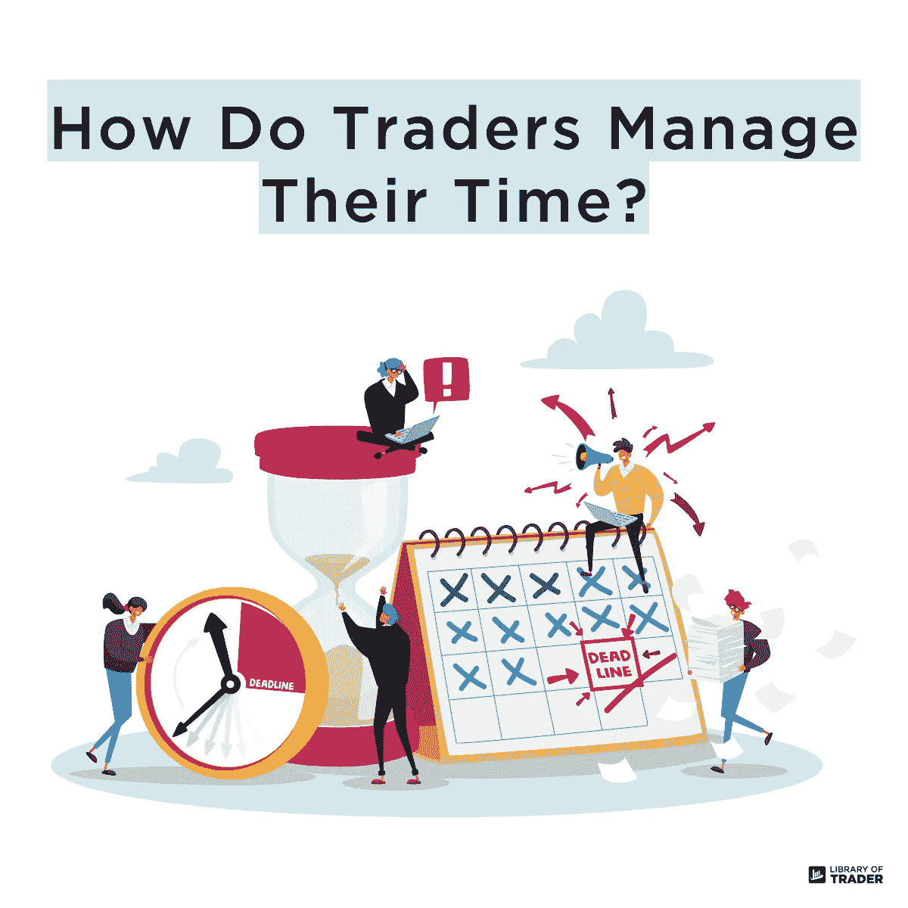

# 工作生活平衡:交易者可能吗？

> 原文：<https://medium.com/coinmonks/work-life-balance-is-it-possible-for-traders-c9f4e1bffffd?source=collection_archive---------14----------------------->

交易不容易。这是一个连专业交易者都会认同的事实。然而，这个游戏变得更加有趣，因为它具有挑战性！那么，交易好玩吗？我们打赌，只有赢家才能这么说，而输家则因为口袋“出血”而不停抱怨。

最终的问题是交易者为什么交易。听起来很明显，人们想变得富有！然而，大多数交易者承受着压力和焦虑，而不是他们一直谈论的梦想财富。

这篇文章讨论了交易中被忽视的一个方面——心理健康和交易者的工作生活平衡。

# 交易不需要时间，但是需要大量的时间！

每个交易工具都有不同的原则，需要特定的知识。然而，每种工具的每个交易者都应该记住一个通用模型。

1.  了解你所在的乐器。
2.  洞察你所处的市场和时间框架。
3.  运用分析技术来解读市场趋势或价格行为。
4.  制定战略和灵活的战术。
5.  在整个过程中管理风险。

这些步骤不可能在每天几分钟而是几小时后完成。一些日内交易者说他们几乎每个交易日都要盯着监控屏幕。这是令人疲惫的，因为他们似乎没有任何时间给所爱的人，甚至他们自己。

# 当时间消耗伴随着压力，会发生什么？

“耗时”并不是唯一和交易联系在一起的形容词。承受高压也是交易者应该意识到并习惯的。

如果赢了，它可以给交易者补充能量，让他们继续交易。然而，如果交易者得到的是亏损，他们可以耗尽精力。慢性的巨大痛苦会导致交易者严重损害交易者的心理健康，比如抑郁症。

我们尽力通过提高我们的物质主义和精神主义来改善我们的生活。交易被认为是最好的方式之一，但它似乎适得其反——由于不可预测的市场趋势，交易者感到沮丧或不安全。

# 那么，交易员应该怎么做才能平衡工作和生活呢？

首先，我们认为不存在完美的平衡。如果你想有所成就，你必须准备好并愿意为此花费时间和精力。这同样适用于成功交易。

如果你想成为一个专业的交易者，你必须学习基础知识，现场练习策略。它可以占用你平时和亲人在一起的时间，也可以占用你自己的时间。渐渐的，一旦基础打牢了，你就要改变交易和个人生活的时间比例。

简而言之，这是关于你如何一次把事情按优先顺序排列。请记住，我们不能同时做所有的事情！工作与生活平衡的定义可能会出现，因为我们人类贪婪地想同时完成所有事情。这就是为什么我们要平衡一切。然而，我们可能忽略了一个事实，那就是“有时因为爱而失去平衡是平衡生活的一部分。”

你觉得怎么样？在评论区分享你对这个话题的想法吧！

请继续关注我们的下一篇博客，深入探讨交易的方方面面。关注我们的媒体简介，获取更多关于各种交易主题的深入信息！

通过其他平台的不断更新在下面！

*   网址:【libraryoftrader.net/】T2
*   insta gram:[instagram.com/libraryoftrader/](https://www.instagram.com/libraryoftrader/)
*   推特:[twitter.com/libraryoftrader](https://twitter.com/libraryoftrader)
*   领英:[linkedin.com/company/library-of-trader/](https://www.linkedin.com/company/library-of-trader/)
*   电报:[t.me/libraryoftradercourse](https://t.me/libraryoftradercourse)

> 交易新手？尝试[加密交易机器人](/coinmonks/crypto-trading-bot-c2ffce8acb2a)或[复制交易](/coinmonks/top-10-crypto-copy-trading-platforms-for-beginners-d0c37c7d698c)