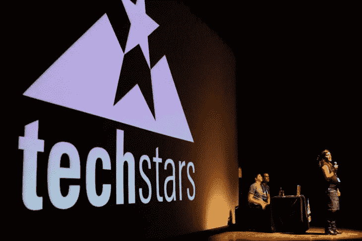

# 与政府合作，共同建设可持续的生态系统

> 原文：<https://medium.com/coinmonks/working-with-governments-to-build-sustainable-ecosystems-together-8104768fe8a2?source=collection_archive---------27----------------------->

Building ecosystems need to be sustainable too.

有人说政府很难共事。

有人说企业更难合作。

我说，如果你没有共识和信任，任何人都很难共事。

政府和创业公司能有效合作吗？

不久前，我在 Techstars 启动日参加了一个小组会议。

主题是“与政府合作，共同建设可持续的生态系统”。

在可持续的创业生态系统中，政府应该扮演什么角色？

*   尽可能地培养、播种、帮助、支持所有玩家
*   成为希望和可能性的灯塔，召集玩家走到一起，互相支持
*   为创始人、加速器、风投和相关行业提供资助，以刺激研发
*   然而，要注意的是，政府不可持续的持续支持，流血的钱来支持所有的事情，所有的人，所有的一次和永久的

Every player in the ecosystem plays a key role in growing the community.

**生态系统参与者和政府之间成功的伙伴关系是什么样的？**

*   当目标一致时，就达到了里程碑，更多的创业公司在更长的时间范围内蓬勃发展
*   检验政府是否做得好的试金石是当你看到更多的初创企业在不同的阶段蓬勃发展

StartupX 这样的组织如何与政府机构成功合作？

*   从理解和调整核心目标开始
*   例如，政府希望在 SG 中推动更多加速器，他们真正想要的是为稍微成熟一点的初创公司提供优质支持，以继续增长，进而帮助整个生态系统
*   一个可能的解决方案不仅仅是考虑下游，而是进一步向上游发展，培养更多的创业者和对这个领域的兴趣
*   耐心和沟通——gov 的工作速度稍慢，但有一些方法可以有效沟通

Like Brock and Venom, a symbiotic relationship is key.

除了政府，可持续的创业生态系统还需要什么？

*   政府，创始人，基金，大学和更多的创始人
*   你永远不会有足够多的创始人，所以更多的创始人总是一件好事
*   创业生态系统不是区块链上的数据库，也不是机械车间里的引擎，它是一个活生生的、不断调整的无定形有机实体，类似于一个由相互联系的人组成的网络

并非一切都是美好和阳光，也有挑战。

工作层想要的和能做的可能与管理层的老板想要的截然不同。

At the core of it, community building is about providing long-term value that will sustain itself.

他们可能会长期思考和计划，但在短期基础上运作。最终，他们必须展示业绩，业绩应在每个财政年度结束时或公务员的奖金到期时(即绩效评估季节)公布。

钱是有的，但是除非你完全符合标准，符合他们的要求，否则你不会得到它。

测试、试点、试验和一次性项目需要付出巨大的努力才能启动，并过早地消亡。

因此，对于任何正在或考虑与企业和政府合作的人来说，很好地理解需要做什么并睁大眼睛去做是至关重要的。

-

谁更难共事？政府、企业还是创业公司？

-

2022 年全球创业周末:我们正在进军 Web3。

在这里买票—[https://startupweekendglobal.com/](https://startupweekendglobal.com/?fbclid=IwAR3QPbyLNykbuphkfBzBOtPFxSbwDM4G9wnFOaM1xyn3cCWMxSHWH3jR1PE)

-

#创业#商业#创业#成长#成功#社交媒体#文化#创业#战略# eth #比特币#政府#经验#企业#创新

> 交易新手？试试[密码交易机器人](/coinmonks/crypto-trading-bot-c2ffce8acb2a)或者[复制交易](/coinmonks/top-10-crypto-copy-trading-platforms-for-beginners-d0c37c7d698c)