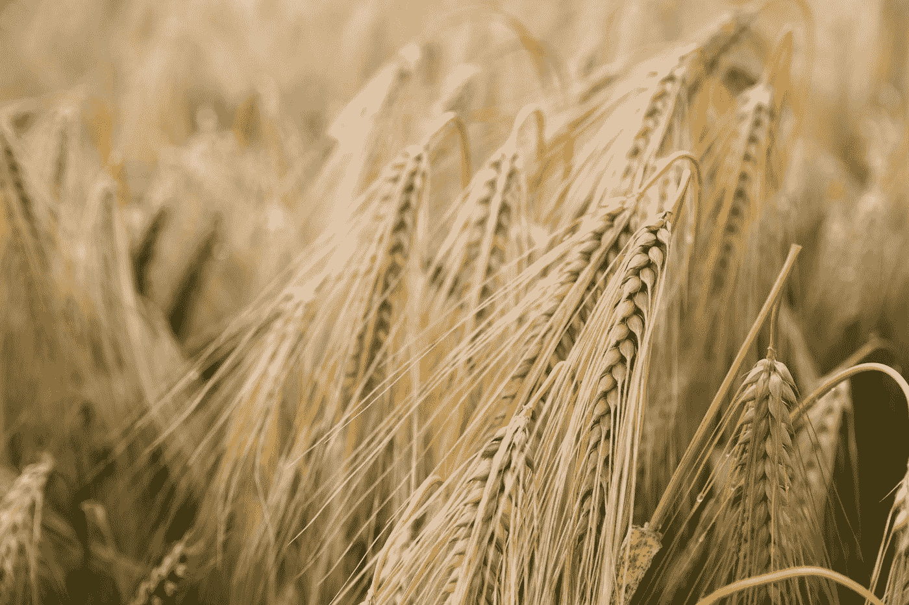

# 俄罗斯-乌克兰冲突打乱了世界粮食和肥料的格局

> 原文：<https://medium.com/coinmonks/world-grain-fertilizer-scenarios-being-disrupted-by-russia-ukraine-conflict-7d9e5d9bb9ca?source=collection_archive---------37----------------------->

Photo by [Kai Pilger](https://unsplash.com/@kaip?utm_source=medium&utm_medium=referral) on [Unsplash](https://unsplash.com?utm_source=medium&utm_medium=referral)

哦，顺便问一下，你知道有一场关于谷物的战争吗？

2022 年 10 月 29 日**乌克兰总统沃洛季米尔·泽伦斯基(Volodymyr Zelenskiy)就俄罗斯暂停谷物出口走廊合作(黑海谷物交易)的最新举措向公众和媒体发表了讲话。美国和欧盟都强烈批评了俄罗斯在今年 20 国集团(G-20)峰会召开前做出的决定。**

**2022 年 9 月 13 日****也有报道称，联合国(UN)正寻求安排一项交易，俄罗斯和乌克兰将允许从俄罗斯通过乌克兰出口的氨进入全球市场。******

******任何关注俄罗斯-乌克兰冲突的人都知道，自俄罗斯于 2022 年 2 月 24 日入侵乌克兰以来，黑海一直是国际市场上风险最高且动荡不安的地区之一。******

******这项拟议中的交易确实试图塑造黑海正在恢复正常经营的说法，但如果这笔交易最终敲定，那里的实际情况可能会完全不同。俄罗斯已经一次又一次地证明，联合国赞助的协议不会降低对乌克兰采取军事行动的可能性。事实上，该管道在 2022 年 2 月 24 日完全关闭。******

******许多国际公司和组织认为，这项拟议中的交易是应对全球粮食危机的必要条件。然而，俄罗斯的肥料外交[**不断干扰着这一进程。**](/areas-producers/fertilizer-diplomacy-2-0-862b6a6a6321)******

**** [## 肥料外交 2.0

### 联合国新提出的协议是否给谷物出口走廊(黑海…

medium.com](/areas-producers/fertilizer-diplomacy-2-0-862b6a6a6321)**** 

****欲阅读更多关于全球经济未来核心领域和关键生产者的分析和案例，请关注出版物 [**领域&生产者**](https://medium.com/areas-producers) 。****

**** [## 地区和生产商

### 这份出版物通过分析商业新闻、法律案件和与…有关的国际事务，探索了一种范式的转变

medium.com](https://medium.com/areas-producers) 

> 交易新手？试试[加密交易机器人](/coinmonks/crypto-trading-bot-c2ffce8acb2a)或者[复制交易](/coinmonks/top-10-crypto-copy-trading-platforms-for-beginners-d0c37c7d698c)****