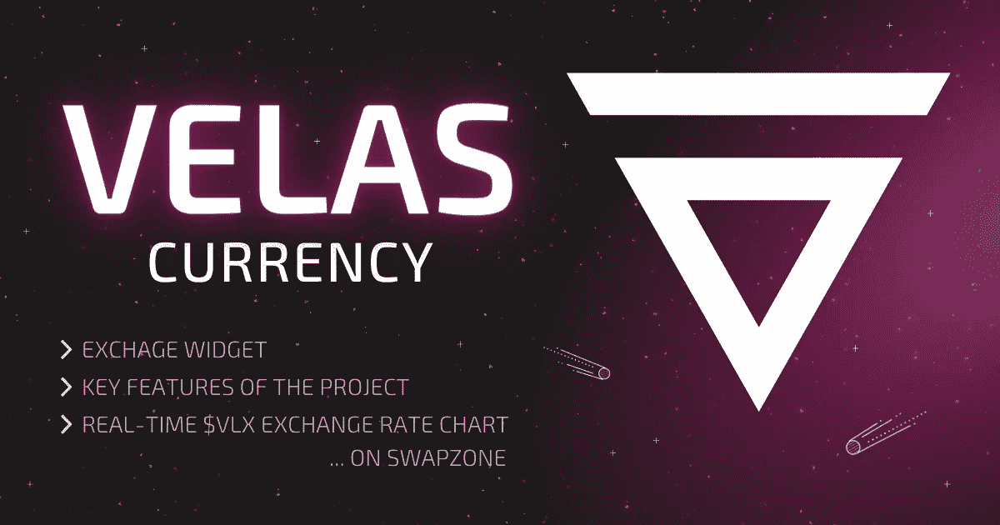

# 世界上最快的 EVM/eBPF 混合链:Velas (VLX)项目概述

> 原文：<https://medium.com/coinmonks/worlds-fastest-evm-ebpf-hybrid-chain-velas-vlx-project-overview-59a836823b2a?source=collection_archive---------16----------------------->

Velas 是世界上最快的 EVM/eBPF 混合链。它是现代区块链架构之一，具有几个独特的产品，提高了灵活性、操作性和安全性。所以，如果你被这个问题困扰——什么是 Velas？那么，没有理由再看下去了，这里有你需要知道的所有细节。首先，我们将列出需要注意的要点。

# 什么是 Velas crypto (VLX)？

## 关键要点

*   Velas 是区块链网络，而 VELAS VLX 是 VELAS 区块链上用作官方价值衡量单位的令牌。
*   Velas 赢得了“混合链”的称号，因为它结合了以太坊和索拉纳以及它的跨链特性。
*   区块链成立于 2019 年，总部位于瑞士。
*   Velas 区块链是一个开发去中心化应用的去中心化平台。
*   这是新一代的自我学习、人工智能密码系统。

# Velas 的创始人是谁？

在成立之初，Velas 基本上是由两个合作伙伴创建的，尽管目前，该团队已经发展到容纳更多的伙伴关系和合作。亚历克斯·亚历山德罗夫担任首席执行官，法尔哈德·沙古利亚莫夫担任首席信息官，两人合作创建了 2019 年的瑞士 Velas。

法尔哈德·沙古利亚莫夫第一次接触加密系统可以追溯到 2016 年，当时他首次投资加密技术，恰逢他的技术公司在中国初创。这两种经验的结合为孕育 Velas 项目的想法的发展奠定了基础。他率先提出了 ISIN 倡议；第一个加密货币国际安全识别码。

另一方面，亚历克斯·亚历山德罗夫从他的金融背景经验中成长起来。他最初是包括衍生品在内的多种资产的交易员。亚历克斯从维持对资产的广泛投资转向了加密领域。他利用自己 15 年以上的 IT 专业经验，构建了一个名为 Coinpayments 服务的支付网关。Coinpayment 使用以太币、比特币、莱特币和许多其他替代币处理支付。它仍然是市场上最大的加密支付网关。

随着 Velas 项目的持续增长，该网络开始了更多的合作，以促进增长。Velas 与 CoinPayments、WEB3 Space、SOLANA、BlueZilla 和市场上的一些知名公司合作。它还与利基市场之外的公司合作。Velas 是瑞士区块链黑客马拉松的官方协议合作伙伴。它与东道主劳伦斯·菲什伯恩、法拉利车队、NFT 赛车运动 GPNFTS 公司以及无数其他合作伙伴合作。

# Velas (VLX)是做什么用的？

Velas (VLX)是一种加密硬币，有许多使用案例。作为 Velas 链中的官方货币，代币 Velas (VLX)主要用于支付、交换、交易费用结算的交易功能，以及支持对验证者的股权证明激励。

# 是什么让 Velas (VLX)独一无二？

Velas crypto 项目获得了 tag 世界上第一个最快的 EVM/eBPF 混合链机制，这是 Solana 区块链代码库和以太坊虚拟机功能融合的结果。区块链是建立在 Solana 的速度和可伸缩性，并补充了以太坊的附加功能。这为其用户提供了创建跨链应用程序的空间，它不仅是这方面的先锋力量，而且也是最快的，因为它能够在一分钟内处理多达 4，500，000 笔交易(每秒 75，000 笔)，具有即时终结性、可靠性支持和非常低的费用。

该网络的目标是融合 Web 3.0 功能、区块链系统和创新技术，旨在创建一个透明、以用户为中心、分散的产品和服务生态系统，以提高全球人民的生活质量，让互联网重新变得可访问。该网络是一个开源平台，采用分散式治理风格，托管多个分散式项目和应用程序。Velas Network 在 Crypto Valley top 23 区块链公司。

这还不是全部，区块链生态系统运行着一个人工智能驱动的委托利益证明(AIDPOS)共识机制。此功能有助于项目的自学功能，并增强可扩展性、高安全性和互操作性。

由于需要破纪录的效率，Velas 区块链使用了高度复杂的结构，这种结构易于限制同步节点的时间。为了纠正这一点并防止大量节点的丢失，AIDPOS 算法被加入进来，以保持性能和安全性之间的平衡。因此，将“人工智能卫士”技术引入网络。

# 有多少 Velas (VLX)硬币在流通？

目前，Velas (VLX)硬币的流通供应量为 23.2 亿 VLX。token 里有 23.24 亿 VLX 币。VLX 于 2019 年 10 月 3 日首次出售，售价不到 0.02 美元。然而，目前，硬币的价值、用途和范围都有所增长。在撰写本文时，其定价为 0.0437 美元。

由于 Velas 生态系统的结构，所有账户持有人的个人数据始终保持私密

根据 Coinmarketcap 的数据，在撰写本文时，VLX 硬币排在第 123 位。

# Velas dApp 开发

Velas 平台是几个分散应用程序的主机，其中一些是 VelasPad 和 BitOrbit。

Velas 区块链为开发者提供了一个保护隐私的应用、服务和产品社区，增强了用户体验。平台支撑扎实；以太坊的编程语言，允许从以太坊迁移应用程序。不只是以太坊，还有创，还有币安智能链(BSC)也是。

在 Velas 开发平台上，可以以不到一美元的费用执行数千笔交易。用户还可以通过平台上的开发支持计划享受资金、曝光和合作机会，该平台提供资金、赠款、筹款和营销。它不仅为区块链上的 dapps 服务。通过 EVM，它还为以太坊平台上托管的 dapps 提供服务。

# 贝拉斯·EVM

以太坊虚拟机(EVM)是旨在改进分散应用程序开发的几个 Velas 计划之一。它是以太坊和 Velas 之间的桥梁。它为以太坊和 Velas 用户提供了两个世界的精华。

以太坊是 dApps 开发中使用最广泛的 DeFi 平台。因此，EVM 将作为一个平台，用户可以通过它在以太坊上托管他们的应用程序，同时运行这些应用程序，享受 Velas 网络每秒 75，000 次交易(TPS)的速度能力。EVM 将以较低的费用为分散以太坊应用的开发者提供扩展的能力。

# 韦拉斯帕德

VelasPad 是 Velas 加密平台的发射台。它作为孵化器平台，与 Velas 开发团队一起运作。它帮助资金，赠款和营销活动，以支持创新的区块链项目使用 Velas 的技术。通过 VelasPad，用户和开发人员社区参与 token 发布活动，并为有前途的项目提供早期资金，以快速将产品推向市场。

它对于改善托管在网络上的分散式应用程序(dApps)的用户体验也很有用。

# Velas 网络是如何保护的？

加密货币行业内的项目面临着在可扩展性和安全性之间找到平衡的挑战。这是 Velas 区块链开辟新路径的领域之一。

随着人工智能的引入，Velas 区块链提供了最佳的安全性和可扩展性。这个人工智能模块作为一个附加层来实现速度和安全性的最佳平衡。AI 模块名为 AIDPoS。

# 如何购买 Velas (VLX)？

与许多其他加密货币不同，VLX 不能用法定货币购买。它必须用密码购买。因此，要购买 VLX，你必须首先使用法定加密交易所购买比特币，然后向支持 VLX 币的交易所转账。

你可以在几个加密交易所做到这一点，但如果你想要快速的交易执行和出色的客户服务，那么就用 Swapzone 吧！

要在 Swapzone 上获得 VLX 硬币，您需要用另一枚硬币进行交换。无论是比特币、以太坊等。

*   转到 Swapzone.io
*   在“发送”字段中选择 BTC。
*   输入您希望交换的 BTC 数量。
*   在“到达”部分选择 VLX。
*   选择您感兴趣的交易过滤器。
*   选择最优惠的报价，并输入您唯一的 VLX 地址。
*   等待几分钟，等待您的 VLX 资金存入。

# 哪种加密货币钱包支持 Velas (VLX)？

几个加密交换机和钱包都支持 VLX。下面是支持 VLX 的集中式交换机(CEX)和分散式交换机(DEX)的列表。

# CEX

BW.com、Exmo.com、ZBG.com、Probit.com、Bittrex Global、FMFW (Bitcoin.com)、ChangellyPro、CoinEx、Digifinex、Gate.io、Kucoin、Huobi Global 和 BitForex。

# 地塞米松

Uniswap、PancakeSwap、WagyuSwap、SushiSwap、AstroSwap 和 KyberSwap。

总之，Velas 网络是一个独特的区块链，它在 Solana 和 Ethereum 结构的融合中茁壮成长。它保持了可伸缩性和效率之间的平衡，提供了每秒 75，000 个事务的速度。它支持各种编程语言和跨链功能，将应用从其他区块链迁移到 Velas 网络。所有这些特点加上低费用和无缝的用户体验，有助于货币的排名和市场主导地位。

# 转换 Velas 的流行鞋款

[VLX 到 BTC](https://swapzone.io/exchange/vlx/btc)
[VLX 到 ETH](https://swapzone.io/exchange/vlx/eth)
[VLX 到 LTC](https://swapzone.io/exchange/vlx/ltc)
[VLX 到 BNB](https://swapzone.io/exchange/vlx/bnb)
[VLX 到 BCH](https://swapzone.io/exchange/vlx/bch)
[VLX 到 USDT](https://swapzone.io/exchange/vlx/usdt)
[VLX 到θ](https://swapzone.io/exchange/vlx/theta)
[VLX 到 XMR](https://swapzone.io/exchange/vlx/xmr)
[VLX 到 TRX](https://swapzone.io/exchange/vlx/trx)
[VLX 到](https://swapzone.io/exchange/vlx/bsv)

> 交易新手？尝试[加密交易机器人](/coinmonks/crypto-trading-bot-c2ffce8acb2a)或[复制交易](/coinmonks/top-10-crypto-copy-trading-platforms-for-beginners-d0c37c7d698c)