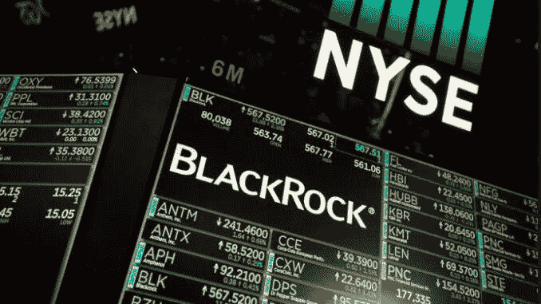

# 全球最大的资产管理公司支持客户购买比特币

> 原文：<https://medium.com/coinmonks/worlds-largest-asset-manager-to-enable-clients-to-buy-bitcoin-e0dd7911271?source=collection_archive---------6----------------------->

## 听腻了比特币？我们才刚刚开始。

BlackRock Logo at the New York Stock Exchange ([Source](https://energynewsbeat.co/the-worlds-largest-asset-manager-blackrock-lost-1-7-trillion-in-first-six-months-of-2022/))

神圣的狗屎。

如果你关注我的文章，你会知道[我最近在比特币](/@trevorstark02/im-selling-all-my-assets-to-buy-one-thing-seriously-255f1298f6b6)上全押了。我从未对自己的投资理论如此自信过。

> 就在几天前，贝莱德(全球最大的资产管理公司)…