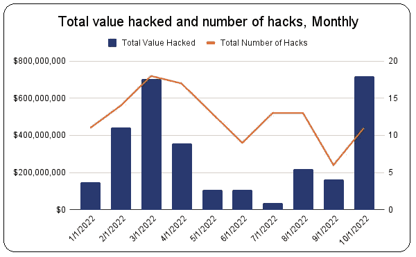

# 今年 10 月是加密史上最糟糕的一个月，黑客获利 7 . 18 亿美元

> 原文：<https://medium.com/coinmonks/worst-month-in-crypto-history-this-october-with-hackers-raking-in-718m-usd-38b59ad62672?source=collection_archive---------20----------------------->

一个新的 1 . 12 亿美元的黑客攻击发生在去中心化的金融平台 **Mango** 上。昨天，奥特赛克审计员在推特上首次披露了这一消息。

芒果的人说，他们已经动员起来冻结被盗资金。芒果是一个基于索拉纳的区块链的[分散交易所](https://bitnewsbot.com/what-are-decentralized-exchanges/)，它为用户提供进行现货交易和贷款的能力。

尽管这个月还没过半，但就[黑客攻击](https://bitnewsbot.com/tag/hackers)而言，10 月将成为加密货币史上最糟糕的一个月。根据研究公司 Chainalysis 的数据，本月到目前为止，已经发生了 11 起抢劫事件，总损失达 7 . 18 亿美元。

如果违规行为继续以这种速度发展，预计今年将是失窃数量最多的一年。到目前为止，黑客已经在 125 次攻击中获利超过 30 亿美元。

# 黑客更喜欢 DeFi

与前几年相比，今年的显著不同之处在于，攻击的目标是分散金融(DeFi)协议。

之前的对象主要是集中交易所。这一趋势始于去年。对此有一个解释。

大型交易所加强了他们的防御，使得攻击他们变得更加困难，而 DeFi 由于较弱，更容易受到攻击。

Source: Chainanalysis

# 最脆弱:桥梁

最易受攻击的仍然是网桥，它们是允许将令牌从一个区块链转移到另一个的应用程序。分散经济生态系统的致命弱点。仅这个月就有 3 起盗窃案，盗取了价值 6 亿美元的硬币。

# 对币安的巨大打击

最近的大事件当然是对连接到币安智能链的币安交易所桥梁的攻击。据发现，价值数亿美元的 BNB 代币被盗。黑客设法欺骗 BNB 大桥削减了 200 万 BNB 代币(超过 5.8 亿美元)。

一旦他获得了它们，他就试图把它们作为抵押品，从 Venus Protocol lending platform 借 stablecoins。这样他就不会放弃一个目标，如果他把它们拿出来出售，就会发生这种情况。这个计划部分成功了。在币安人有机会关闭链条、冻结剩余资金之前，他成功地获得了价值 1 . 27 亿美元的硬币。

会上突出介绍了 BNB 网络的一个特点。仅用了 26 个验证器就关闭了网络 8 个小时。因此，问题就来了，一个有 26 个验证器的区块链是否真的是分散的。在任何情况下，很少有人能把它拿下来。我们当然都知道答案。

这不是唯一的情况。大多数分散的区块链都只分散在词牌上。当然，这并没有阻止 BNB 的发展和繁荣。举个例子，当 BNB 在 2017 年推出时，它是 10 美分。今天它差不多有 300 美元，曾经涨到 550 美元。

然而，有一个紧迫的问题是，作为加密生态系统的一部分，桥是否会存活下来。如果加密货币被广泛采用，它们将需要安全可靠的价值转移系统。一个桥梁失败的角色，尽管它们确实有用。

桥梁是该系统的重要组成部分。除非以太坊这样的大型区块链最终占据主导地位。在新生的、因此令人兴奋的加密货币领域，这是一个大赌注。

*原载于 2022 年 10 月 13 日*[*【https://bitnewsbot.com】*](https://bitnewsbot.com/worst-month-in-crypto-history-this-october-with-hackers-raking-in-718m-usd/)*。*

> 交易新手？尝试[加密交易机器人](/coinmonks/crypto-trading-bot-c2ffce8acb2a)或[复制交易](/coinmonks/top-10-crypto-copy-trading-platforms-for-beginners-d0c37c7d698c)