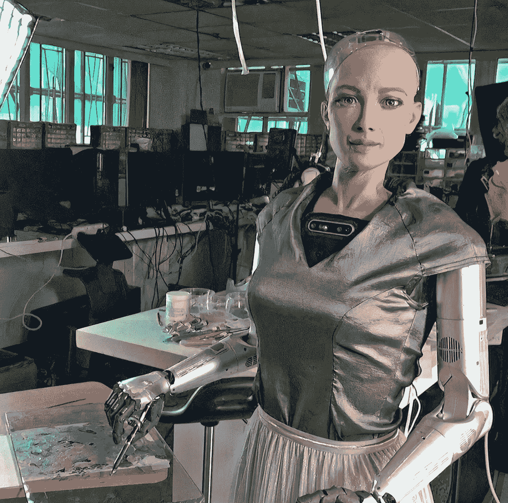

# 你会从机器人那里购买艺术品吗？

> 原文：<https://medium.com/coinmonks/would-you-buy-art-from-a-robot-f07da1fcc01f?source=collection_archive---------35----------------------->

Scary, beautiful and as real as it gets.

机器人索菲亚的 NFT 作品售价为 68.8 万美元。

机器人做的艺术算“艺术”吗？

如果艺术品是由一个有知觉的、有创造力的生物所做，那么它是真实的、原创的吗？

如果你不知道，索菲亚是一个世界闻名的人形机器人，它有着令人惊讶的逼真的面部特征和非常非常聪明的大脑。

她的对话和思考是如此超现实。

她能相对轻松地辩论和回答相当复杂的问题。

可以肯定地说，我们离 iRobot 和埃隆·马斯克承诺的世界不远了。

所以当汉森机器人公司决定加入 NFT 游戏时，他们决定让索菲亚画一些原创的东西。

好吧，我们和索菲娅还有一段距离，从纯粹的创造力中有机地汲取一些东西。

所以他们决定找个画家来画索菲亚的肖像。

索菲娅随后用真漆重新创作了这幅画，并将其作为 NFT 作品拍卖。

Someone bought her masterpiece for $688,000!

人工智能真的走了很长的路。

但是想想看，我们曾经梦想机器人和机器像人类一样行事。

> 交易新手？试试[加密交易机器人](/coinmonks/crypto-trading-bot-c2ffce8acb2a)或者[复制交易](/coinmonks/top-10-crypto-copy-trading-platforms-for-beginners-d0c37c7d698c)

我们在好莱坞电影和《星际迷航》中看到它们。

索菲亚甚至拿着画笔，在画布上细腻地绘画。

它所需要的机械精度、工程和计算能力简直令人难以置信。

为了让索菲娅达到一个 5 岁小孩的水平，还需要做很多事情。

你怎么能不对人类的能力感到惊讶呢？

她的作品被称为“索菲亚实例化”。

Yep, Sophia did it all by herself

你可以称之为她的杰作。

它看起来和真人画的原作惊人地相似。

有人为此支付了 68.8 万美元。

让我想知道“价值”到底在哪里。

是的，他们一定很喜欢模仿真人的机器人画的画。

说说 meta。

也许我们可以重新创建“索菲亚实例化”并出售实物！

明白了吗？

就像制作一个人类的索菲亚和绘制索菲亚画她的作品。

我想知道你是否可以从零开始，用数字艺术家制作的艺术品来做实体再造的生意。

化无形为有形。

从虚拟到现实。

谁准备好了。

-

机器人做的艺术算不算“艺术”？

-

# startups # business # startupx # growth # success # social media # culture # entrepreneur # strategy # sophiatherobot # humanoid # sophia artwork # artists # NFT # nftart # airobots # machines # robotics # engineering