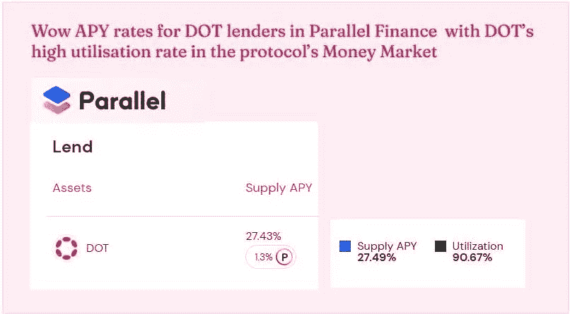
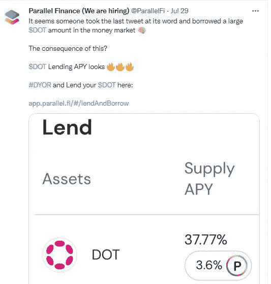
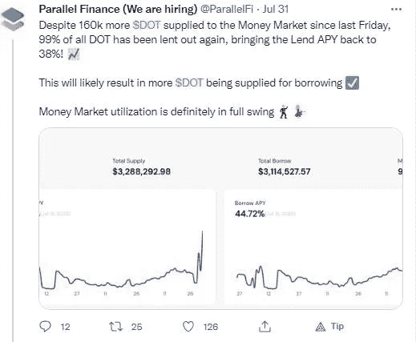
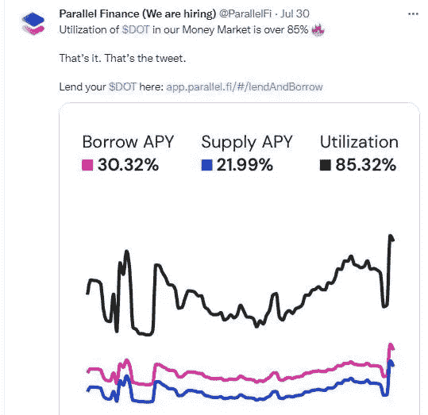
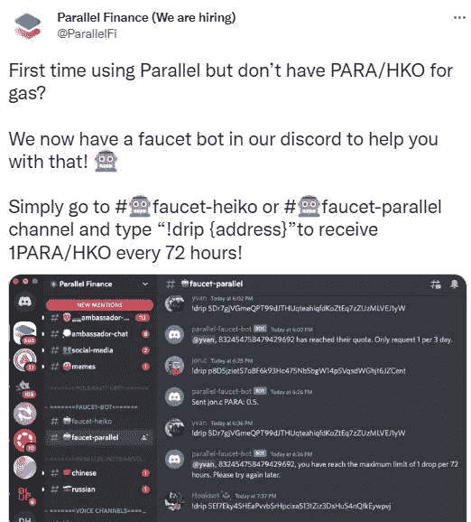
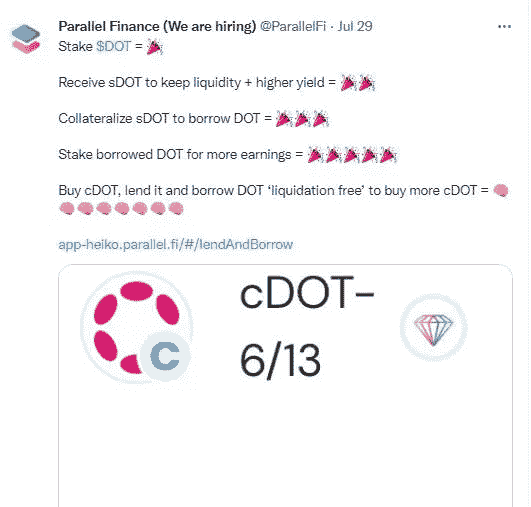

# 哇 APY 利率为点贷款人在平行金融与点的高利用率在协议的货币市场

> 原文：<https://medium.com/coinmonks/wow-apy-rates-for-dot-lenders-in-parallel-finance-with-dots-high-utilization-rate-in-the-142f0ddafb7d?source=collection_archive---------42----------------------->

# 7 月份的一个甜蜜的违约事件让平行金融领域的网络贷款人兴奋不已

7 月底，平行金融发生了一些疯狂的事情，在[平行金融的货币市场](https://app.parallel.fi/lendAndBorrow)中，DOT 的 APY 达到 37%，哇…

[Parallel Finance Tweet](https://twitter.com/ParallelFi)

正如我在我的[其他文章](/@kikctikcy/more-rewards-for-lp-providers-with-the-yield-money-market-functions-of-parallel-finance-452834f737a3)中提到的，平行金融有一个货币市场，在这个市场上，DOT 持有者可以借出他们的 DOT 并赚取收益，形式是借款人用 DOT 偿还利息，然后用 Para tokens 空投平行金融协议激励。

突然在 7 月 29 日，支付给网络贷款人的网络利率上升到 37%，发生了什么？，这绝对是疯狂的事情，尽管这一切对网络贷方来说都很棒。

# 借款人对网络贷款有很高需求的网络贷款人的热门 APY

[Parallel Finance Tweet](https://twitter.com/ParallelFi)

借款人对 DOT 的需求如此之大，以至于 Parallel Finance 的货币市场上 99%的 DOT 都贷给了他们，结果，DOT supply APY 成了超级 dooper HOT！！

甚至从那一天起，并行金融货币市场的点利用率就一直高达 85%以上！！

[Parallel Finance Tweet](https://twitter.com/ParallelFi)

因此，在并行金融的货币市场中，DOT 的利用率很高，大量 DOT 被借入和借出，货币市场中的 DOT 供应商；放款，赚取利润丰厚的 APY 供应他们的点在平行金融的货币市场。

有关并行金融货币市场中 DOT 资产使用的详细信息，请单击此处:

 [## 并行财务分析

### 实时波尔卡多特网络分析

parallel.fi](https://analytics.parallel.fi/moneymarket/DOT) 

今天，就在我写这篇文章的时候，货币市场上的 APY 点券利率是 28% …相当不错！！

# 从水龙头获得 Para 代币，开始进行平行金融交易

是的，所以如果点持有者想要利用并行金融，但没有支付交易费用所需的协议的 Para 令牌，他们可以从并行金融的 discord 中的#水龙头-并行渠道获得它。

[Parallel Finance Twitter](https://twitter.com/ParallelFi/status/1557349597617717248?s=20&t=jz72oJPEe8CA3Q_j3HQpcg)

所以，在这里加入水货金融不和谐——【https://discord.gg/h3y92VVp】T4 得到验证后，去#水龙头——水货频道打这个消息”！drip { address } "接收 1 Para 的空投款项，该款项将在 72 小时后到达您的钱包。显然，地址字段应该有您的点帐户地址。

## 使用并行金融的基本点收益最大化策略

我喜欢用一个基本策略来结束我的演讲，这个策略是让网络持有者在平行金融上用他们的网络资产获得最大收益…

[Parallel Finance Tweet](https://twitter.com/ParallelFi)

没错，stake DOT，get sDOT。

利用 sDOT 在并行金融的货币市场上借入 DOT

赌注借来的点，以获得更多的收入！！

*这就是所有的人，我希望你喜欢我说的小甜 DEFI 插曲。*

****你可以在这里阅读我的其他文章了解更多平行金融-****

*[新时代创新的 Web3 金融解决方案 DEFI Super App —并行金融](/coinmonks/innovative-web3-financial-solutions-of-new-age-defi-super-app-parallel-finance-650638fe5bc3)*

*[并行金融的增值 Web 3 金融服务使其成为 DEFI 超级 App](/coinmonks/value-added-web-3-financial-services-of-parallel-finance-make-it-a-defi-super-app-ebe04a7f8e66)*

# *关于平行金融*

*Parallel FInance 是 Polkadot Network 中最活跃的 DEFI parachains 之一，TVL 超过 4.88 亿美元。该协议提供的各种 Web3 金融服务使它成为一个超级 DEFI 应用程序。此外，作为 AMM 和货币市场协议，Parallel Finance 通过其 DOT liquid staking 和 Crowdloan 模块为 DOT 持有者提供有价值的服务。*

*事实上，对于点持有者来说，Parallel Finance 是一个一站式中心，这个 Super Defi 应用程序为他们提供服务，使点持有者能够参与 Polkadot 网络的重要方面，如下注和为 Polkadot 的 Parachain Crowdloans 捐款。*

*请了解学习平行金融做自己的研究(DYOR)以及。*

***网站**——[https://parallel.fi/index.html](https://parallel.fi/index.html)*

***推特**——[https://twitter.com/ParallelFi](https://twitter.com/ParallelFi)*

***不一致【https://discord.gg/DeyEntFT】——***

*白皮书—[https://parallel fi . git book . io/parallel-finance/polkadot-network/白皮书](https://parallelfi.gitbook.io/parallel-finance/polkadot-network/white-paper)*

> *交易新手？尝试[加密交易机器人](/coinmonks/crypto-trading-bot-c2ffce8acb2a)或[复制交易](/coinmonks/top-10-crypto-copy-trading-platforms-for-beginners-d0c37c7d698c)*