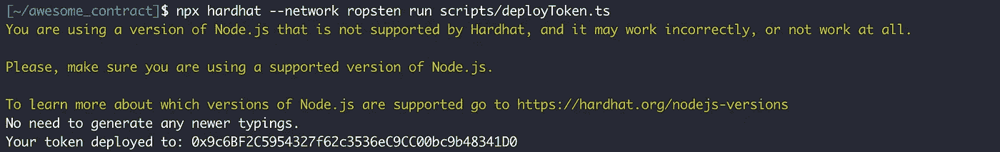

# 与 Hardhat 一起撰写您的第一份智能合同

> 原文：<https://medium.com/coinmonks/writing-your-first-smart-contract-with-hardhat-b93e8d07eaeb?source=collection_archive---------6----------------------->


每个人都喜欢 [Remix](https://remix.ethereum.org/) ，但是你可能想把你的文件放在本地，然后离线测试你的合同！[安全帽](https://hardhat.org/)来了。Hardhat 是一个编写和部署合同的开发环境。它为你提供了各种各样的插件和可访问性，让一切变得更简单。它有许多工具**来部署**、**运行**、**测试、**和**调试**你的合同。事不宜迟，让我们看看如何用它写你的第一份合同。

## **设置项目**

首先，您应该在设备上安装 npm。如果已经安装了，那就太好了。如果没有，可以用[这个](https://docs.npmjs.com/downloading-and-installing-node-js-and-npm)教程来安装。(记住 Hardhat 建议使用 Node.js 版本 12 到 16。虽然它在我使用的版本 18 上工作)

然后，我们为我们的项目创建一个目录。

```
mkdir awesome_contract && cd $_
```

按照这些命令初始化 npm 并安装 Hardhat 插件。

```
npm init
```


```
npm install --save-dev hardhat@2.9.9
```


```
npx hardhat
```


Set the type of the project to **Advanced sample project that uses TypeScript**. It gives us more options.

如果一切顺利，您的 Node.js 项目现在应该有了 hardhat 库。


The file structure should be something like this.

## 安装安全帽-部署

这个 hardhat 插件添加了一种机制，可以将合同部署到任何网络，跟踪它们并复制相同的测试环境。

您可以使用这个简单的命令轻松安装它。

```
npm install -D hardhat-deploy
```


最后要做的事情是在 *hardhat.config.ts* 文件中导入 hardhat-deploy。

```
import "hardhat-deploy";
```


## 获取部署的 API 密钥和私钥

1.  **以太扫描**

你需要得到的第一个 API 密匙是用于[以太扫描](https://etherscan.io/)的。点击[这里](https://etherscan.io/register)为自己创建一个账户。


Yes! Ethereum’s price was $1712\. I also find it hard to believe.

然后转到 [API 密钥部分](https://etherscan.io/myapikey)并创建一个新的 API 密钥。


现在您已经有了 API 密匙，请将它保存在某个地方，因为我们很快就会用到它。

2. **Infura**

当我们写合同时，我们需要在将它们部署到 mainnet 之前对它们进行测试。其中一个流行的测试网是 Ropsten。Infura 让我们可以访问这个测试网。所以我们需要创建一个帐户并访问 Ropsten testnet。首先，你需要到[这里](https://infura.io/register)创建一个账户。


然后转到您的[仪表板](https://infura.io/dashboard)并创建一个新密钥。


Be aware that the network of the project should be **Web3**

一旦你创建了它，转到关键页面。将网络端点更改为 Ropsten，并保存 URL 以备后用。


3. **MetaMask**

最后要做的是，您应该创建一个测试 wallet 并导出它的私钥(不要在这里使用您的主 wallet，因为它会导致属性丢失)。

你可以在几乎任何东西上使用 [MetaMask](https://metamask.io/) ，这里我们使用了 Brave(是的，它比 Chrome 好)扩展。


安装完扩展后，按照以下步骤完成钱包创建过程。


Fox’s head moves with the mouse cursor. Pretty cool, ha?


Hit *Create a Wallet* button to create a new one.


It’s up to you to share your data with them or not.


Choose a password for your MetaMask account.


Write down your 12-word recovery phrase somewhere safe. You might need it to recover your wallet in the future.


Now, hit the three dots button and open Account details.


Click Export Private Key and enter your MetaMask password. Finally, it gives you the private key. Write it down cause we need it soon.

所以现在我们得到了我们需要的。转到项目的主目录。将 *.env.example* 文件重命名为*。env* 。用从上述步骤中获得的环境变量填充环境变量。


## 写剧本

目前在 *contracts* 文件夹中有一个名为 *Greeter.sol* 的简单契约。让我们忽略它，写一个简单的 ERC20 令牌。ERC20 令牌有很多实现，但是这里我们使用的是 OpenZeppelin 的[](https://www.openzeppelin.com/)**。**

**OpenZeppelin 是一个框架，它提供区块链标准来帮助您编写安全的智能合约。在这里，我们将把它的契约添加到我们的项目中，然后在我们的智能契约中使用它们。**

```
npm install --save @openzeppelin/contracts
```

****

**安装完成后，您可以在 *node_modules* 目录中找到合同。**

****

**现在一切都准备好了，在 contracts 文件夹中创建一个新文件(我称之为 *SimpleToken.sol* )并开始编写合同。**

**这是我写的一个简单的 ERC20 令牌。除了基本的令牌功能，我还增加了一个。合同的所有者可以允许任何人铸造代币。这并不难，但这是一个很好的练习，可以提高你的坚实度。**

**您可以用这个命令编译契约，看看您的代码是否有问题。**

```
npx hardhat compile
```

**之后，您需要编写一个部署脚本来将您的合同发送到区块链。**

**在*脚本*目录下新建一个文件(姑且称之为 *deployToken.ts* ) *。这是你应该了解一点打字稿的地方。这很简单，不用担心，我们不会用太多。***

**部署脚本由 4 个重要部分组成(第 17–22 行)。首先，我们得到契约对象。其次，我们填充契约的构造函数。接下来，我们等待合同发送到区块链，最后，我们在控制台中打印合同地址。**

**您可以使用这个简单的命令轻松地部署契约。**

```
npx hardhat --network ropsten run scripts/deployToken.ts
```

****

**如你所见，合同被部署到了 **Ropsten** 网络，你可以在[浏览器](https://ropsten.etherscan.io/address/0x9c6BF2C5954327f62c3536eC9CC00bc9b48341D0)上看到它。**

****

**The contract is not verified yet**

****

**Our Awesome Mintable Token :)**

## **验证合同**

**你发给区块链的每份合同都是未经核实的。问题是合同是字节码，人们看不到你的代码，所以他们不能信任你。**

**您可以将您的代码发送到区块链，并告诉探险者展示您的代码。**

**在安全帽的帮助下，只需一个简单的命令就可以完成。您只需要契约地址加上您在契约构造函数中使用的数据来创建它。**

```
npx hardhat verify --network ropsten 0x9c6BF2C5954327f62c3536eC9CC00bc9b48341D0 "Awesome Mintable Token" "AMT" "100000"
```

****

**它在[浏览器](https://ropsten.etherscan.io/address/0x9c6BF2C5954327f62c3536eC9CC00bc9b48341D0#code)中给了我们合同的代码，当你进入网站时，你可以看到你的代码已经被验证并公开阅读。**

****

> **交易新手？尝试[加密交易机器人](/coinmonks/crypto-trading-bot-c2ffce8acb2a)或[复制交易](/coinmonks/top-10-crypto-copy-trading-platforms-for-beginners-d0c37c7d698c)**