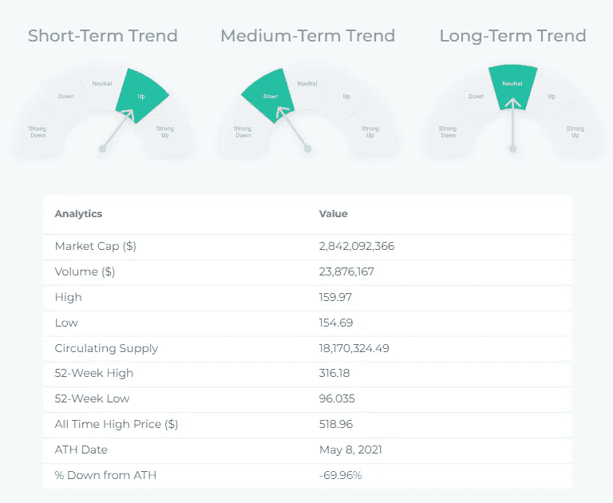

# XMR (Monero)-价格分析，图表模式，描述，技术指标，新闻…

> 原文：<https://medium.com/coinmonks/xmr-monero-price-analysis-chart-patterns-description-technical-indicators-news-e118cbae7a52?source=collection_archive---------39----------------------->

# **XMR(Monero)技术分析:**

Source: [altFINS](https://platform.altfins.com/curatedCharts)

交易设置:价格从 140-150 美元的支撑区域反弹，势头转为看涨(MACD 信号交叉，RSI 越过 50 中线)。价格可能会重新回到 180 美元的阻力区。(设定价格[警报](https://altfins.com/knowledge-base/create-alert-for-cryptocurrencies/))。这是一个艰难的阻力，因为它也是 200 天移动平均线，并且是价格在 8 月份突破上升三角形后被拒绝的水平。

趋势:中期趋势下降，短期和长期趋势中性。

势头喜忧参半，因为 [MACD](https://altfins.com/knowledge-base/macd-line-and-macd-signal-line/) 线位于 MACD 信号线上方(看涨)，但 RSI ~ 50(中性)。

OBV(平衡成交量):持平，表示上涨日的成交量等于下跌日的成交量。因此，买方的需求和卖方的供应处于平衡状态

支撑和阻力:最近的支撑区域是 150 美元，然后是 130 美元。最近的阻力区是 180 美元，然后是 200 美元。

# **图表模式:** XMR / USDT:

## **盈利潜力(买入)+11.75%**

Source: [altFINS](https://platform.altfins.com/tpatterns)

世界协调时 9 月 2 日 0:00 时发现的三角形。这个格局还在形成过程中。未来 26 天内，价格可能向阻力 174.3254 移动。

# 技术指标:

Source: [altFINS](https://platform.altfins.com/screener)

Source: [altFINS](https://platform.altfins.com/screener)

Source: [altFINS](https://platform.altfins.com/screener)

Source: [altFINS](https://platform.altfins.com/news)

# **什么是 Monero？**

Monero 是一个字节码分支，通过环签名、秘密地址、私人交易和 bulletproofs 提供匿名值传输，重点是隐私保护和可替代性。与其竞争对手可选的隐私保护功能相反，Monero 默认提供匿名功能。Monero 的工作证明算法不断发展，以保持分散化，并挫败 ASIC 的主导地位和采矿流程集中化。

访问[altFINS.com](https://platform.altfins.com/)了解更多分析、新闻和基础研究。

> 交易新手？尝试[加密交易机器人](/coinmonks/crypto-trading-bot-c2ffce8acb2a)或[复制交易](/coinmonks/top-10-crypto-copy-trading-platforms-for-beginners-d0c37c7d698c)