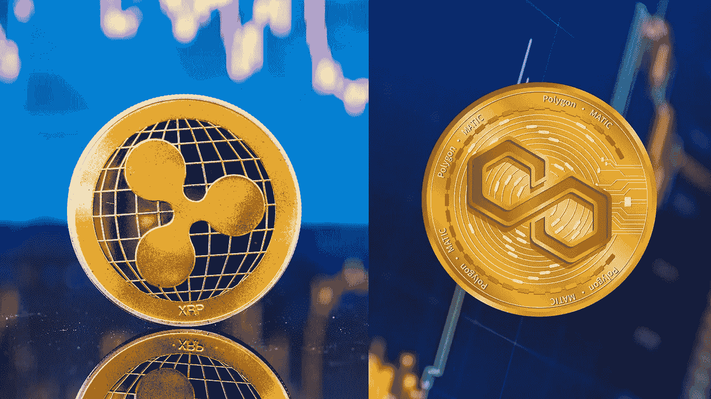

# XRP 和马蒂奇:哪种加密货币更有投资潜力？

> 原文：<https://medium.com/coinmonks/xrp-and-matic-which-cryptocurrency-has-more-potential-for-investment-c7ca59903e95?source=collection_archive---------7----------------------->

## [加密货币与投资💰](/@TraderB/list/cryptocurrency-and-investment-8d81ae749faa)

## 你会选择什么？

## **XRP 介绍(涟漪)**

**Ripple 是一个用于金融交易的数字支付网络。它由克里斯·拉森(Chris Larsen)和杰德·麦卡勒(Jed McCaleb)于 2012 年共同创立。**网络的关键功能…