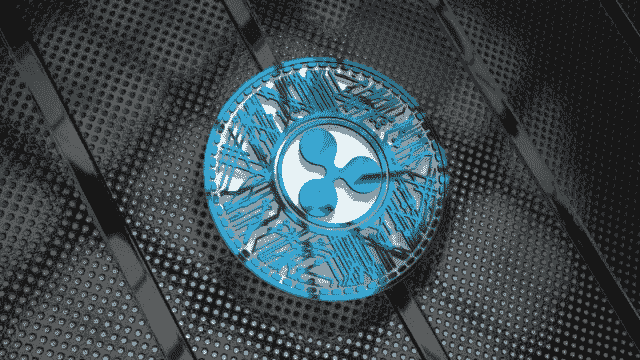

# XRP 很大。原因如下…

> 原文：<https://medium.com/coinmonks/xrp-is-huge-here-is-why-7777b6c9f9d1?source=collection_archive---------16----------------------->

撰写本文时，XRP 是世界第七大加密货币，也是一项独立的数字资产。在世界各地，金融机构和流动性提供商经常使用这种数字货币结算他们的账户。XRP 是世界上唯一一种与金融部门直接相连的中央加密货币。

# 什么是 XRP？

XRP 是一种运行在 XRP 账本上的加密货币，是由杰德·麦卡勒、亚瑟·布里托和大卫·施瓦茨创建的区块链。后来，McCaleb 和 Britto 创立了 Ripple，利用 XRP 加速网络交易。除了作为一种投资形式，XRP 还可以作为其他加密货币的交易媒介或作为 Ripple 网络上的交易融资手段。

值得注意的是，XRP 区块链的功能与大多数其他加密货币的区块链略有不同。其他加密货币允许每个能够快速解决困难方程的人访问他们的交易账本和验证流程，但这些交易是安全的，因为大多数账本持有人必须在添加验证之前批准验证。

作为一种替代方案，Ripple network 部分集中了一些事情:虽然它的验证软件可供每个人使用，但用户可以从它所谓的唯一节点列表中选择，根据他们认为欺诈他们的可能性最低的参与者来验证他们的交易。35 个可信验证器目前包含在它的默认列表中。这些验证节点中有六个是由 Ripple 制作的，它还会选择为这个列表授权哪些验证器。用户可以通过选择不使用默认列表，并假设从他们的交易中删除所有 Ripple-backed 验证器，来创建他们自己的可信验证器列表。这将使网络继续批准交易，即使 Ripple 公司停止参与或甚至存在。

而比特币交易确认可能需要几分钟甚至几个小时，并且通常很昂贵。" XRP 交易的确认成本大大降低，只需四到五秒钟."

> 交易新手？试试[加密交易机器人](/coinmonks/crypto-trading-bot-c2ffce8acb2a)或者[复制交易](/coinmonks/top-10-crypto-copy-trading-platforms-for-beginners-d0c37c7d698c)

# 为什么 XRP 将来会很大？

*   **与银行的合作**

Ripple 比任何其他加密货币都更受银行和其他金融机构的重视。因此，它确保了世界上更多的行业采用它。

这种加密货币是独一无二的，因为它被大量机构热烈接受，包括 MUFG、BBVA、SEB、安讯士银行等。

与银行的这种显著关联的另一个好处是，由于他们与这些金融机构的关联和从属关系，他们相对抵制在全球范围内转移加密货币法规。

*   **交易协议**

Ripple 的交易协议用于多种用途，包括发送和接收法定货币、加密货币和信息。该协议可以处理重要的全球事务，并且费用相对低廉。

*   **公共关系**

Ripple 是一家成熟的商业企业，致力于培养优秀的公共关系。在行业爱好者和普通人面前提升他们的文化和形象可以增加品牌认知度。

*   **低收费**

与比特币、莱特币等其他加密货币相比，Ripple 的交易时间更短。Ripple 是一种非常有助于交易的加密货币，因为除了这一优势，它还提供类似的低廉交易费。

作为一种分散的加密货币，Ripple 已经成功吸引了世界各地许多主要金融机构的兴趣。这枚硬币归 Ripple Labs 所有，商家确保没有任何限制。这种加密货币的价格一直保持不变，这在很大程度上要归功于这种部分集中化。

加密货币市场非常不稳定，充满了惊喜，但 XRP 已经建立了一个非常坚实的基础，从长远来看，这将使它成为一个强有力的竞争对手。

 [## 如何识别下一个比特币

### 每个交易者都想在加密货币大幅升值之前，在它变得微不足道之前购买它…

medium.com](/coinmonks/how-to-identify-the-next-bitcoin-2d6ccc1b5b2b) 

> 加入 Coinmonks [电报频道](https://t.me/coincodecap)和 [Youtube 频道](https://www.youtube.com/c/coinmonks/videos)了解加密交易和投资

# 另外，阅读

*   [Bookmap 评论](https://coincodecap.com/bookmap-review-2021-best-trading-software) | [美国 5 大最佳加密交易所](https://coincodecap.com/crypto-exchange-usa)
*   [加密交易机器人](/coinmonks/crypto-trading-bot-c2ffce8acb2a) | [造币评论](https://coincodecap.com/coingate-review)
*   最佳加密[硬件钱包](/coinmonks/hardware-wallets-dfa1211730c6) | [Bitbns 评论](/coinmonks/bitbns-review-38256a07e161)
*   [新加坡十大最佳加密交易所](https://coincodecap.com/crypto-exchange-in-singapore) | [收购 AXS](https://coincodecap.com/buy-axs-token)
*   [红狗赌场评论](https://coincodecap.com/red-dog-casino-review) | [Swyftx 评论](https://coincodecap.com/swyftx-review)