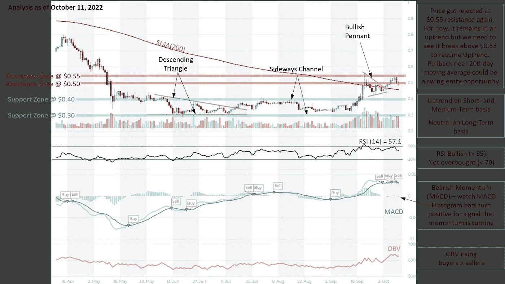
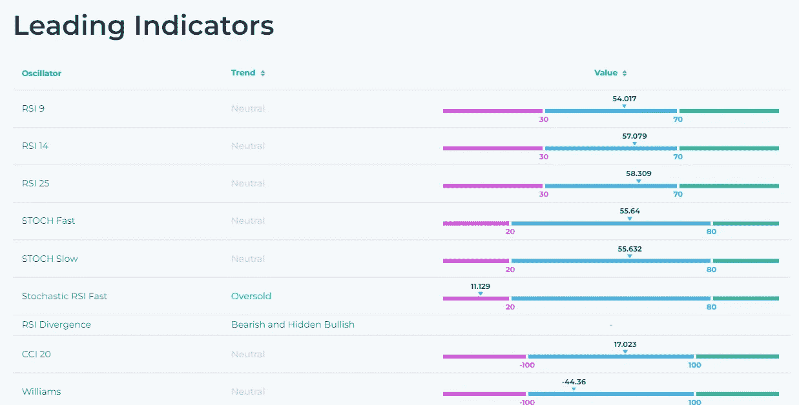
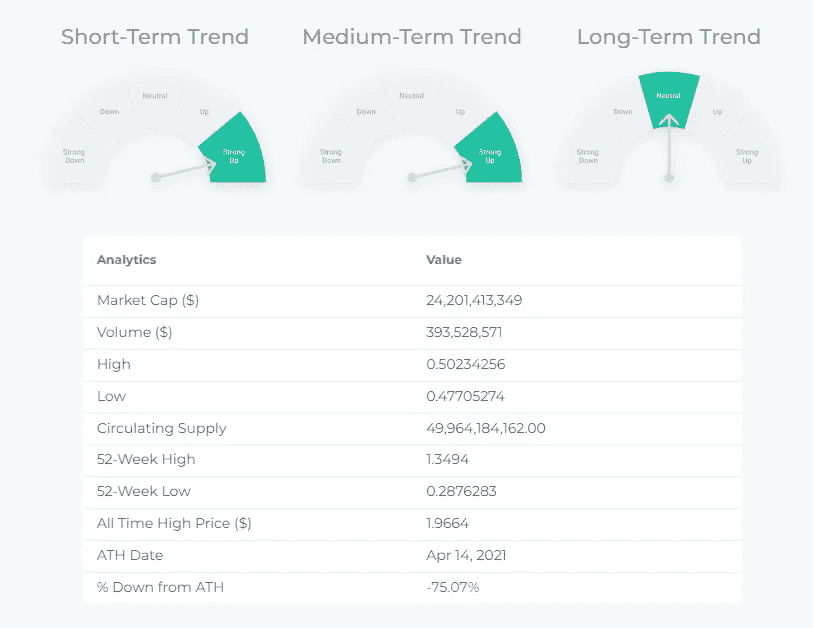
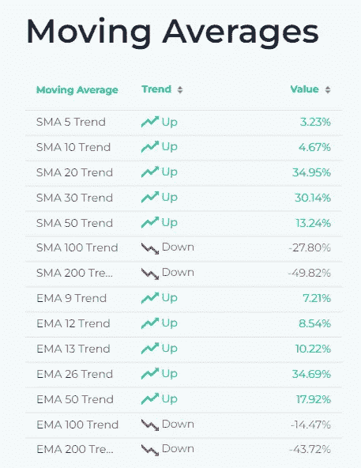
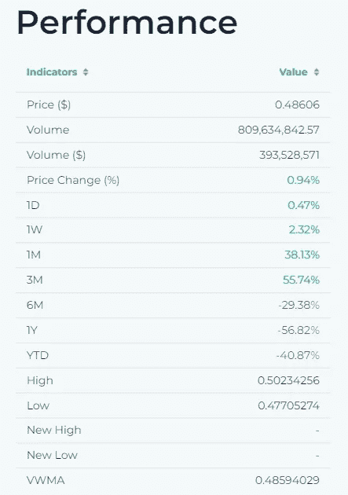
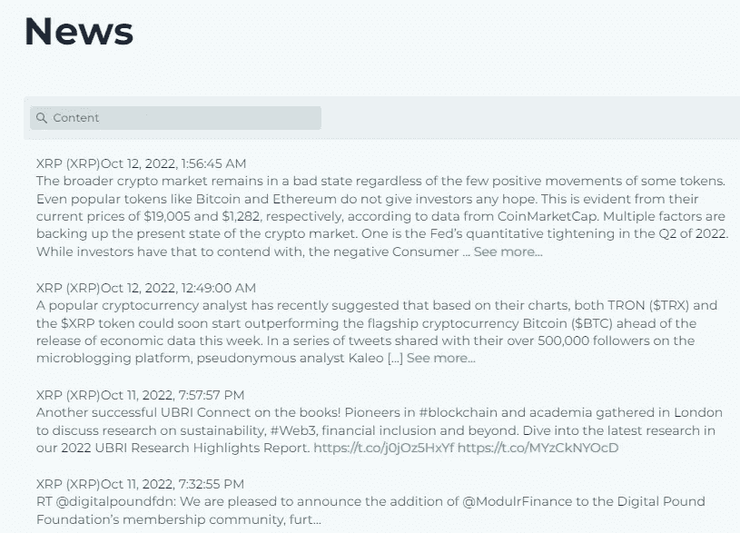
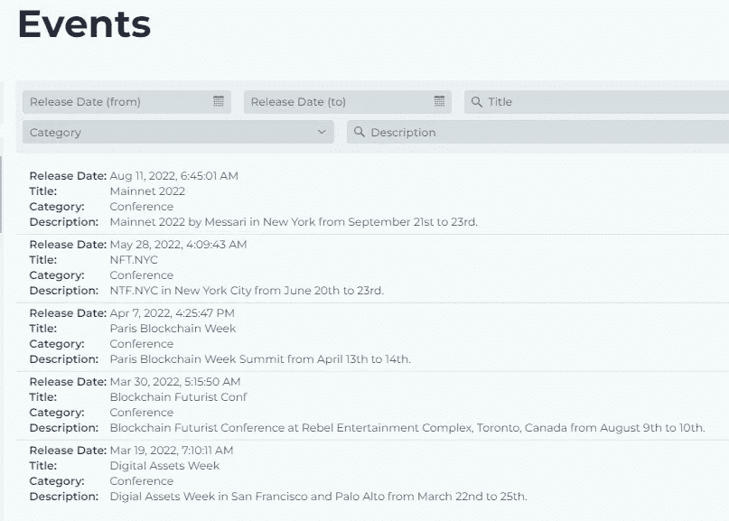

# XRP(涟漪)-价格图表，技术指标，新闻…

> 原文：<https://medium.com/coinmonks/xrp-ripple-price-chart-technical-indicators-news-c5e590711102?source=collection_archive---------29----------------------->

一种名为 XRP 的加密货币旨在使金融机构之间的资金转移更快、更便宜。对于在不同法定货币之间转移资金的金融机构来说，XRP 是支撑 Ripple 的 xRapid 产品(一种按需流动性解决方案)的过渡货币。XRP 分类账是一个由点对点节点网络支持的开源加密分类账，使用 XRP 作为其本地加密货币。

# XRP 技术分析:

Source: [altFINS](https://altfins.com/crypto-screener/xrp-xrp)

Source: [altFINS](https://altfins.com/crypto-screener/xrp-xrp)

Source: [altFINS](https://altfins.com/crypto-screener/xrp-xrp)

Source: [altFINS](https://altfins.com/crypto-screener/xrp-xrp)

Source: [altFINS](https://altfins.com/crypto-screener/xrp-xrp)

Source: [altFINS](https://altfins.com/crypto-screener/xrp-xrp)

Source: [altFINS](https://altfins.com/crypto-screener/xrp-xrp)

> 交易新手？试试[加密交易机器人](/coinmonks/crypto-trading-bot-c2ffce8acb2a)或者[复制交易](/coinmonks/top-10-crypto-copy-trading-platforms-for-beginners-d0c37c7d698c)