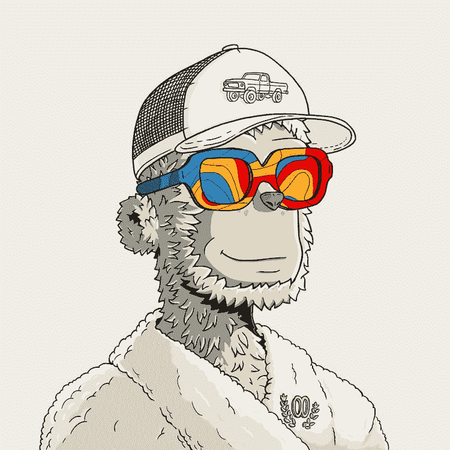
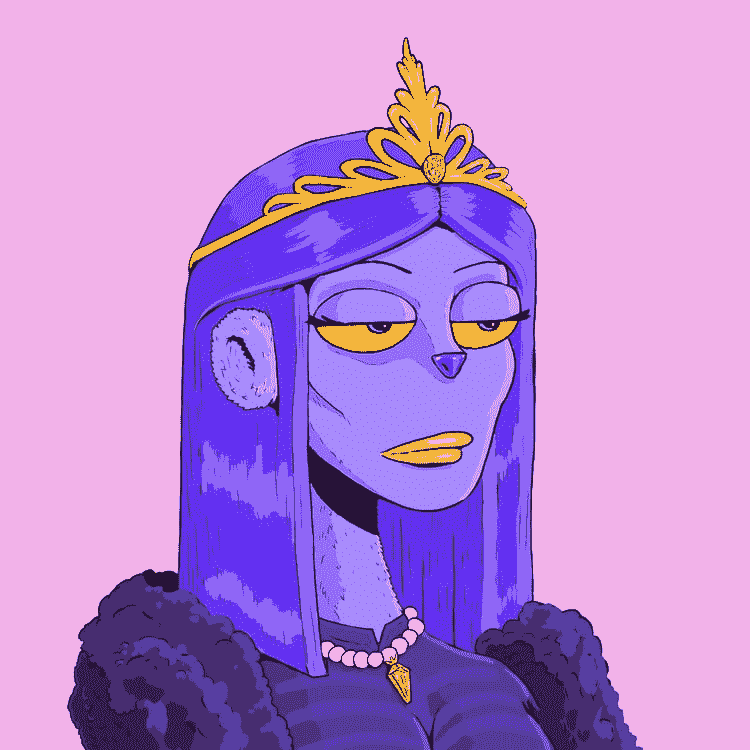

# y00ts

> 原文：<https://medium.com/coinmonks/y00ts-c87b68d55b6f?source=collection_archive---------28----------------------->

期待已久的 y00ts 艺术展今晚就要开始了。最近 5 个月一直在闹的大家(？？老实说，我实际上不知道确切的时间)今晚终于可以看到他们的 NFT 艺术。在里斯本的索拉纳活动上谈论 y00ts 艺术展览会很有趣，你不觉得吗？！

**艺术**

嗯，艺术是主观的，每个人都喜欢一件特定的艺术品胜过喜欢另一个人。我个人非常喜欢这种艺术(不，我没有 NFT 的作品)。我喜欢它友好和受欢迎的外观，但也喜欢这些太阳镜的毒品属性(见这里的艺术揭示:【https://y00ts.com/drops)

NTFs 也有一个类似人类的外观，在我看来，这使他们成为一个有吸引力的 PFP。到目前为止，除了女王 y00t(下图)之外，我所见过的 y00t 都是由男性发起的，在我看来，有更多女性发起的 NFT 对索拉纳·NFT 空间是有好处的。然而，这对我来说是可以理解的，因为这肯定意味着更多的工作。

这并不意味着这一天不会发生。

**透明度**

我喜欢 y00ts 团队在艺术创作过程中的透明度(可以在这里找到:[https://Twitter . com/delilahdegods/status/1588469353632083968](https://twitter.com/delilahdegods/status/1588469353632083968))，这在 NFT 空间是不正常的(至少据我所知)。我只是快速浏览了一下，但在我看来，提供一些东西是一个积极的信号。

**定时**

在索拉纳事件发生的时候揭开神秘面纱可能不是巧合，对吗？

最后，没有人会关心几年后的延迟，甚至可能不会在揭露之后。至少我知道我不在乎，只要 y00ts 的艺术/产品是好的。

**价格/底价**

可能会在揭示后下降，因为人们猜测得到一个神话，有些人会翻转，如果他们没有。所以睁大你的眼睛寻找偷窃。不知道底价会是多少，我也不在乎(我没那么有钱，哈哈)。大概没有一个相信球队的人喜欢谈论这个话题，所以，这就是底价。

**拜拜**

以上是我的想法，感谢您的阅读。

正如弗兰克喜欢说的:

> 交易新手？尝试[加密交易机器人](/coinmonks/crypto-trading-bot-c2ffce8acb2a)或[复制交易](/coinmonks/top-10-crypto-copy-trading-platforms-for-beginners-d0c37c7d698c)