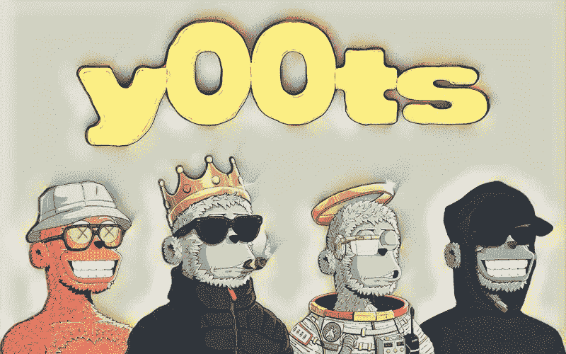

# y00ts NFT 系列:狂热的狂热分子中的新热点

> 原文：<https://medium.com/coinmonks/y00ts-nft-collection-the-new-buzz-among-degods-maniacs-8cc8c1688baa?source=collection_archive---------14----------------------->

每个人都被 NFT 令人兴奋的意外激增所震惊，但吸引人们注意力的是新系列受欢迎的速度。y00ts NFT 系列就是这样一个系列，它取代了其他“蓝筹股”NFT，成为人们谈论的焦点。

虽然 DeGods NFT 社区已经在很长一段时间内以一种大的方式震撼了空间，但它的创造者们提出了另一个独特的项目，名为“y00ts”。好吧，这是炒作，现在每个人都很清楚什么是 [y00ts NFT 收集](https://www.y00ts.com/)。然而，让我们定义它们，不要留下任何怀疑的余地。

y00ts 是一个独特的 NFT 集合，由 Solana 广受欢迎的 NFT 项目 DeGods 背后的团队开发。最初，y00tsslist 将提供给 DeGods 持有者和那些已经进入 y00t 名单的人，y00t 名单已经达到最大值。因此，所有成功的申请者都将通过名为 y00tlist 的 Twitter 帐户收到通知。

不管你是不是那些幸运地得到了 y00ts 的人，还是有必要知道是什么激起了 NFT 囤积者对这个收藏的兴趣。

# NFT 是什么？

y00ts 是由 Dust Labs 在索拉纳区块链收集的 15，000 个 NFT，Dust Labs 是炒作德戈斯 NFT 收集背后的团队。y00ts NFT 系列以一只羊的单一图像为特色，各种元数据层叠在顶部，赋予 y00ts 它们的特征和属性。

以前，y00ts NFT 被称为 Duppies，其最初的计划是成为 DeGods 生态系统的扩展集合。

y00ts 无疑已经成为 NFT 空间中的一个显著亮点，尤其是当它吸引了包括 Allen Iverson、霍伊·曼德尔、Wayne Rooney 等在内的几位名人的兴趣时。

回到 2022 年 7 月，该项目最出人意料地展开了，因为该团队在 7 月底或 8 月初宣布了 Duppies mint。然而，一个 Twitter 黑客破坏了计划，团队宣布，“我们尝试了一些狗屎。我们学到了一些东西。现在，我们正在尝试一些新的东西。”

看起来，DeGods 的创造者们是对的，他们用回归吸引了 DeGods 的持有者和 NFT 的狂热爱好者。现在在 Web3 上存在一个由 15，000 个古怪的人组成的强大社区，他们使用创新的学者系统和透明的薄荷列表参与 y00ts 项目。

随着围绕 y00tslist 的大肆宣传，[的声望飙升至新的高度](https://www.cryptotimes.io/solana-nft-project-degods-soars-ahead-of-y00ts-launch/)，同时人们继续将他们的名字列入 y00t 名单。

# 什么是 y00tslist 和 y00t 奖学金？

y00t 列表与 NFT 项目的预售相同，只是在此过程中，用户必须提交一份申请，团队可以自行决定批准或拒绝。

要加入 y00ts mint，用户必须获得 y00tlist 奖学金。获得批准的用户将需要 375 DUST(DeGods 生态系统的本地令牌)来铸造他们的 y00t NFT。

请注意，y00t 名单现已超额认购，收藏家们在围绕该项目的激烈讨论中争相购买 y00t NFT。

不过，该团队已经将 2022 年 9 月 2 日定为 y00ts NFT 系列的发布日期，并于 9 月 5 日开始[铸造过程，该过程因封锁程序错误而推迟](https://www.cryptotimes.io/y00ts-nft-delays-mint-due-to-blocker-bug/)。

因此，铸造过程已被重新安排在 9 月 6 日晚上 8 点太平洋标准时间，这也是进一步推迟。

# 怎么去 NFT？

15，000 y00t 系列可使用 DUST 购买，如上所述，DUST 是 DeGods 生态系统的固有标志。灰尘可以通过立桩收集。NFT 也可以在二级市场上购买，如果你没有德戈斯 NFT 或灰尘。请注意，在撰写本文时，每辆 y00t NFT 的价格约为 375 美元，相当于 1320 美元或 36 索尔。

y00ts 名单已满，人们已经在等待铸造 y00tlist。如果你错过了创造 y00t 的机会，那么你可以在 Solana 的二级 NFT 市场上找到 y00t，比如 Magic Eden。

进入 y00ts 生态系统的另一种方式是通过其名为 t00bs 的次级 NFT 系列。

如果你在等待名单上，那么你可以用 375 美元的灰尘铸造一个 t00b。铸造将基于先到先得的过程。记住，每个钱包最多只能铸造 1 t00b。y00 列表 19 小时结束后，未出租的 t00bs 将向等候者开放。

# y00ts NFT 公司的版权和知识产权

y00ts 团队或最初的 degods 创作者正在试验一种新的版权和所有权系统的想法，称为 NFTs 的ⓨ。这个想法将是一个常见的版权符号ⓒ.的自定义替换

该团队在其[白皮书](https://docs.google.com/document/d/1X3BiIeoiLxVYhJ9zB7SDx7IsVoB36wuS9fzWPx63-is/edit)中也是透明的，同时强调“这是我们认为这个系统如何工作的一个非常粗略的近似值。接受批评，看看事情会如何发展。”

目前大多数 NFT 收藏的设置是，持有者只获得他们持有的一件 NFT 的知识产权。然而，CC0 或知识共享是一个替代方案，允许 NFT 持有者的资产归公共领域所有。

NFT 持有者可以创建企业和子社区，也可以通过粉丝艺术和其他方式将他们的 NFT 商业化。因此，通常人们对 NFT 的兴趣会增加，而其价值也会提高。

尽管如此，目前的设置并不支持整个集合受益的想法。通俗地说，y00ts 设置利用ⓨ将其作为一种注册版权的方式，以 NFT 集合作为管理机构。

每个集合都有自己的ⓨ注册中心，这样就很容易确定谁有权使用 NFT 的 IP。因此，项目可以以 Web3 的速度批准和拒绝使用请求。

# 你的故事是什么？

y00ts 团队引入了“y00ts st0re”这一全新概念，让艺术家提交他们定制的 traits 版本。在我们了解更多之前，您必须了解 y00ts 商店是什么以及它是如何工作的。

y00ts 商店将成为定制 y00ts 特征的市场。任何人都可以在 y00ts 商店内提交任何原始 y00ts 特征的定制以供批准。对于批准，必须适合与原始特征相同的空间，并且必须可由原始元数据标记识别。

获得批准后，提交的个人将拥有该特征的ⓨ。

在它的范围内，持有者可以接触艺术家为他们做委托工作。这样，艺术家将拥有其作品的知识产权，以收取 10%的版税.

一旦完成，持有者可以从 y00ts 商店购买社区创造的特征。然而，艺术家也可以根据他们的目的和偏好将特征设置为自由的。

请注意，持有人每个月只能将一个定制特征应用于他们的 NFT。定制的性状不能改变性状的大小/形状/名称。例如，t 恤衫不能换成毛皮大衣，尺寸也应该保持不变。而且，元数据是改不了的。

此外，社区成员可以创建并正式注册子社区或子 Dao。他们可以向 SOL 收取入场费，也可以从其子社区的所有销售额中收取%的版税。

# 定制 y00ts:

要获得定制权，持有者必须将其 y00ts nft 抵押 30 天，然后将ⓨ令牌添加到 y00t 的元数据中。任何 y00t 最多可以容纳 6 个ⓨs.元数据示例:“ⓨ令牌:1”

持有人可以使用获得的ⓨ令牌通过 y00ts 商店将定制的ⓨ特征应用到他们的 y00t NFT。请记住，新特征必须与其元数据上的 y00t 属性相匹配。一旦ⓨ代币被使用，y00t 持有者可以随时将任何性状改回原始 y00t 基数。0

然而，在应用 y00ts 商店的新定制特征之前，他们将不得不等待另外 30 天。由于赌注要求，持有者必须小心选择什么特征。

如果持有者决定永远不使用ⓨ代币，y00t 将简单地收集它们。因此，NFT 可能会以溢价出售附带的代币。

值得注意的是，除了ⓨ的所有者，没有人能复制这种特质/主题/风格/品牌。如果尝试的衍生品试图在市场上上市，那么它们将不会被批准。此外，该团队表示，6 个月后，y00ts 商店中将不再添加用户生成的特征。

创作者现在可以将 y00ts 分成他们自己的作品。此外，持有者可以单独出售限量供应的帽衫，或者换成另一种特征。从此时起，y00ts 商店新增加的特色将通过与生活方式品牌和大型服装的有限供应合作来实现。

# 通过ⓨ注册实现商业化

拥有特性的ⓨ允许用户在 y00ts 商店上设置特性的价格，并设置可用特性的供应。用户也可以将整个ⓨ卖给其他人，或者从每笔交易中收取 5%的版税。

## 艺术家如何通过ⓨ:赚钱

随着ⓨ注册，许多货币化层可以为每个利益相关者解锁。独立和 1/1 的艺术家可以制作个人特征，并收取溶胶或灰尘。他们还可以在涵盖多种特征的系列中创造时尚品牌。

根据 y00ts 白皮书，艺术家可以“为持有者做有偿(或无偿)委托工作”，通过%的版税享受新的收入流。此外，艺术家也受到激励，在 y00ts 商店出售他们的作品。通过这样做，如果他们有自己的ⓨ注册，他们将在首次出售后获得 10%的版税。

## 非艺术家如何通过ⓨ:赚钱

ⓨ的真正力量在于它可以加速社区内“俱乐部”的创建。任何想要建立子社区的人都可以通过 y00ts 商店找到一位艺术家，委托定制一套带有他们的徽章/标志的特征，并在ⓨ.注册俱乐部

现在，任何活跃的社区成员都可以基于迷因、共同观点、兴趣或其他任何东西创建自己的俱乐部。

只要他们拥有ⓨ的全部特征，他们就可以将这个子社区货币化。他们还可以从每卖出一个带有他们任何特征的 y00t NFT 中收取 1%的版税。此外，他们还可以为实际特征本身收取前期费用，以索尔美元或灰尘美元计算。

**结论:**

y00ts NFT 系列可能是其团队 Dust Labs 成功完成 DeGods NFT 降落后的又一个里程碑。如果 y00ts 继续受到 NFT 爱好者的追捧，它们有可能在未来几天颠覆其他潮流系列。

毫无疑问，该项目有这么多的商店，因为它仍在发展，为持有者和艺术家提供新的商业化方式。

> 交易新手？试试[密码交易机器人](/coinmonks/crypto-trading-bot-c2ffce8acb2a)或者[复制交易](/coinmonks/top-10-crypto-copy-trading-platforms-for-beginners-d0c37c7d698c)