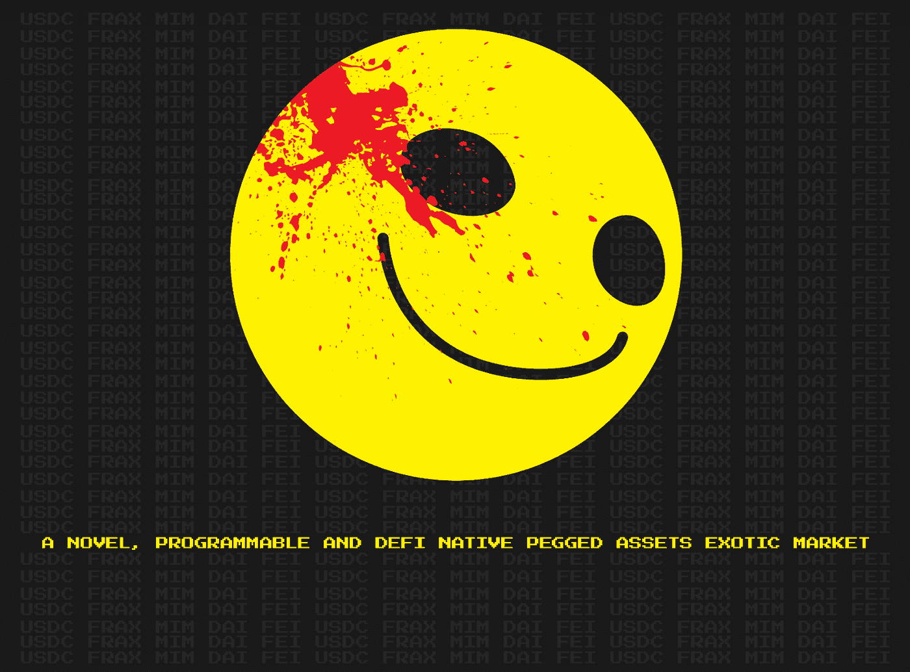

# 千年虫金融，奇异的衍生产品

> 原文：<https://medium.com/coinmonks/y2k-finance-exotic-derivatives-cce28637d379?source=collection_archive---------15----------------------->

正如我们所知，非常好的加密阅读器，解除与稳定货币的联系是加密投资者希望保持部分投资组合稳定货币的最坏情况之一。UST、DEI、Iron Finance 和许多其他公司的倒闭，让许多投资者在那些旨在维持平价和固定某一价值的产品上蒙受了巨大损失。2000 年金融，是一个项目来填补空白…