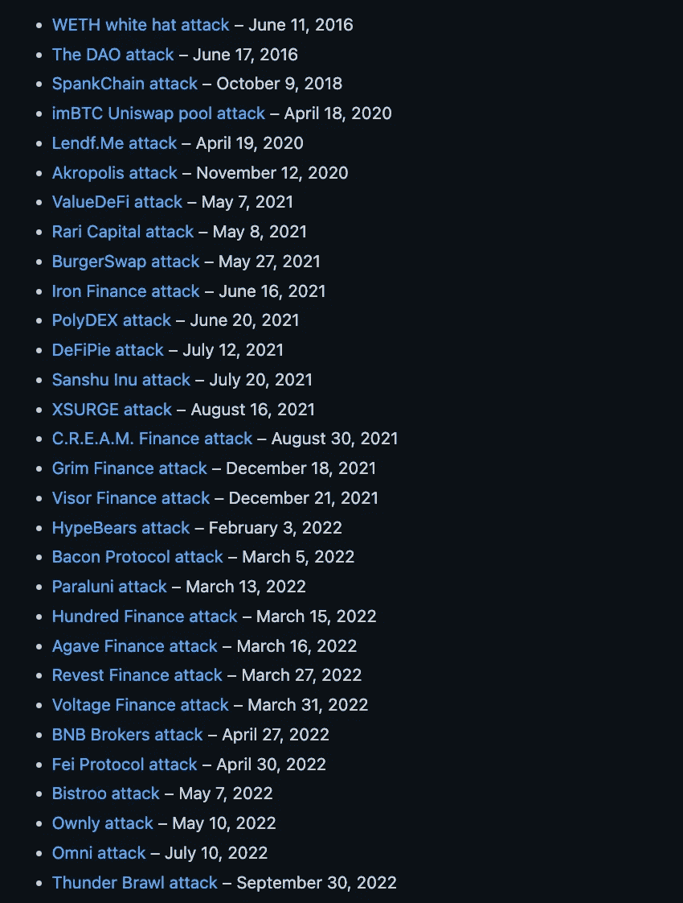
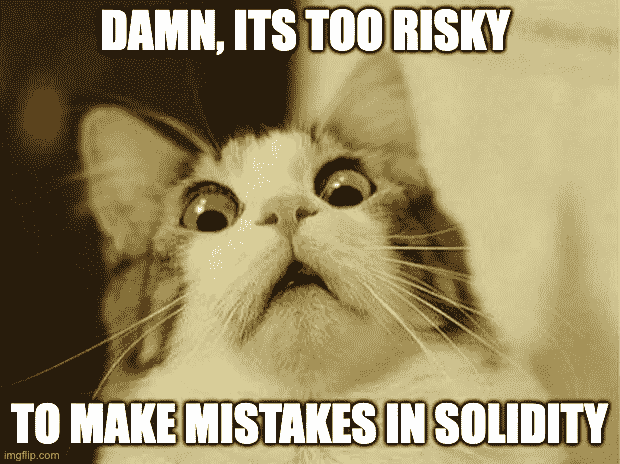

# 又一个重返攻击——是什么阻止我们成为更好的智能合同开发者？

> 原文：<https://medium.com/coinmonks/yet-another-re-entrancy-attack-whats-keeping-us-from-being-a-better-smart-contract-developer-4b3decc52b46?source=collection_archive---------1----------------------->

嘿，范姆👋🏻

欢迎阅读解密系列的另一篇文章，我们将选取一个特定的智能合约/Web3 主题并深入了解它。

距离震惊整个 web3 世界的臭名昭著的 DAO hack 事件已经过去了 ***6 年 3 个月零 25 天*** 。

我们目睹了超过 350 万以太网由于智能合同中的一个错误而被盗走。

这个黑客向我们介绍了智能合约中可能出现的最危险的攻击之一， ***重入攻击，*** 。

从那时起，已经有了巨大的改进和尝试来降低在智能合约中引入这种攻击媒介的风险。

自动化测试工具开始包括关于重入错误的警告，智能合同审计员对处理外部调用的代码变得特别谨慎，大量博客和视频内容被创建(*并且仍在制作*)来解释重入攻击。

但是，如果您观察了过去几年中的漏洞利用，以及所有其他新的攻击媒介，重入漏洞利用仍然是一个主要问题，可以被视为许多智能合同漏洞利用背后的一个相当大的 bug。

让我和你们分享一下由于重入导致的所有智能合约攻击，看看下面的[列表](https://github.com/ethereum/solidity/issues/12996#issuecomment-1187381059)。👇

事实上，我读到的最近一次重入漏洞攻击就发生在几周前，当时 Stader 的 NearX smart 合同被利用，并出现了同样众所周知的重入漏洞，损失了 83 万美元。

*吓人吧？*😰

好吧，这不仅仅是关于智能合约中的重入错误，博客也不会解释重入错误。

重入攻击只是智能合约开发社区非常了解的许多众所周知的攻击之一，但即使在今天，我们仍然在智能合约中发现了这种漏洞的痕迹，这导致了令人难以置信的大规模利用。

# 现在的问题是— **为什么？**

尽管我们有大量的工具、库和教育性的内容来应对这些常见的错误和攻击媒介，但为什么我们仍然一次又一次地目睹这些众所周知的攻击呢？

这无疑是一个可能有多种说法或答案的宽泛或开放式问题。

然而，在参与了多项智能合约安全审计、与相当多的智能合约开发人员进行了互动，并成为一些非常活跃的智能合约开发人员社区的一员后，我发现了这背后的两个极其简单但却势在必行的原因。

最重要的是，这些原因围绕着我们如何处理智能合同开发和学习可靠性的基础，尤其是在初始阶段。

# **1。“*安全不是我的工作*”**心态

毫无疑问，web3 领域的大多数开发人员认为契约开发和智能契约安全是两回事，这在某种程度上是正确的。

但是，完全否认这两件事之间的任何关联，很可能是一个错误。

这背后的基本原理是，在它的核心，智能合同开发的过程大致包括 3 个最重要的步骤:

*   **设计&开发**
*   **优化**
*   **合同的安全验证**

虽然我们非常清楚前两个步骤，但我们最常忘记，甚至更糟的是，根本不认为 ***安全验证*** 是合同开发过程的一部分。

这令人担忧，因为即使我们考虑智能合约的一个基本事实，即它们在链上部署后不可改变的性质，我们也可以非常清楚地看到添加**安全检查和验证**作为智能合约开发过程中的强制步骤的重要性。

即使您在部署后几秒钟就发现了一个主要的 bug，您也不能更改合同中的一行代码，这一事实本身就令人生畏。

> 好吧，如果你认为你总是可以升级你的智能合同或者可升级的合同非常安全，**让我打断你一下。*🛑*t19】**
> 
> ***看了一下*** [***虫洞代理 Bug***](/immunefi/wormhole-uninitialized-proxy-bugfix-review-90250c41a43a) 又觉得。
> 
> 可升级的合同也会有漏洞。*🪲*t33】

## 你应该怎么做？

简而言之，将 ***安全检查&验证*** 视为您开发的任何智能合约的必要部分，如果您还没有学习智能合约安全的基础知识，至少要学习一下。

一旦你考虑到这一点，你就不能再仅仅依赖于为你的智能契约编写测试用例。

测试脚本无疑是有帮助的，然而，它们更倾向于确保契约功能按预期执行，而契约的安全性远不止于此。

即使作为一名智能合约开发人员，您也应该至少精通以下安全工具之一(*实际上不仅仅是 1 个*)来验证您的合约的安全性:

*   ***静态分析工具如***[***Slither***](https://github.com/crytic/slither)*[***myth RIL***](https://github.com/ConsenSys/mythril)*[***Mythx***](https://mythx.io/)***。这些工具可以有效地帮助您识别您的合同中可能存在的任何众所周知的智能合同漏洞。*****
*   *****模糊测试工具如*** [***鼹鼠***](https://github.com/crytic/echidna) ***或*** [***哈维***](https://mariachris.github.io/Pubs/FSE-2020-Harvey.pdf)*通过将随机的&意外数据抛入您的合同中，帮助识别潜在的漏洞利用场景或合同执行失败。***
*   ***[**Scribble**](https://github.com/consensys/scribble) ，这是 [ConsenSys](https://medium.com/u/6c7078bf7b01?source=post_page-----4b3decc52b46--------------------------------) 提供的一个令人惊叹的运行时验证工具，它允许您用关键属性来注释 solidity smart 契约。***
*   ***在审计复杂而庞大的智能合同时，您最需要的是一个*可视化工具*，这正是 [**Surya**](https://github.com/ConsenSys/surya) 的用武之地。它提供了一个令人难以置信的简化版本，包括调用图、继承图等关于契约结构的所有关键细节。***
*   **[**VS Code visual auditor**](https://marketplace.visualstudio.com/items?itemName=tintinweb.solidity-visual-auditor)extension 是一个非常有用的工具，它提供了面向安全的语法和语义突出显示，以及许多其他工具，使契约的安全开发更加容易。**

> **我的最爱→ **Slither，Surya，VS Code visual auditor，还有 Echindna** 。*😎***

## ****你为什么要这么做(*如果你能让合同得到审核*)？****

**首先，没有人会比你自己(*和你的团队*)更关心你的智能合同的安全性。第一个对你的代码安全负责的人应该是你。**

**其次，智能合同审计行业一直(*并且仍然是*)处于一个 ***高需求&低供给的好的安全审计师*****阶段。****

**这基本上意味着只有少数几个非常有经验的审计员，依靠他们中的几个人并不能真正扩展到足以让 web3 世界指数级地扩展它的边界。**

**此外，还有大量的项目等待他们的合同得到审核，这就是为什么当轮到您时，您需要准备好一组正确的合同、足够的测试用例、覆盖报告，以及最重要的，您可能希望与您的安全审核员讨论的关键点。**

**然而，如果你自己不了解，至少不了解智能合约安全的基本知识，你将无法与智能合约安全专家进行有效的讨论。**

**将 ***安全验证*** 步骤包含在您的智能合约开发旅程中，允许您在静态分析工具的帮助下预先过滤掉所有众所周知的错误。**

**这使得安全审计员可以专门关注合同中更重要的潜在威胁，而不是识别和报告那些可以通过上述工具轻松找到的威胁。**

**因此，在审计之前执行您自己的安全检查不仅缩短了冗长的审计持续时间，而且有助于在整个过程中获得一个适当的、更好的结果。**

**这个概念被 [*安全社区*](https://secureum.substack.com/) 精辟地定义为[关心(*全面审计准备情况评估* )](https://github.com/secureum/CARE) ，目的是在审计之前准备好您的合同，以确保安全审计的结果相对更好、更有效。**

> **值得注意的是，我将安全性作为智能合同开发流程的一部分并不是要取代对合同的审计，而是为充分的安全审计做准备。**

# **2.避免错误&扎实的实验(*和从中得到的教训*)**

**好吧，虽然第一点是针对已经熟悉 solidity( *和智能合约安全性基础知识*)的开发人员，但这一部分更倾向于那些开始学习 solidity 或处于智能合约开发非常早期阶段的人。**

**给你一个小提示:**

> **除了学习和开发简单可靠的智能合约，不要害怕在学习可靠时尝试和犯错误。**

**从一开始 *Solidity* 或 smart contract 开发，一般来说，对于许多处于早期阶段的开发人员来说，是非常有趣但令人畏惧且困难的，原因很明显:**

*   ***智能合约的* ***不可改变的特性*** *以及在链上部署之前一步到位的想法。***
*   ***智能合约的开源特性，以及任何人都可以访问/阅读每一行代码的事实。***
*   ******的整体概念智能合约*** *内的编程和储钱以及随之而来的* ***安全风险*** *。****
*   ******还处于萌芽阶段*** *坚实性和跟上快速变化/演变的语言的困难。****

****

**现在，在开发智能合同时，与犯错误相关的问题和风险不容忽视。然而，这些对有效学习智能合同的过程有负面影响。**

**有了这么多的利害关系，开发人员就更难尝试可靠性或者自己犯错了。**

**“ ***”不重新发明轮子或尝试新的东西，以避免在合同中引入新的 bug 的流行想法“*** 阻止了开发人员探索不同的可靠性概念，从而从整体上限制了他们在智能合同开发方面的潜力。**

**事实上，现在认为简单地派生一个已经存在的审计合同比从头开始写一个要安全得多。虽然这确实最小化了合同在生产中出现 bug 的风险，但它确实阻止了开发人员在开发相同产品时处理所有可能(*和*)遇到的复杂问题。因此，这使我们常常不去深究可靠性的概念。**

**虽然简单地学习区块链发展课程或消费智能合约上的在线内容可能会帮助你开始任何特定的主题，但它不会让你深入学习基本原理。除非你用它弄脏你的手。**

**最重要的是，不尝试 Solidity 智能合约也让我们无法了解合约可能存在的各种安全漏洞以及合约可能被破坏的过多方式。**

***例如，回到重入的例子:***

> **每个智能契约开发人员都可能听说过、阅读过或讨论过可重入性攻击媒介，但是我们中有多少人真的尝试在一些虚拟契约上进行同样的实验，只是为了了解幕后发生了什么？**

**这正是基于智能合约安全的战争游戏或 CTF(如**或* [*该死的易受攻击的 Defi*](https://www.damnvulnerabledefi.xyz/) )在学习智能合约开发和安全方面也发挥如此重要作用的地方。它们允许您直接与合同进行交互，犯错误并最终找出漏洞。***

**现在，肯定有一些智能合同开发人员对可靠性和智能合同进行了大量实验，因此正在成为行业中的佼佼者(例如，*查看* [*秘密可靠性竞赛获胜者*](https://underhanded.soliditylang.org/) *或他们的* [*挑战提交*](https://github.com/ethereum/solidity-underhanded-contest/tree/master/2022/submissions_2022) *)。***

****

**Winners of Underhanded Solidity Contest 2022**

**然而，正如我之前提到的， ***对于 web3 世界来说，以最大限度的安全措施来扩展其边界和规模，我们不能简单地依赖于该领域的少数专家。*****

**相反，每个智能合约开发人员都应该渴望学习更多知识，不仅仅是学习基础知识，而是尝试、犯错、从中学习，然后与社区分享。**

> **因为，与一般生活非常相似，软件开发中最好的学习也来自于错误。**

## *****错误或学习经验*** 每个 smart contract dev 至少应该有一次:**

**如果你刚从扎实开始，有一堆错误/实验你可以(*和应该*)边学边做。**

**从我头顶上放下一些。**

****稳固性 101 错误/教训:****

1.  **使用 ***内存*** 关键字代替 ***存储*** 然后意识到你从来没有真正在契约上永久存储过关键的契约状态。**
2.  **因此，依赖博客时间戳进行随机计算并意识到它们如何被矿工操纵是一种糟糕的做法。*更多细节有* [*这里有*](https://swcregistry.io/docs/SWC-116) *。***
3.  **使用私有可见性修饰符存储智能协定状态变量上的秘密信息，结果发现智能协定上没有私有信息。
    任何人都可以看到每个状态变量值。*详见* [*SWC-136*](https://swcregistry.io/docs/SWC-136)**
4.  **你将永远相信，一个没有支付功能(*或支付回退功能*)的合同永远不会收到任何 ETH，除非你学会 [***自毁*** 如何能强行资助这样一个与 ETH 的合同。](https://swcregistry.io/docs/SWC-106)**
5.  **未能在函数&中提供所需的*输入验证*意识到这可能会导致不必要的情况任何无效的参数都可能在没有正确验证的情况下被传递。([*SWC-123*](https://swcregistry.io/docs/SWC-123)*)***

*****气体优化&安全错误/教训:*****

***6.编写昂贵的 for 循环只是为了找出这是如何导致 [***阻塞气体限制***](https://swcregistry.io/docs/SWC-128) 问题并使整个事务失败的***

**7.违反 [***检查效果交互模式***](https://fravoll.github.io/solidity-patterns/checks_effects_interactions.html) s，并意识到这将如何导致经典的随机攻击。**

**8.在具有不同存储布局的两个协定之间使用委托调用，并了解为什么存储布局必须完全相似才能使委托调用起作用。确保 *delegatecall()* 中涉及的两个合同之间的存储布局完全相同非常重要。否则，这会导致存储冲突。点击阅读更多关于存储冲突的信息[。](https://docs.openzeppelin.com/upgrades-plugins/1.x/proxies#storage-collisions-between-implementation-versions)**

**9.包括对合同的必要功能的不充分的访问控制，以及意识到这将如何导致任何不良行为者在未经批准的情况下执行交易。 [*SWC-105*](https://swcregistry.io/docs/SWC-105) 相当充分地涵盖了这个话题。**

**10.试图使用 ***转移*** 功能将乙醚从一个合同发送到另一个合同，却发现它总是只发送硬编码的 ***2100*** 气体。这将帮助您认识到***. call . value(…)(" ")***功能的重要性，该功能允许通过交易调整要发送的气体。阅读更多关于为什么[的内容。*呼叫()可能比转移()*](https://consensys.net/diligence/blog/2019/09/stop-using-soliditys-transfer-now/) *。***

**11.意识到在 struct 或 general 中删除 mappings 值是多么棘手，并学习正确的方法。**

**12.试图使用 Uniswap 将*令牌 A* 与*令牌 B* 交换，容易受到三明治攻击。这可能会帮助你认识到交易顺序依赖的黑暗面，MEVs，以及[*以太坊*](https://www.paradigm.xyz/2020/08/ethereum-is-a-dark-forest) *的黑暗森林。***

****

**Mr. Walter White experimenting with Solidity**

**虽然这些只是一些例子，但在智能合约开发中还有更多有趣的主题，从基本的可靠性到 EVM 操作码中的高级深度，人们可以学习和尝试。**

# **包装它😊**

**Web3 在很短的时间内取得了很大的进步，然而，智能合约的安全性仍然是一个主要问题。**

**上面讨论的两个想法不会让阳光和彩虹同时出现。毫无疑问，为了让 Web3 成为一个更安全的地方，我们还需要做更多的工作。**

**然而，想象一下，整整一代开发人员在学习或开发智能合约时包含上述两种思想，优先学习安全性的基础知识，尝试可靠性，从他们的错误中学习，然后与社区分享这些学习成果。**

**这将缓慢但肯定地把我们带向一个比现在更安全的 web3 世界。**

> **所需要的只是一些保持一致的承诺，从错误和实验中学习更多的意愿，以及成为更好版本的智能合同开发者的愿望。**

# **关于我自己**

## **我是谁？🙋🏻‍♂️**

**𝙃𝙞, 𝙄 𝙖𝙢 𝙕𝙖𝙧𝙮𝙖𝙗 👋🏻**

*   **智能合同工程师和开发团队领导[推送协议](https://medium.com/u/7e1cbe74a9a4?source=post_page-----4b3decc52b46--------------------------------)。**
*   **我从事智能合同开发以及智能合同的安全审计。**

## **我做什么🧑🏼‍💻**

*   **我写聪明的合同。**
*   **我对智能合约进行安全审计，并提高 EVM 连锁店智能合约的整体安全性。**
*   **我撰写和谈论 Web3 和智能合约&为扩展 Web3 的边界贡献我的一份力量。**

## **打声招呼，保持联系🤝**

**[***我的社交|关注我的每周简讯|我的 Web3 演讲&演讲***](https://linktr.ee/zaryab2000)**

> **交易新手？尝试[加密交易机器人](/coinmonks/crypto-trading-bot-c2ffce8acb2a)或[复制交易](/coinmonks/top-10-crypto-copy-trading-platforms-for-beginners-d0c37c7d698c)**