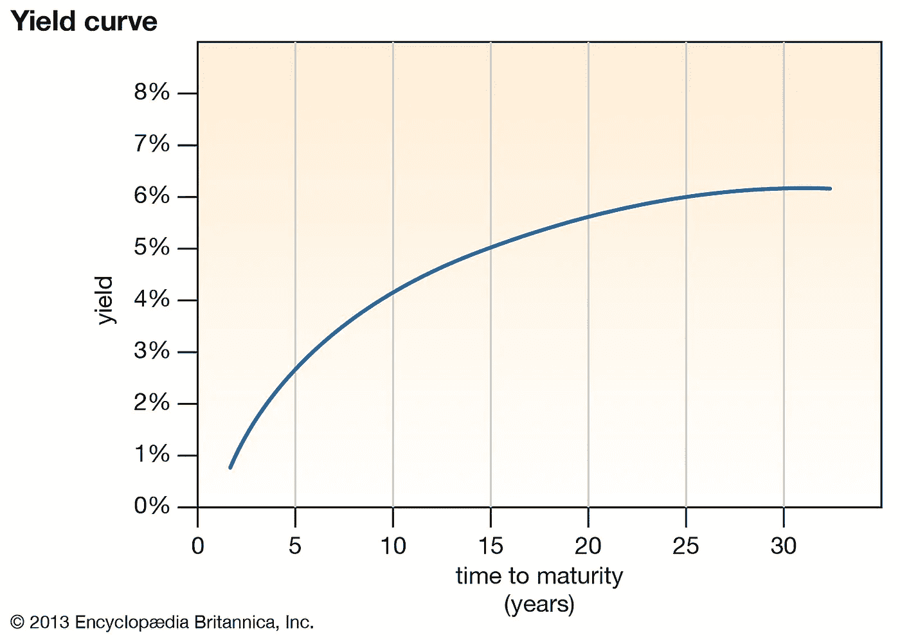
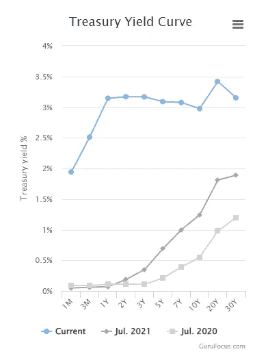
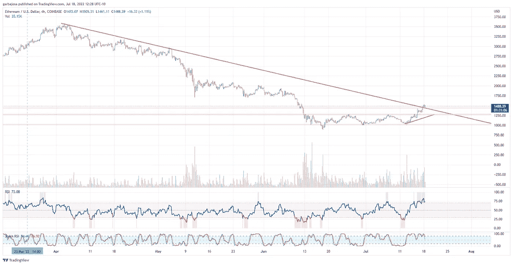
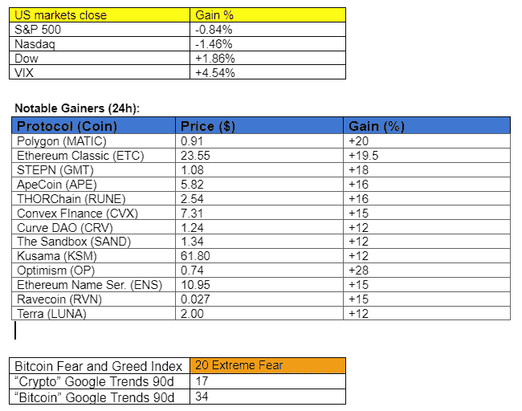

# 收益率曲线反转，呀！这对 crypto 意味着什么？

> 原文：<https://medium.com/coinmonks/yield-curve-inversion-yikes-what-does-it-mean-for-crypto-8a139499a87e?source=collection_archive---------21----------------------->

## 加密每日混合器 7.18.22

每日简讯，让您与密码市场、协议、新闻等保持同步！

Photo by [Bansah Photography](https://unsplash.com/es/@bansahphotography248?utm_source=medium&utm_medium=referral) on [Unsplash](https://unsplash.com?utm_source=medium&utm_medium=referral)

**概述**

*   当心收益率曲线反转！(是什么？)
*   比特币/以太坊:突围还是造假？？
*   Celsius 为散户投资者制定了计划。支付？
*   元宇宙发射的另一边。成功？

早上好，家人，

收益率曲线又一次反转了！

但是什么是收益率曲线呢？为什么会反转呢？这对 crypto 意味着什么？？！！

鉴于当前宏观经济对市场的影响，我们这些低级的密码学家应该学习一些基本的经济学原理，以理解我们当前面临的金融环境。增长和获取知识可以帮助我们在汹涌的金融浪潮中航行。

**什么是收益率曲线？**

收益率是从贷方借钱的成本。例如，按照目前的利率(2 年 3.17%)，如果一个人想借 100 美元，为期两年，他们必须在两年内偿还 103.17 美元，也称为到期。

2 年期=短期。

10 年期=长期。

30 年期限=长期。

通常，借款时间越长，收益越高，因为贷方承担的风险越大。所以如果一个人借 30 年的钱，会比借 2 年的钱还贵。

通常如此，但不是今天。进入收益率曲线反转。

健康的收益率曲线如下所示:

来源:【Britannica.com】

*下面是当前收益率曲线(蓝色曲线)。*

**

**来源:*[*Gurfocus.com*](https://www.gurufocus.com/yield_curve.php)*

*如果你仔细观察，两年期利率比十年期利率高。不好，反转！*

***收益率曲线反转是什么意思？***

*投资者不会轻易接受反向收益率曲线。从历史上看，这意味着 6-24 个月的衰退。自 1955 年以来，收益率曲线在每次衰退前都会反转，只有一个错误信号。自 1900 年以来，28 个收益率曲线反转中有 22 个实现了下行。*

***为什么会反转？***

*收益率曲线反转不是自然现象。这是因为交易员预测负责操纵利率的美联储将在未来降低利率。向下跌的市场增加资金是美联储在衰退期间的典型反应。这是自 20 世纪 80 年代以来每次经济衰退期间都会发生的一种行为。*

***前方衰退？***

*不幸的是，我们不参与预测市场，而是提供数据来帮助读者理解当前的宏观经济因素。尽管市场正在买入，但衰退即将到来的可能性很大。除非加密技术开始与传统市场脱钩，这是可能的(潘迪拉资本公司的丹·莫尔黑德在本报告中预测)，否则加密技术将模仿传统市场的衰落命运。*

*本周末，crypto 见证了健康的反弹，而股票继续下滑，这可能是未来事情的前兆。手指交叉。但总而言之，为了霍德林的最大利益，我们必须继续为大规模脱钩欢呼。*

# *市场更新🌍*

*BTC:突围还是伪装？*

*本周末热情高涨，但宏观形势的现实似乎削弱了加密技术的上涨势头。比特币突破了备受争议的 21.7K 阻力，但很快下跌，如果它打算将之前的阻力转化为支撑，它将需要多头的另一次推动。看 4H 图表显示，BTC 面临长达一个月的下跌趋势，如果支撑失败，可能会回到 19k 水平。BTC 收盘上涨 7.86%，至 22，432 美元。*

**

**高清*[图表](https://www.tradingview.com/x/Wis29HHj/)*

*另一方面，以太坊(ETH)突破了其长期下跌趋势，并试图重新测试该水平，以继续其积极的攀升。然而，相对强弱指数(RSI)在 4H 图上进入超买区。ETH 完成了当天的交易，上涨 18.19%，至 1581 美元。*

**

**高分辨率* [*图表*](https://www.tradingview.com/x/lHdlGrMY/)*

**

****通过*** [***订阅***](https://tradergabi.substack.com/subscribe?) ***免费成为第一个收到此每日简讯的人。****

*如果你喜欢这份报告，并且认为它值 20 分(0.01 美分)，请点击下面的按钮来支持我的写作。(最多 50 次！)谢谢！*

# *新闻观察📰*

*Celsius 制定了零售计划。四面楚歌的加密贷款公司 Celsius [注意到了](https://www.coindesk.com/business/2022/07/18/celsius-outlines-next-steps-as-bankruptcy-proceedings-begin/?utm_medium=referral&utm_source=rss&utm_campaign=headlines)其破产程序的下一步，即考虑选择继续“长期加密”或接受面向散户投资者的贴现现金结算。该公司还在考虑资产出售、第三方投资机会，以及在其比特币采矿业务背后扩大资产负债表。*

***寻求公开上市的圈子。** USDC stablecoin 供应商 Circle 重申了[计划](https://decrypt.co/105337/stablecoin-provider-circle-eyes-public-listing-in-q4-this-year-cfo)于 2022 年底通过特殊目的收购公司上市，据其首席财务官 Jeremy Fox-Green 称。该公司支持 550 亿美元的流通 USDC 代币，看起来财务状况良好，100%持有现金和国债。你会买一个圈当股票吗？*

***Genesis 借给 3AC 236 亿美元。**加密贷款服务 Genesis 曾[借给三箭资本](https://www.theblock.co/post/158167/crypto-lender-genesis-lent-2-36-billion-to-three-arrows-capital)236 亿美元，后者最近申请了第 15 章破产。该公司将 3AC 诉诸仲裁，但在一家咨询公司被指派监督 3AC 的流动性危机后，最近暂停了诉讼。*

***新闻花絮:***

*   *继 6 月份裁员 10%之后，双子证券交易所洛杉矶分部宣布裁员 7%。*
*   *观点:不，Mt. Gox 支付[不会破坏比特币的价格。](https://www.coindesk.com/markets/2022/07/14/no-mt-gox-payouts-arent-going-to-torpedo-bitcoins-price/)*
*   *克里斯蒂风险基金[关闭](https://www.christies.com/about-us/press-archive/details?PressReleaseID=10594&lid=1)第一笔秘密投资:Layerzero 实验室。*

# *在协议层，⛓*

*stETH 进入第二层。 Liquid staking 供应商 Lido (LDO)已经[向 Layer-2s 引入](https://blog.lido.fi/lidos-steth-comes-to-layer-2/)stETH 令牌，允许更便宜的交易和进入扩展的 DeFi 生态系统。此外，此举将增加代币的流动性，代币价格一直受到瑞士联邦储蓄银行(ETH)的温和拖累。*

***私道投票。**道投票平台快照[推出](https://www.theblock.co/post/158084/snapshot-to-let-daos-hide-votes-with-threshold-encryption?utm_source=twitter&utm_medium=social)治理过程中隐私保护投票。这一升级将允许投票者在投票结束前保持隐私。*

***协议级花絮:***

*   *Flowcarbon [在市场条件下推迟了](https://twitter.com/DecryptingStory/status/1548927108134477824?s=20&t=pDoS09tJOs8FpYm6HSCJPg)令牌的发布。*

# *NFT 和元宇宙最新消息🐵*

**

***彼岸元宇宙的成功。4500 名参与者第一次登上了 Bored Ape 游艇俱乐部的另一边开放世界元宇宙，在那里他们与环境互动，并与巨型人物面对面。在成功发射后，宇迦实验室发布了一份精简版论文，指出了一些原则和未来的路线图。***

***迪拜增加了区块链/元宇宙的风险敞口**。迪拜王储谢赫哈姆丹发起了一项战略，将区块链和元宇宙公司在该国的数量增加 5 倍。此举旨在让迪拜跻身该行业的全球十大城市之列，并帮助创造超过 4 万个就业岗位。*

***NFT 花絮:***

*   *时代杂志[利润](https://www.cnbc.com/2022/07/17/99-year-old-publisher-time-is-leading-legacy-media-into-the-nft-future.html)1000 万美元，20000 块时计。*

***作家笔下的花***

*在经济衰退时，Crypto 有一些锦囊妙计。*

*是的，价格在短期内会下跌，但是当经济数据开始下滑时，美联储开始印刷钞票来拯救一艘正在下沉的船。*

*更多的钱意味着市场上更多的流动性，这是一个比特币和加密都喜欢的环境。不幸的是，在这种情况下，美元首当其冲。旧习难改，美联储想要一个健康的经济，即使以美元通胀为代价。因此，如果这种情况出现，那是显而易见的，做多比特币，做空美元。*

*尽管如此，表达你自己的观点是必要的，因为我们不是在预测市场。我们只是呈现趋势。*

# ****加布里****

**关注我的* [*推特*](https://twitter.com/web3_gabri) *每日更新！**

****免费成为*** [***订阅***](https://tradergabi.substack.com/subscribe?) ***的第一个收到每日简讯的人。****

*如果你喜欢这份报告，并且认为它值 20 分(0.01 美分)，请点击下面的按钮来支持我的写作。(最多 50 次！)谢谢！*

*出版商、作家和图表分析师表达的所有观点不应被解释为财务建议，也不一定反映秘密玩笑的观点。出版商、作家和图表制作者可能持有所讨论的代币和资产的头寸。鼓励读者自己做研究。*

> *交易新手？尝试[加密交易机器人](/coinmonks/crypto-trading-bot-c2ffce8acb2a)或[复制交易](/coinmonks/top-10-crypto-copy-trading-platforms-for-beginners-d0c37c7d698c)*