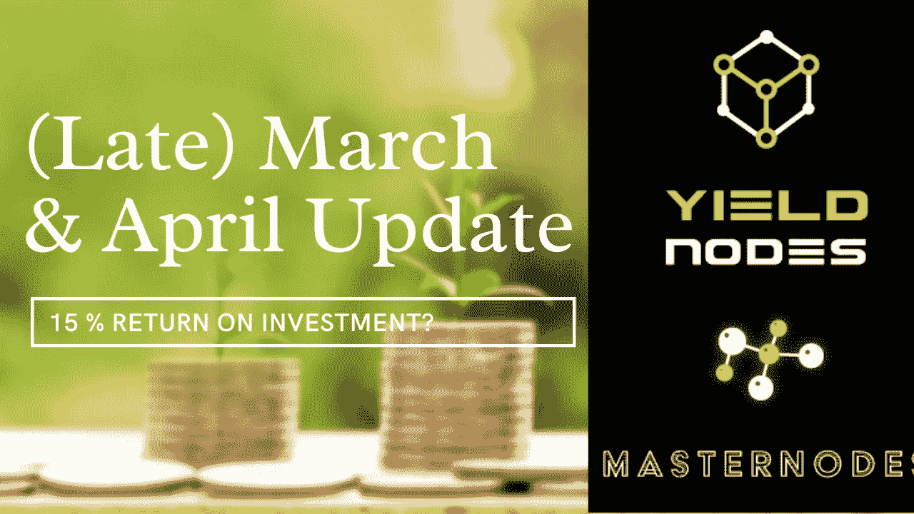

# YieldNodes 3 月和 4 月更新——我在 yield nodes 投资 4 个月赚了多少钱？

> 原文：<https://medium.com/coinmonks/yieldnodes-march-april-update-how-much-did-i-make-investing-with-yieldnodes-for-4-months-ceaee551bb49?source=collection_archive---------17----------------------->

编者按:我忘了发表这篇文章，所以它的发表比我写的晚了很多。此外，Mai 和 6 月的更新即将推出。

嗨，欢迎来到我的 YieldNodes 之旅的更新博客。我开始疯狂投资€500 到这个项目，有一个非常丑陋的网站。但是，我对这个团队了解得越多，看了对首席执行官的采访(一个新的采访已经用德语出版了，我很快会写一个总结)，我就越有信心把我整个投资组合的一部分投资到这些人身上。

Terra 的三月份发生了太多的事情，所以我跳过了三月份的更新，将它和四月份的数据一起放在我的博客里。

# 三月份的收益

我的主节点平衡是€2400.15 的最高纪录。其中一些资金是在这个月增加的，所以我只赚了 7.4%的一部分，也就是 6.87%，结果是€164.85。

# 三月份的附属积分

从联盟的角度来看，三月再次取得了相当大的成功，使€达到了 299.69。我把每一欧元都重新投资了。

# 四月份的收益

4 月份，主节点余额为€5411，收益率为 8.16%，€441.75%。

# 四月份的附属积分

四月完全疯了，赚了€2669.83 分。当我看到这个数字时，我简直不敢相信自己的眼睛。每一欧元都是大师级的。

> 交易新手？试试[密码交易机器人](/coinmonks/crypto-trading-bot-c2ffce8acb2a)或者[复制交易](/coinmonks/top-10-crypto-copy-trading-platforms-for-beginners-d0c37c7d698c)

# 摘要

3 月和 4 月都非常成功，合计收益 15.03%。随着我的主节点余额从回报和附属收入中增长，我的绝对回报数字也在上升。

请记住，这些回报没有一个是有保证的，你应该只投资你准备损失的钱。

# 想从 YieldNodes 开始吗？

*   你自己去研究 YieldNodes 吧，说到底我只是网上随便找的一个人！
*   使用[我的会员链接(点击此处)](https://yieldnodes.com/?a=MyKawjWO4Aj6qAW&trk=publish0x)进行注册，我将赚取您存款的 5%,无需额外费用。提前感谢！
*   只投资你能承受的损失
*   通过比特币存款—查看我的[完整存款指南(点击此处)](https://www.publish0x.com/defi-adventures/yieldnodes-step-by-step-deposit-guide-use-bitcoin-wallet-kra-xlzrqxp)
*   决定你是否想要支付你的收入或复合他们！
*   如果你想了解更多，请告诉我，你可以通过 [Twitter](https://twitter.com/n1ce34007134) 联系我

如果你想了解更多，请查看我在 YieldNodes 上的[其他博客。](https://www.publish0x.com/defi-adventures)

如果你觉得这篇文章有帮助，请考虑在这里为它鼓掌，并关注我更多！