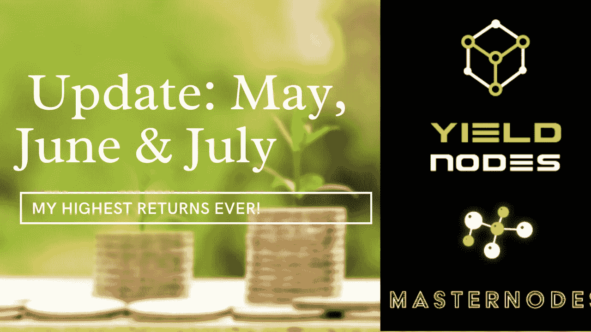

# YieldNodes 五月、六月和七月更新—愉快地投资 8 个月！

> 原文：<https://medium.com/coinmonks/yieldnodes-may-june-july-update-happily-invested-for-8-months-db53d51e06ff?source=collection_archive---------3----------------------->

My highest returns ever!

嘿，大家好，我回来了，我的 YieldNodes 位置的更新系列。YieldNodes 一直是我最强的加密头寸，出于重新平衡和税收的原因，我已经开始获利。

在这个博客里，你会发现我在五月、六月和七月的结果。这几个月仅投资 YieldNodes 就非常有利可图，我的附属公司利润使 YieldNodes 成为我表现最好的加密项目。如果你[通过我的链接](https://yieldnodes.com/?a=MyKawjWO4Aj6qAW&trk=medium)投资，我希望你对回报感到满意，并感谢你支持这个博客。

让我们开始吧！

# 五月份的结果

YieldNodes 月份的回报率为 6.5%。在我的主账户余额€8400.70 上，这导致了 546.05€的利润。最重要的是，我通过加盟店赚了€2547.53 英镑。一个疯狂的数字！所有的东西都在当月进行了再投资，因此已经包含在主节点余额中。

# 六月份的结果

6 月份再次超过 6%，确切地说是 6.1%。这导致€的利润为 550.76 英镑，而€的主账户余额为 9028.85 英镑。我对一致的结果非常满意。最重要的是，我通过代销商赚了€532.11 英镑。尽管现在比一个月前少了很多，但我对这些结果非常满意，每一分钱都被重新投资了。

我要求在 6 月 15 日之前支付€450 以支付一些费用。这些款项已于 7 月 8 日按照 YieldNodes 条款支付到我的北海巨妖账户上。

# 七月份的结果

9.2%!这是我见过的最高的屈服节点结果，也是我见过的最高的节点平衡。你可以想象，这感觉太棒了！在€10175.7 英镑的主节点余额上，我仅在€就赚了 936.16 英镑的利润，在€的代销商账户上赚了 1149.85 英镑。

随着我在 YieldNodes 上的投资组合不断增长，我从附属链接中看到了一些令人印象深刻的收益，我决定将我的利润支付给€2000，以支付税收费用，而不是变得贪婪。我们不能忘记，即使我真的信任 YieldNodes，事情仍然可能在任何时候出错。

我将在 8 月 8 日收到这笔支出，并在我 8 月份的博客中报告它是否像迄今为止所有其他支出一样顺利。

# 结论

给你，我过去几个月的所有收益。总的来说，2022 年回报 53.8%，在其他项目举步维艰甚至完全倒闭的情况下，我认为这是非常可观的。考虑到最近的审计，证明 YieldNodes 手头有所有投资资金的 133%,并准备支付给每个投资者，这个项目在我看来比以往任何时候都好。

在博客中写道:我真的想回到月度报告的模式，而不是一次做几个月。期待我的八月更新很快:)

我经常收听德国 YieldNodes 电报组，看到许多重复的问题。欢迎在评论中提出任何问题，或者在 twitter 上联系[。](https://twitter.com/0xn1ce)

n1e

请记住，这些回报没有一个是有保证的，你应该只投资你准备损失的钱。

# 想从 YieldNodes 开始吗？

*   你自己去研究 YieldNodes 吧，说到底我只是网上随便找的一个人！
*   使用[我的会员链接(点击此处)](https://yieldnodes.com/?a=MyKawjWO4Aj6qAW&trk=medium)进行注册，我将赚取您存款的 5%,无需额外费用。提前感谢！
*   只投资你能承受的损失
*   通过比特币存款—查看我的[完整存款指南(点击此处)](https://0xn1ce.medium.com/yieldnodes-step-by-step-deposit-guide-use-bitcoin-wallet-kraken-or-credit-card-earning-5-15-6d1b75965c0c)
*   决定你是否想要支付你的收入或复合他们！
*   如果你想了解更多，请告诉我，你可以通过 [Twitter](https://twitter.com/n1ce34007134) 联系我

如果你想了解更多，请查看我在 YieldNodes 上的其他博客。

如果你觉得这篇文章有帮助，请考虑为它鼓掌(点击手的符号),并关注我的更多更新！

> 交易新手？尝试[加密交易机器人](/coinmonks/crypto-trading-bot-c2ffce8acb2a)或[复制交易](/coinmonks/top-10-crypto-copy-trading-platforms-for-beginners-d0c37c7d698c)